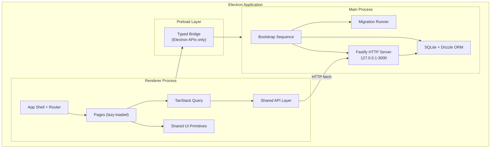
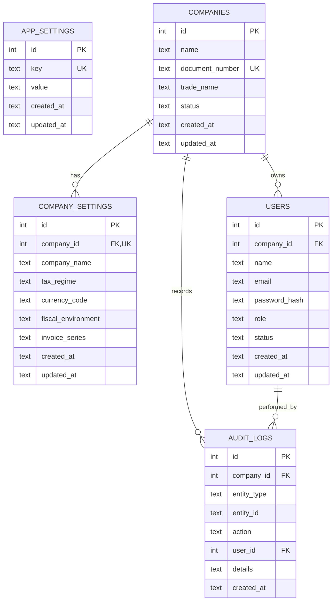

# Design Document: Phase 0 - Foundation and MVP Shell

## Overview

Phase 0 establishes the structural foundation for the Stockando Desktop application. It delivers a working Electron desktop application with stable routing, multi-company context management, local-first persistence through SQLite via a Fastify HTTP API, shared UI primitives, and a responsive shell experience suitable for daily use.

The architecture follows a clear three-layer separation:

1. **Main process** (`src/main/`) — Electron bootstrap, SQLite database (Drizzle ORM), Fastify HTTP server, business logic, and migrations.
2. **Preload** (`src/preload/`) — Minimal typed bridge for Electron APIs (not used for data access).
3. **Renderer** (`src/renderer/`) — React + TypeScript UI with TanStack Router, TanStack Query, Tailwind CSS, and shared UI primitives.

Data flows from the renderer through HTTP requests to the local Fastify server (`127.0.0.1:3000`) running in the main process, which executes queries against SQLite via Drizzle ORM. TanStack Query manages caching and invalidation on the renderer side.

## Architecture



### Key Design Decisions

1. **Fastify over IPC for data**: The renderer communicates with the main process via a local Fastify HTTP server rather than Electron IPC. This simplifies the data layer, enables standard HTTP patterns (REST, status codes, structured errors), and keeps TanStack Query integration natural.

2. **Preload bridge stays minimal**: The preload layer exposes only Electron-specific APIs (window controls, native dialogs, file system). All business data flows through the HTTP API.

3. **TanStack Router for navigation**: File-based routing with lazy loading for route-level code splitting. The root route renders the AppShell with a persistent sidebar.

4. **Company context as query key prefix**: The active company ID is included in all query keys, ensuring automatic cache isolation when switching companies.

5. **Settings two-tier model**: Application-level settings (shared) live outside company scope; company-level settings are scoped by `companyId`. Both use the same HTTP API pattern.

## Components and Interfaces

### Main Process Components

#### Bootstrap Sequence

Responsible for initializing the application on startup:

```typescript
interface BootstrapResult {
  status: 'success' | 'error'
  error?: { code: string; message: string }
  lastActiveCompanyId?: number
}
```

Initialization order:
1. Resolve database file path (`app.getPath('userData')/database.sqlite`)
2. Open SQLite connection with WAL mode enabled
3. Execute pending migrations sequentially
4. Insert seed data if first run (default settings)
5. Start Fastify HTTP server
6. Return last active company from app settings

#### Fastify API Server

Routes organized by domain:

| Endpoint | Method | Purpose |
|----------|--------|---------|
| `/api/bootstrap` | GET | App initialization status and last active company |
| `/api/companies` | GET | List all companies |
| `/api/companies` | POST | Create a new company |
| `/api/companies/:id` | PUT | Update company |
| `/api/companies/:id/settings` | GET | Get company settings |
| `/api/companies/:id/settings` | PUT | Update company settings |
| `/api/settings` | GET | Get app-level settings |
| `/api/settings` | PUT | Update app-level settings |
| `/api/settings/active-company` | PUT | Set last active company |

All responses follow a standard envelope:

```typescript
interface ApiResponse<T> {
  data: T
  success: true
}

interface ApiError {
  success: false
  error: {
    code: string
    message: string
  }
}
```

#### Migration Runner

```typescript
interface Migration {
  version: number
  name: string
  up: (db: BetterSqlite3.Database) => void
}

interface MigrationResult {
  applied: number
  total: number
  lastVersion: number
}
```

Migrations execute within individual transactions. On failure, the transaction rolls back and the runner halts, preserving the database in its pre-migration state.

#### Database Layer

The schema is already defined in `src/main/db/schema.ts`. For Phase 0, the relevant tables are:

- `companies` — Company records with name, document number, trade name, status
- `companySettings` — Per-company configuration (tax regime, currency, fiscal environment)
- `users` — Users scoped to a company
- `roles` / `rolePermissions` — Role-based access control
- `auditLogs` — Change history for critical entities

App-level settings stored in a separate `appSettings` table (to be added):

```typescript
// New table for Phase 0
const appSettings = sqliteTable('app_settings', {
  id: integer('id').primaryKey({ autoIncrement: true }),
  key: text('key').notNull().unique(),
  value: text('value').notNull(),
  createdAt: text('created_at').notNull(),
  updatedAt: text('updated_at').notNull()
})
```

### Renderer Components

#### App Shell

The existing `AppShell` component provides the root layout:
- Collapsible sidebar with navigation items
- Company name display in header area
- Theme toggle (light/dark)
- Main content area via `<Outlet />`

Extensions needed for Phase 0:
- Company selector in sidebar header
- Active company name prominently displayed
- Company creation flow (dialog or dedicated page)

#### Router Structure

```typescript
// Route tree for Phase 0
const routes = {
  '/': HomePage,
  '/settings': SettingsPage,
  '/companies/new': CompanyCreatePage,
  '/products': ProductsPage,     // placeholder
  '/categories': CategoriesPage, // placeholder
  '*': NotFoundPage
}
```

All routes are lazy-loaded except the root layout.

#### Shared API Layer

```typescript
// src/renderer/src/shared/api/client.ts
const API_BASE = 'http://127.0.0.1:3000/api'

interface FetchOptions {
  method?: 'GET' | 'POST' | 'PUT' | 'DELETE'
  body?: unknown
}

function apiClient<T>(endpoint: string, options?: FetchOptions): Promise<T>
```

#### Query Hooks

```typescript
// Company hooks
function useCompanies(): UseQueryResult<Company[]>
function useCreateCompany(): UseMutationResult<Company, Error, CreateCompanyInput>
function useActiveCompany(): { company: Company | null; setActive: (id: number) => void }

// Settings hooks
function useAppSettings(): UseQueryResult<AppSettings>
function useCompanySettings(companyId: number): UseQueryResult<CompanySettings>
function useUpdateCompanySettings(): UseMutationResult<CompanySettings, Error, UpdateSettingsInput>
```

#### UI Primitives

The shared UI layer (`src/renderer/src/shared/ui/`) provides:

| Component | States | Purpose |
|-----------|--------|---------|
| Layout (PageShell, Section) | — | Consistent page structure |
| Form inputs (Input, Select, Textarea) | default, focus, error, disabled | Form fields with validation |
| Button | default, hover, active, disabled, loading | Primary actions |
| Table | loading, empty, populated, error | Data display |
| Dialog | open, closed | Modal interactions |
| Toast (Sonner) | success, error, info | Non-blocking notifications |
| EmptyState | — | Empty data placeholder |
| ErrorState | — | Error display with retry |
| LoadingState | — | Loading indicator |

All primitives support light and dark modes, use ARIA attributes, and accept keyboard interaction.

## Data Models

### Core Entities (Phase 0 scope)



### Type Definitions

```typescript
// Inferred from Drizzle schema
type Company = typeof companies.$inferSelect
type CompanyInsert = typeof companies.$inferInsert
type CompanySettingsRow = typeof companySettings.$inferSelect
type User = typeof users.$inferSelect
type AuditLog = typeof auditLogs.$inferSelect

// API request/response types
interface CreateCompanyInput {
  name: string
  documentNumber: string
  tradeName?: string
}

interface UpdateCompanySettingsInput {
  companyId: number
  taxRegime?: string
  currencyCode?: string
  fiscalEnvironment?: string
  invoiceSeries?: string
}

interface AppSettings {
  lastActiveCompanyId: number | null
  theme: 'light' | 'dark' | 'system'
}
```

### Company Data Isolation

All business entities include a `companyId` foreign key. The Fastify API layer enforces company scoping:

1. The renderer sends the active company ID with each request (via query param or header)
2. The server validates the company exists
3. All queries filter by `companyId` — no cross-company data leaks
4. Mutations validate the target entity belongs to the active company

## Correctness Properties

*A property is a characteristic or behavior that should hold true across all valid executions of a system — essentially, a formal statement about what the system should do. Properties serve as the bridge between human-readable specifications and machine-verifiable correctness guarantees.*

### Property 1: Company data isolation

*For any* two distinct companies A and B, and *for any* query executed in the context of company A, the results SHALL NOT include any records with `companyId` equal to B's identifier.

**Validates: Requirements 2.4**

### Property 2: Migration sequential ordering

*For any* set of pending migrations, the Migration Runner SHALL apply them in strictly ascending version order, and the resulting database version SHALL equal the highest migration version applied.

**Validates: Requirements 6.2**

### Property 3: Migration transactional atomicity

*For any* migration that fails during execution, the database state SHALL be identical to the state before that migration began — no partial schema or data changes persist.

**Validates: Requirements 6.3**

### Property 4: Settings two-tier resolution

*For any* setting key, if a company-level value exists for the active company then it SHALL be returned; otherwise the application-level default SHALL be returned. App-level settings are never affected by company-level writes.

**Validates: Requirements 4.1, 4.5**

### Property 5: Audit timestamp consistency

*For any* record creation, `created_at` SHALL be set to the current time. *For any* record update, `updated_at` SHALL be updated to the current time while `created_at` remains unchanged.

**Validates: Requirements 12.2, 12.3**

### Property 6: Company name uniqueness enforcement

*For any* attempt to create a company with a `documentNumber` that already exists in the database, the operation SHALL fail with a validation error and the database SHALL remain unchanged.

**Validates: Requirements 3.2**

### Property 7: Settings write atomicity

*For any* settings write operation, either all setting values are persisted and the new values are returned on subsequent reads, or the operation fails and all previous values remain unchanged.

**Validates: Requirements 4.2, 4.4**

## Error Handling

### Error Classification

| Category | HTTP Status | User Experience | Example |
|----------|-------------|-----------------|---------|
| Validation | 400 | Inline field errors | Missing company name |
| Not Found | 404 | Toast notification | Company not found |
| Conflict | 409 | Inline error | Duplicate document number |
| System | 500 | Error notification + retry | Database write failure |
| Bootstrap | — | Full-screen error state | Migration failure |

### Error Response Format

```typescript
interface ApiErrorResponse {
  success: false
  error: {
    code: string           // Machine-readable: 'VALIDATION_ERROR', 'CONFLICT', 'SYSTEM_ERROR'
    message: string        // Human-readable description
    fields?: Record<string, string>  // Field-level validation errors
  }
}
```

### Error Handling Strategy by Layer

**Main Process (Fastify)**:
- Wrap all route handlers in try/catch
- Map database constraint violations to structured error codes
- Log full error details (stack trace, context) to console in development
- Never expose raw SQLite or internal errors to the renderer

**Renderer (React)**:
- TanStack Query `onError` callbacks display Sonner toasts for system errors
- Form mutations display inline validation errors using the `fields` map
- Bootstrap failures render a full-screen error component with diagnostics
- Background fetch failures log to console without disrupting the user

### Critical Failure Paths

1. **Database initialization fails**: Show error screen with message, prevent navigation to data screens
2. **Migration fails**: Halt bootstrap, preserve pre-migration state, show error with version info
3. **Fastify server fails to start**: Quit application with error dialog
4. **Company context invalid**: Redirect to company selection/creation flow

## Architectural Conventions

This section establishes cross-cutting implementation conventions that apply to ALL phases of the Stockando Desktop application. When implementing tasks from any spec, always apply these patterns. These conventions override any conflicting patterns in other design sections.

### 1. Feature-Sliced Design (FSD)

The renderer follows FSD methodology. Start minimal and extract layers only when reuse is confirmed.

**Layer Rules:**
- Start with only `app/` + `pages/` + `shared/` layers
- Add `widgets/`, `features/`, `entities/` ONLY when code is confirmed reused across 2+ pages
- Import direction: `app → pages → shared` (no upward imports, no cross-imports between pages)
- Every page is a slice under `pages/` with segments: `ui/`, `model/`, `api/`, `lib/`
- `shared/` has NO business logic — only UI kit, utilities, API client, config
- File naming: domain-based (`user.ts`, `order.ts`) NOT technical-role (`types.ts`, `utils.ts`)
- Public API: each page exports through `index.ts`. Internal files are not imported directly by other modules
- Do NOT pre-create `entities/` or `features/` layers. Extract only when the same code is actively used in multiple places

**Structure:**

```
src/renderer/src/
  app/          → Providers, router, global config
  pages/        → Route-level slices (each with ui/, model/, api/, lib/)
    dashboard/
    categories/
    products/
    ...
  shared/       → Infrastructure (no business logic)
    ui/         → Design system components
    api/        → API client, typed fetchers
    lib/        → Utilities (formatDate, roundHalfUp, etc.)
    hooks/      → Generic hooks (useDebounce, useLocalStorage)
    config/     → App config, constants
```

### 2. Error Handling (Result Pattern + Typed Errors)

All service-layer errors use a typed error hierarchy. Never throw raw `Error` or expose database internals.

**Rules:**
- Define an `AppError` base class hierarchy: `AppError`, `NotFoundError`, `ValidationError`, `ConflictError`, `BusinessRuleError`, `SystemError`
- Service layer returns typed errors — NEVER throw raw `Error` or expose SQLite details
- Use the `Result<T, E>` pattern (`ok`/`err`) for operations where failure is expected (parsing, validation)
- Fastify route handlers: wrap in try/catch, map `AppError` subclasses to HTTP status codes
- Renderer: TanStack Query `onError` callbacks map error codes to user-friendly messages via a `USER_ERROR_MESSAGES` map
- React `ErrorBoundary` wraps page-level components for unhandled render errors
- Every catch block must handle, re-throw, or log — NO silent swallowing

**Error class mapping:**

| Error Class | HTTP Status | Usage |
|-------------|-------------|-------|
| `ValidationError` | 400 | Invalid input, missing fields |
| `NotFoundError` | 404 | Entity not found in company scope |
| `ConflictError` | 409 | Duplicate natural key |
| `BusinessRuleError` | 422 | Invalid status transition, insufficient stock |
| `SystemError` | 500 | Unexpected internal failure |

### 3. Zod Validation

Zod schemas are the single source of truth for request validation and TypeScript types at system boundaries.

**Rules:**
- Define Zod schemas for ALL API request bodies in a co-located schema file per route module
- Use `z.infer<typeof schema>` for TypeScript types — do NOT manually duplicate types
- Use `safeParse()` for user input validation (returns structured errors, no throws)
- Apply string validations at schema definition (`min`, `max`, `email`, regex for access keys)
- Use `z.enum()` for status/type discriminants instead of `z.string()`
- Use `discriminatedUnion` for polymorphic inputs (movement types, trigger types)
- Use `.strict()` on request body schemas to reject unknown fields
- Export both schemas AND inferred types from each module
- Validate at system boundaries (Fastify route handlers) — once validated, trust downstream

**Example:**

```typescript
// src/main/routes/customers/schema.ts
import { z } from 'zod'

export const createCustomerSchema = z.object({
  name: z.string().min(1).max(200),
  documentNumber: z.string().min(1).max(20).optional(),
  email: z.string().email().optional().nullable(),
  phone: z.string().max(20).optional().nullable(),
  address: z.string().max(500).optional().nullable(),
  customerType: z.enum(['individual', 'business']).optional(),
}).strict()

export type CreateCustomerInput = z.infer<typeof createCustomerSchema>
```

### 4. TanStack Query (Query Factories + Custom Hooks)

All async data fetching uses TanStack Query with a consistent key factory pattern.

**Rules:**
- Use Query Key Factory pattern for every domain:

```typescript
export const productKeys = {
  all: (companyId: number) => [companyId, 'products'] as const,
  lists: (companyId: number) => [...productKeys.all(companyId), 'list'] as const,
  list: (companyId: number, filters: ProductListFilters) => [...productKeys.lists(companyId), filters] as const,
  details: (companyId: number) => [...productKeys.all(companyId), 'detail'] as const,
  detail: (companyId: number, id: number) => [...productKeys.details(companyId), id] as const,
}
```

- ALL query/mutation calls abstracted into custom hooks — views only consume hooks
- Company ID included in ALL query keys for automatic cache isolation on company switch
- `staleTime` configured per domain (inventory: shorter, settings: longer)
- Mutations use `onSuccess` → `invalidateQueries` with the appropriate key factory
- Optimistic updates ONLY for safe, idempotent operations (never for financial/fiscal)
- No `useEffect` + `useState` for data fetching — TanStack Query handles all async state

### 5. Compound Components

Complex UI components with multiple coordinating parts use the compound component pattern.

**Applicable components:**
- `DocumentItemsEditor` (items table + totals + add/remove)
- `DataTable` (table + pagination + filters)
- `StatusTransitionActions` (contextual action buttons)
- `PaymentForm` / `PaymentHistory` (form + running balance)

**Pattern:**
- Context + guard hook + Provider + sub-parts assembled via `Object.assign`
- Context value structured as `{ state, actions, meta }` for rich components
- Support controlled/uncontrolled hybrid (`value ?? internalValue`)
- Expose Provider so state source can be lifted (useful when data comes from TanStack Query)
- Export only the namespaced compound (`DataTable.Header`, `DataTable.Body`, `DataTable.Pagination`)

**Example structure:**

```typescript
// shared/ui/data-table/index.ts
import { DataTableRoot } from './data-table-root'
import { DataTableHeader } from './data-table-header'
import { DataTableBody } from './data-table-body'
import { DataTablePagination } from './data-table-pagination'

export const DataTable = Object.assign(DataTableRoot, {
  Header: DataTableHeader,
  Body: DataTableBody,
  Pagination: DataTablePagination,
})
```

### 6. TypeScript Advanced Types

Use TypeScript's type system to enforce correctness at compile time.

**Rules:**
- Use `const` assertions for status/type discriminants: `as const` objects
- Use discriminated unions for state machines (quote status, fiscal doc status, async states)
- Use `z.infer` for all schema-derived types — single source of truth
- Use branded types for domain identifiers where confusion is possible:

```typescript
type CompanyId = number & { __brand: 'CompanyId' }
type ProductId = number & { __brand: 'ProductId' }
type WarehouseId = number & { __brand: 'WarehouseId' }
```

- Use mapped types for generating API response variants (`PaginatedResult<T>`)
- Generic constraints on service functions: ensure `companyId` is always required
- Use Drizzle's `$inferSelect` / `$inferInsert` for DB-level types
- Use `satisfies` operator for type-safe config objects (transition maps, error maps)
- Prefer `interface` for object shapes, `type` for unions and computed types

**Example — status transition map with satisfies:**

```typescript
const VALID_QUOTE_TRANSITIONS = {
  draft: ['sent', 'cancelled'],
  sent: ['accepted', 'rejected', 'cancelled'],
  accepted: ['converted'],
  rejected: [],
  converted: [],
  cancelled: [],
} as const satisfies Record<QuoteStatus, readonly QuoteStatus[]>
```

### Cross-Cutting Summary

| Concern | Where Applied | Key Rule |
|---------|--------------|----------|
| FSD | Renderer structure | `pages/` + `shared/` only; extract when confirmed multi-use |
| Error Handling | Service layer + routes | `AppError` hierarchy, `Result<T,E>`, no silent swallowing |
| Zod | Route handlers | Schema-first validation, `z.infer` for types, `safeParse` |
| TanStack Query | Renderer hooks | Key factories, custom hooks, company-prefixed keys |
| Compound Components | Complex UI | Context + guard hook + Provider + parts |
| TypeScript | Everywhere | Discriminated unions, branded types, const assertions |

> **Note:** These conventions override any conflicting patterns in the existing design sections. When implementing tasks, always apply these patterns.

## Testing Strategy

### Unit Tests

- **Migration Runner**: Test migration ordering, transaction rollback on failure, idempotent re-runs
- **Company data isolation**: Test query filtering logic with multiple companies
- **Settings resolution**: Test app-level vs company-level precedence
- **API route handlers**: Test validation, error mapping, response format
- **Audit timestamp logic**: Test `created_at`/`updated_at` behavior on create and update

### Integration Tests

- **Bootstrap sequence**: Verify end-to-end startup with fresh database, existing database, and corrupted state
- **Company CRUD**: Create, read, update companies through the Fastify API
- **Settings persistence**: Write and read settings through the API, verify cache invalidation
- **Error scenarios**: Duplicate company creation, invalid inputs, database failures

### Property-Based Tests

Using a property-based testing library (e.g., `fast-check`) for the correctness properties defined above:

- **Property 1 (Company isolation)**: Generate random company data and queries, verify no cross-company leakage
- **Property 2 (Migration ordering)**: Generate random migration sets, verify sequential application
- **Property 3 (Migration atomicity)**: Generate migrations with random failure points, verify rollback
- **Property 4 (Settings resolution)**: Generate random settings configurations, verify correct precedence
- **Property 5 (Audit timestamps)**: Generate random create/update sequences, verify timestamp invariants
- **Property 6 (Uniqueness)**: Generate random company creation attempts, verify constraint enforcement
- **Property 7 (Settings atomicity)**: Generate random settings writes with simulated failures, verify all-or-nothing

Each property test runs minimum 100 iterations.

Tag format: **Feature: phase-0-foundation, Property {number}: {property_text}**

### Component Tests

- **AppShell**: Renders correctly with navigation, active route indication, company name display
- **Company selector**: Shows list, switches context, handles empty state
- **Settings forms**: Validates inputs, displays errors, shows success feedback
- **UI Primitives**: Render correctly in all states (loading, empty, error, populated)
- **Not-found page**: Renders with navigation link to home

### Performance Validation

- Bootstrap completes within 3 seconds (measured with performance.now())
- Route transitions under 500ms for lazy-loaded routes
- Company switching completes within 500ms (cache invalidation + refetch)
- UI interactions respond within 100ms
