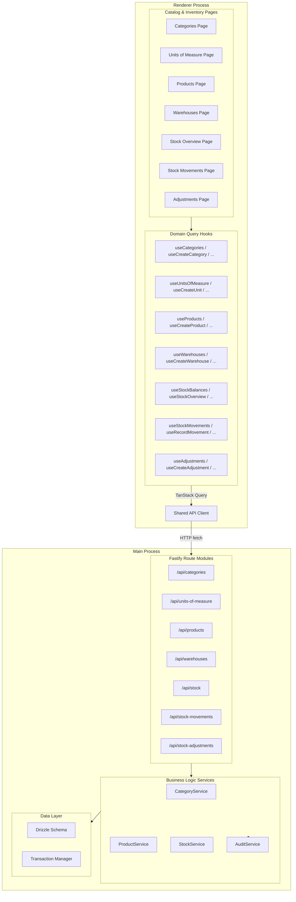
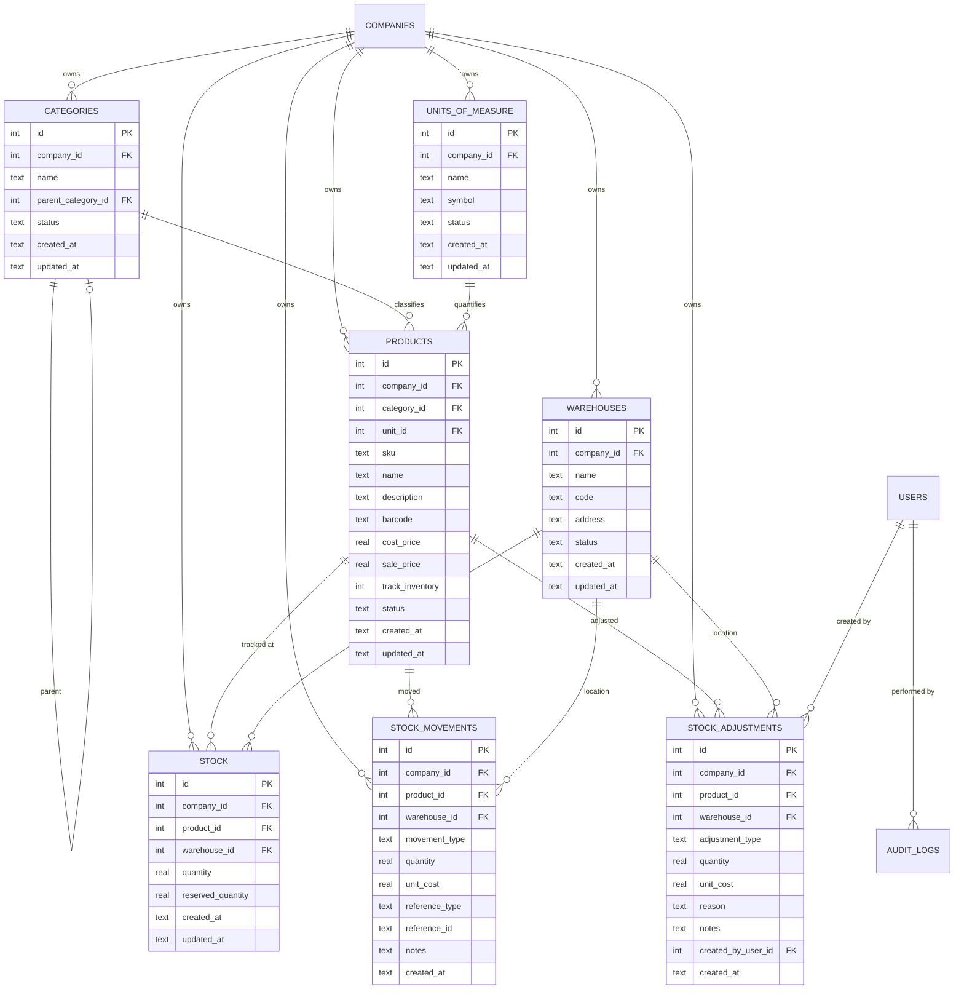

# Design Document: Phase 1 - Catalog and Inventory Management

## Overview

Phase 1 delivers the first operational business module for the Stockando Desktop application. It provides a complete product catalog system (categories, units of measure, and products), warehouse management, stock movement tracking, inventory adjustments with audit traceability, and stock reconciliation workflows.

The module builds on Phase 0's foundation (Fastify HTTP API, SQLite via Drizzle ORM, TanStack Query/Router, shared UI primitives) and extends it with transactional stock operations, paginated list endpoints, and rich inventory management UI screens.

Key architectural principles:
- **Materialized balances from movement history**: Stock_Record quantities are updated transactionally alongside every movement, ensuring the balance always equals the net sum of movements.
- **Immutable movements**: Once created, stock movements cannot be modified or deleted — corrections flow through the adjustment mechanism.
- **Company-scoped isolation**: All entities and queries are filtered by the active company ID.
- **Transactional consistency**: Stock operations (movements, adjustments, transfers) execute within a single SQLite transaction to prevent partial state.

## Architecture



### Key Design Decisions

1. **Service layer for business logic**: Route handlers delegate to service functions that encapsulate validation, authorization, and transactional operations. This keeps routes thin and testable.

2. **Stock operations use explicit transactions**: The `StockService` wraps movement recording, balance updates, and adjustment creation in a single `db.transaction()` call. If any step fails, the entire operation rolls back.

3. **Pagination via limit/offset on all list endpoints**: All list endpoints accept `limit` and `offset` query parameters with a default page size of 20. Responses include a `total` count for client-side pagination controls.

4. **Composite indexes for performance**: The existing schema already includes composite indexes on `(companyId, sku)`, `(companyId, productId, warehouseId)`, etc. Additional indexes on `(companyId, productId)` and `(companyId, warehouseId)` in stock_movements ensure movement history queries remain fast.

5. **Immutable movement records**: No PUT or DELETE endpoints exist for stock movements. Corrections are always made through the stock adjustment mechanism, which creates a new adjustment movement.

6. **TanStack Table for product and movement lists**: Product catalog and movement history use `@tanstack/react-table` with server-side pagination and controlled filtering state.

7. **Query key structure with company prefix**: All query keys include the active company ID for automatic cache isolation when switching companies (e.g., `[companyId, 'products', 'list', filters]`).

## Components and Interfaces

### Main Process — Route Modules

#### Categories API (`/api/categories`)

| Endpoint | Method | Purpose |
|----------|--------|---------|
| `/api/categories` | GET | List all categories for the active company |
| `/api/categories` | POST | Create a new category |
| `/api/categories/:id` | PUT | Update a category |
| `/api/categories/:id` | DELETE | Delete a category (if unreferenced) |

#### Units of Measure API (`/api/units-of-measure`)

| Endpoint | Method | Purpose |
|----------|--------|---------|
| `/api/units-of-measure` | GET | List all units for the active company |
| `/api/units-of-measure` | POST | Create a new unit |
| `/api/units-of-measure/:id` | PUT | Update a unit |
| `/api/units-of-measure/:id` | DELETE | Delete a unit (if unreferenced) |

#### Products API (`/api/products`)

| Endpoint | Method | Purpose |
|----------|--------|---------|
| `/api/products` | GET | Paginated product list with filters |
| `/api/products` | POST | Create a product |
| `/api/products/:id` | GET | Product detail with resolved category/unit names |
| `/api/products/:id` | PUT | Update a product |
| `/api/products/:id` | DELETE | Delete a product (if no active stock movements) |

Query parameters for GET list:
- `limit` (default: 20), `offset` (default: 0)
- `categoryId` (optional filter)
- `status` (optional filter: `active`, `inactive`)
- `search` (optional: matches name or SKU)

#### Warehouses API (`/api/warehouses`)

| Endpoint | Method | Purpose |
|----------|--------|---------|
| `/api/warehouses` | GET | List all warehouses for the active company |
| `/api/warehouses` | POST | Create a warehouse |
| `/api/warehouses/:id` | PUT | Update a warehouse |
| `/api/warehouses/:id` | DELETE | Delete a warehouse (if no non-zero stock) |

#### Stock API (`/api/stock`)

| Endpoint | Method | Purpose |
|----------|--------|---------|
| `/api/stock/product/:productId` | GET | Stock balances per warehouse for a product |
| `/api/stock/warehouse/:warehouseId` | GET | Paginated product stock at a warehouse |
| `/api/stock/reconcile` | POST | Run reconciliation check for a product/warehouse pair |

#### Stock Movements API (`/api/stock-movements`)

| Endpoint | Method | Purpose |
|----------|--------|---------|
| `/api/stock-movements` | GET | Paginated, filterable movement history |
| `/api/stock-movements/inbound` | POST | Record an inbound movement |
| `/api/stock-movements/outbound` | POST | Record an outbound movement |
| `/api/stock-movements/transfer` | POST | Record a transfer between warehouses |

Query parameters for GET list:
- `limit`, `offset`
- `productId` (optional)
- `warehouseId` (optional)
- `movementType` (optional)
- `startDate`, `endDate` (optional)

#### Stock Adjustments API (`/api/stock-adjustments`)

| Endpoint | Method | Purpose |
|----------|--------|---------|
| `/api/stock-adjustments` | GET | Paginated adjustment history |
| `/api/stock-adjustments` | POST | Create a stock adjustment |

### Main Process — Service Layer

```typescript
// src/main/services/category-service.ts
interface CategoryService {
  list(companyId: number): Promise<Category[]>
  create(companyId: number, input: CreateCategoryInput): Promise<Category>
  update(companyId: number, id: number, input: UpdateCategoryInput): Promise<Category>
  delete(companyId: number, id: number): Promise<void>
}

// src/main/services/product-service.ts
interface ProductService {
  list(companyId: number, filters: ProductListFilters): Promise<PaginatedResult<ProductListItem>>
  detail(companyId: number, id: number): Promise<ProductDetail>
  create(companyId: number, input: CreateProductInput): Promise<Product>
  update(companyId: number, id: number, input: UpdateProductInput): Promise<Product>
  delete(companyId: number, id: number): Promise<void>
}

// src/main/services/stock-service.ts
interface StockService {
  getProductBalances(companyId: number, productId: number): Promise<StockBalance[]>
  getWarehouseOverview(companyId: number, warehouseId: number, pagination: Pagination): Promise<PaginatedResult<WarehouseStockItem>>
  recordInbound(companyId: number, input: InboundMovementInput): Promise<StockMovement>
  recordOutbound(companyId: number, input: OutboundMovementInput): Promise<StockMovement>
  recordTransfer(companyId: number, input: TransferInput): Promise<{ source: StockMovement; destination: StockMovement }>
  createAdjustment(companyId: number, input: AdjustmentInput): Promise<StockAdjustment>
  reconcile(companyId: number, productId: number, warehouseId: number): Promise<ReconciliationResult>
}

// src/main/services/audit-service.ts
interface AuditService {
  log(entry: AuditLogEntry): Promise<void>
}
```

### Renderer — Query Hooks

```typescript
// Category hooks
function useCategories(companyId: number): UseQueryResult<Category[]>
function useCreateCategory(): UseMutationResult<Category, ApiError, CreateCategoryInput>
function useUpdateCategory(): UseMutationResult<Category, ApiError, UpdateCategoryInput & { id: number }>
function useDeleteCategory(): UseMutationResult<void, ApiError, number>

// Unit of Measure hooks
function useUnitsOfMeasure(companyId: number): UseQueryResult<UnitOfMeasure[]>
function useCreateUnit(): UseMutationResult<UnitOfMeasure, ApiError, CreateUnitInput>
function useUpdateUnit(): UseMutationResult<UnitOfMeasure, ApiError, UpdateUnitInput & { id: number }>
function useDeleteUnit(): UseMutationResult<void, ApiError, number>

// Product hooks
function useProducts(companyId: number, filters: ProductListFilters): UseQueryResult<PaginatedResult<ProductListItem>>
function useProductDetail(companyId: number, productId: number): UseQueryResult<ProductDetail>
function useCreateProduct(): UseMutationResult<Product, ApiError, CreateProductInput>
function useUpdateProduct(): UseMutationResult<Product, ApiError, UpdateProductInput & { id: number }>
function useDeleteProduct(): UseMutationResult<void, ApiError, number>

// Warehouse hooks
function useWarehouses(companyId: number): UseQueryResult<Warehouse[]>
function useCreateWarehouse(): UseMutationResult<Warehouse, ApiError, CreateWarehouseInput>
function useUpdateWarehouse(): UseMutationResult<Warehouse, ApiError, UpdateWarehouseInput & { id: number }>
function useDeleteWarehouse(): UseMutationResult<void, ApiError, number>

// Stock hooks
function useProductStock(companyId: number, productId: number): UseQueryResult<StockBalance[]>
function useWarehouseOverview(companyId: number, warehouseId: number, pagination: Pagination): UseQueryResult<PaginatedResult<WarehouseStockItem>>
function useRecordInbound(): UseMutationResult<StockMovement, ApiError, InboundMovementInput>
function useRecordOutbound(): UseMutationResult<StockMovement, ApiError, OutboundMovementInput>
function useRecordTransfer(): UseMutationResult<TransferResult, ApiError, TransferInput>
function useCreateAdjustment(): UseMutationResult<StockAdjustment, ApiError, AdjustmentInput>
function useReconcile(): UseMutationResult<ReconciliationResult, ApiError, { productId: number; warehouseId: number }>

// Stock movement hooks
function useStockMovements(companyId: number, filters: MovementListFilters): UseQueryResult<PaginatedResult<StockMovement>>
```

### Renderer — Page Components

| Page | Route | Purpose |
|------|-------|---------|
| CategoriesPage | `/categories` | List, create, edit, delete categories |
| UnitsOfMeasurePage | `/units-of-measure` | List, create, edit, delete units |
| ProductsPage | `/products` | Paginated product list with search/filter |
| ProductDetailPage | `/products/:id` | Product detail with stock info |
| WarehousesPage | `/warehouses` | List, create, edit, delete warehouses |
| StockOverviewPage | `/stock` | Stock overview per warehouse or product |
| StockMovementsPage | `/stock-movements` | Movement history with filters |
| StockAdjustmentPage | `/stock-adjustments` | Adjustment form and history |

### Renderer — Shared Components (new)

| Component | Purpose |
|-----------|---------|
| DataTable | Generic table wrapper using TanStack Table with pagination controls |
| ConfirmDialog | Confirmation dialog for destructive actions |
| FilterBar | Reusable filter/search bar for list pages |

## Data Models

### Entity Relationships



### Type Definitions

```typescript
// Inferred from Drizzle schema
type Category = typeof categories.$inferSelect
type CategoryInsert = typeof categories.$inferInsert
type UnitOfMeasure = typeof unitsOfMeasure.$inferSelect
type UnitOfMeasureInsert = typeof unitsOfMeasure.$inferInsert
type Product = typeof products.$inferSelect
type ProductInsert = typeof products.$inferInsert
type Warehouse = typeof warehouses.$inferSelect
type WarehouseInsert = typeof warehouses.$inferInsert
type StockRecord = typeof stock.$inferSelect
type StockMovement = typeof stockMovements.$inferSelect
type StockAdjustment = typeof stockAdjustments.$inferSelect

// Movement type discriminant
const MOVEMENT_TYPES = {
  inbound: 'inbound',
  outbound: 'outbound',
  transfer_in: 'transfer_in',
  transfer_out: 'transfer_out',
  adjustment: 'adjustment',
} as const

type MovementType = (typeof MOVEMENT_TYPES)[keyof typeof MOVEMENT_TYPES]

// Adjustment type discriminant
const ADJUSTMENT_TYPES = {
  increase: 'increase',
  decrease: 'decrease',
  correction: 'correction',
} as const

type AdjustmentType = (typeof ADJUSTMENT_TYPES)[keyof typeof ADJUSTMENT_TYPES]

// API request types
interface CreateCategoryInput {
  name: string
  parentCategoryId?: number | null
}

interface UpdateCategoryInput {
  name?: string
  parentCategoryId?: number | null
  status?: 'active' | 'inactive'
}

interface CreateUnitInput {
  name: string
  symbol: string
}

interface UpdateUnitInput {
  name?: string
  symbol?: string
  status?: 'active' | 'inactive'
}

interface CreateProductInput {
  sku: string
  name: string
  description?: string
  barcode?: string
  costPrice?: number
  salePrice?: number
  categoryId?: number | null
  unitId?: number | null
  trackInventory?: boolean
}

interface UpdateProductInput {
  name?: string
  description?: string
  barcode?: string
  costPrice?: number
  salePrice?: number
  categoryId?: number | null
  unitId?: number | null
  trackInventory?: boolean
  status?: 'active' | 'inactive'
}

interface CreateWarehouseInput {
  name: string
  code: string
  address?: string
}

interface UpdateWarehouseInput {
  name?: string
  address?: string
  status?: 'active' | 'inactive'
}

interface InboundMovementInput {
  productId: number
  warehouseId: number
  quantity: number
  unitCost?: number
  referenceType?: string
  referenceId?: string
  notes?: string
}

interface OutboundMovementInput {
  productId: number
  warehouseId: number
  quantity: number
  unitCost?: number
  referenceType?: string
  referenceId?: string
  notes?: string
}

interface TransferInput {
  productId: number
  sourceWarehouseId: number
  destinationWarehouseId: number
  quantity: number
  notes?: string
}

interface AdjustmentInput {
  productId: number
  warehouseId: number
  adjustmentType: AdjustmentType
  quantity: number
  unitCost?: number
  reason: string
  notes?: string
  createdByUserId: number
}

// API response types
interface ProductListItem {
  id: number
  sku: string
  name: string
  categoryName: string | null
  unitSymbol: string | null
  costPrice: number | null
  salePrice: number | null
  trackInventory: boolean
  status: string
}

interface ProductDetail extends Product {
  categoryName: string | null
  unitName: string | null
  unitSymbol: string | null
}

interface StockBalance {
  warehouseId: number
  warehouseName: string
  warehouseCode: string
  quantity: number
  reservedQuantity: number
}

interface WarehouseStockItem {
  productId: number
  productName: string
  productSku: string
  quantity: number
  reservedQuantity: number
}

interface ReconciliationResult {
  productId: number
  warehouseId: number
  computedBalance: number
  materializedBalance: number
  discrepancy: number
  isConsistent: boolean
}

// Pagination
interface Pagination {
  limit: number
  offset: number
}

interface PaginatedResult<T> {
  data: T[]
  total: number
  limit: number
  offset: number
}

interface ProductListFilters extends Pagination {
  categoryId?: number
  status?: string
  search?: string
}

interface MovementListFilters extends Pagination {
  productId?: number
  warehouseId?: number
  movementType?: MovementType
  startDate?: string
  endDate?: string
}

// Audit log entry
interface AuditLogEntry {
  companyId: number
  entityType: string
  entityId: string
  action: string
  userId?: number
  details?: string
}
```

### Stock Balance Update Logic

The core invariant is that `stock.quantity` always equals the net sum of all movements for the same `(companyId, productId, warehouseId)` tuple. This is maintained transactionally:

```typescript
// Pseudocode for inbound movement
async function recordInbound(db: DrizzleDB, companyId: number, input: InboundMovementInput): Promise<StockMovement> {
  return db.transaction(async (tx) => {
    // 1. Validate product exists, belongs to company, has trackInventory=true
    const product = await validateProduct(tx, companyId, input.productId)

    // 2. Create movement record
    const movement = await tx.insert(stockMovements).values({
      companyId,
      productId: input.productId,
      warehouseId: input.warehouseId,
      movementType: 'inbound',
      quantity: input.quantity,
      unitCost: input.unitCost,
      referenceType: input.referenceType,
      referenceId: input.referenceId,
      notes: input.notes,
      createdAt: new Date().toISOString(),
    }).returning()

    // 3. Upsert stock record (create if not exists, increment quantity)
    await upsertStockBalance(tx, companyId, input.productId, input.warehouseId, input.quantity)

    return movement[0]
  })
}
```

## Correctness Properties

*A property is a characteristic or behavior that should hold true across all valid executions of a system — essentially, a formal statement about what the system should do. Properties serve as the bridge between human-readable specifications and machine-verifiable correctness guarantees.*

### Property 1: Stock balance equals net movement sum

*For any* product and warehouse combination, the materialized Stock_Record quantity SHALL equal the algebraic sum of all stock movements for that product-warehouse pair (inbound and transfer_in add, outbound and transfer_out subtract, adjustment adds or subtracts based on type).

**Validates: Requirements 5.5**

### Property 2: Non-negative stock enforcement

*For any* outbound movement, transfer, or decrease adjustment attempt, if the resulting Stock_Record quantity would become negative, the operation SHALL be rejected and the database SHALL remain unchanged.

**Validates: Requirements 5.6, 7.5**

### Property 3: Transfer conservation

*For any* transfer operation between two warehouses, the sum of quantities across both warehouses for the transferred product SHALL remain unchanged after the transfer completes.

**Validates: Requirements 6.3**

### Property 4: Movement immutability

*For any* stock movement record that has been created, no update or delete operation SHALL modify or remove that record.

**Validates: Requirements 6.6**

### Property 5: Company data isolation

*For any* two distinct companies A and B, and *for any* catalog or inventory query executed in the context of company A, the results SHALL NOT include records belonging to company B.

**Validates: Requirements 8.1, 8.4**

### Property 6: Uniqueness constraint enforcement

*For any* attempt to create a category with a name that already exists for the same company, or a product with a duplicate SKU, or a warehouse with a duplicate code, or a unit with a duplicate name, the operation SHALL be rejected with a conflict error and the database SHALL remain unchanged.

**Validates: Requirements 1.2, 2.2, 3.2, 4.2**

### Property 7: Transactional atomicity for stock operations

*For any* stock movement, adjustment, or transfer that fails at any step during execution, the database state SHALL be identical to its pre-operation state — no partial movements, balance updates, or adjustment records persist.

**Validates: Requirements 11.1, 11.2, 11.3, 11.4**

### Property 8: Referential integrity on deletion

*For any* category, unit, product, or warehouse referenced by dependent entities (products referencing a category, stock movements referencing a product, etc.), deletion SHALL be rejected and the database SHALL remain unchanged.

**Validates: Requirements 1.6, 2.5, 3.7, 4.5**

### Property 9: Adjustment creates corresponding movement

*For any* stock adjustment that is successfully recorded, exactly one corresponding stock movement with movement_type "adjustment" SHALL exist with the same product, warehouse, and quantity.

**Validates: Requirements 7.2**

### Property 10: Reconciliation correctness

*For any* reconciliation check on a product-warehouse pair, the reported computed balance SHALL equal the actual sum of all movements for that pair, and the discrepancy SHALL equal the difference between computed and materialized balances.

**Validates: Requirements 7.6, 7.7**

### Property 11: TrackInventory gate

*For any* product with trackInventory set to false, no stock movement SHALL be accepted for that product.

**Validates: Requirements 3.8, 6.7**

## Error Handling

### Error Classification

| Category | HTTP Status | Scenario | User Experience |
|----------|-------------|----------|-----------------|
| Validation | 400 | Missing required fields, invalid format | Inline field errors |
| Not Found | 404 | Entity doesn't exist or belongs to another company | Toast notification |
| Conflict | 409 | Duplicate name/SKU/code | Inline error on field |
| Business Rule | 422 | Negative stock, referenced entity deletion | Toast with explanation |
| System | 500 | Database failure, unexpected error | Error notification + retry |

### Error Response Format

All errors follow the standard API envelope:

```typescript
interface ApiErrorResponse {
  success: false
  error: {
    code: string
    message: string
    fields?: Record<string, string>
  }
}
```

Error codes for Phase 1:

| Code | Meaning |
|------|---------|
| `VALIDATION_ERROR` | Input failed validation |
| `NOT_FOUND` | Entity not found in active company scope |
| `CONFLICT` | Duplicate natural key |
| `INSUFFICIENT_STOCK` | Operation would cause negative balance |
| `ENTITY_REFERENCED` | Cannot delete — entity has dependencies |
| `INVALID_MOVEMENT` | Product does not track inventory |
| `TRANSFER_SAME_WAREHOUSE` | Source and destination are identical |
| `SYSTEM_ERROR` | Unexpected internal failure |

### Error Handling by Layer

**Service Layer (Main Process)**:
- Validate all inputs before starting transactions
- Map database constraint violations (UNIQUE, FOREIGN KEY) to structured error codes
- Catch transaction failures and map to appropriate error responses
- Never expose raw SQLite errors to the API consumer

**Route Layer (Fastify)**:
- Return structured `ApiErrorResponse` with correct HTTP status
- Log full error context (stack trace, parameters) in development
- Validate request parameters and body before delegating to services

**Renderer (React)**:
- TanStack Query `onError` callbacks display Sonner toasts for system/business errors
- Form mutations display inline validation errors using the `fields` map
- Confirmation dialogs prevent accidental destructive actions
- Loading states shown during mutations to prevent double-submission

### Critical Error Paths

1. **Negative stock attempt**: Return `INSUFFICIENT_STOCK` with current balance and requested quantity
2. **Duplicate entity creation**: Return `CONFLICT` with the conflicting field identified
3. **Delete referenced entity**: Return `ENTITY_REFERENCED` listing the dependent entity type
4. **Transaction failure mid-operation**: Full rollback, return `SYSTEM_ERROR` with operation context

## Architectural Conventions

All cross-cutting implementation conventions are defined in the Phase 0 design document (`.kiro/specs/phase-0-foundation/design.md` — "Architectural Conventions" section). Apply all rules from that section when implementing Phase 1 tasks. The conventions cover:

1. **Feature-Sliced Design** — pages/ + shared/ structure, domain-based naming
2. **Error Handling** — AppError hierarchy, Result<T,E>, no silent swallowing
3. **Zod Validation** — Schema-first at boundaries, z.infer for types
4. **TanStack Query** — Key factories with company prefix, custom hooks only
5. **Compound Components** — Context + guard hook + Provider pattern
6. **TypeScript Advanced Types** — Discriminated unions, branded types, satisfies

### Phase 1 Specific Guidance

**FSD Structure for Catalog Pages:**
```
src/renderer/src/pages/
  categories/
    ui/categories-page.tsx
    api/use-categories.ts      ← query hooks live in page api/ segment
    model/category.ts          ← types, validation schemas
  products/
    ui/products-page.tsx
    ui/product-detail-page.tsx
    api/use-products.ts
    model/product.ts
  warehouses/
    ui/warehouses-page.tsx
    api/use-warehouses.ts
    model/warehouse.ts
  stock/
    ui/stock-overview-page.tsx
    api/use-stock.ts
    model/stock.ts
  stock-movements/
    ui/stock-movements-page.tsx
    api/use-stock-movements.ts
  stock-adjustments/
    ui/stock-adjustment-page.tsx
    api/use-adjustments.ts
    model/adjustment.ts
```

**Zod Schemas for Inventory Operations:**
```typescript
// src/main/routes/stock-movements/schema.ts
import { z } from 'zod'

const movementType = z.enum(['inbound', 'outbound', 'transfer_in', 'transfer_out', 'adjustment'])

export const recordInboundSchema = z.object({
  productId: z.number().int().positive(),
  warehouseId: z.number().int().positive(),
  quantity: z.number().positive(),
  unitCost: z.number().nonnegative().optional(),
  referenceType: z.string().max(50).optional(),
  referenceId: z.string().max(50).optional(),
  notes: z.string().max(500).optional(),
}).strict()

export type RecordInboundInput = z.infer<typeof recordInboundSchema>
```

**TanStack Query Key Factories:**
```typescript
export const categoryKeys = {
  all: (companyId: number) => [companyId, 'categories'] as const,
  list: (companyId: number) => [...categoryKeys.all(companyId), 'list'] as const,
}

export const productKeys = {
  all: (companyId: number) => [companyId, 'products'] as const,
  lists: (companyId: number) => [...productKeys.all(companyId), 'list'] as const,
  list: (companyId: number, filters: ProductListFilters) => [...productKeys.lists(companyId), filters] as const,
  details: (companyId: number) => [...productKeys.all(companyId), 'detail'] as const,
  detail: (companyId: number, id: number) => [...productKeys.details(companyId), id] as const,
}

export const stockKeys = {
  all: (companyId: number) => [companyId, 'stock'] as const,
  product: (companyId: number, productId: number) => [...stockKeys.all(companyId), 'product', productId] as const,
  warehouse: (companyId: number, warehouseId: number) => [...stockKeys.all(companyId), 'warehouse', warehouseId] as const,
}
```

**Compound Component — DataTable:**
The DataTable used for product lists and movement history follows the compound pattern with `DataTable.Header`, `DataTable.Body`, `DataTable.Pagination`, `DataTable.Filters`. See Phase 0 Architectural Conventions for the full pattern.

**Error Handling in StockService:**
Stock operations that may fail with business rule violations (insufficient stock, non-tracked product) use the typed error hierarchy:
- `BusinessRuleError('INSUFFICIENT_STOCK', ...)` for negative balance attempts
- `BusinessRuleError('INVALID_MOVEMENT', ...)` for non-tracked products
- `ValidationError(...)` with field-level details for invalid inputs
- All wrapped in transactions that rollback cleanly on any error

## Testing Strategy

### Unit Tests

- **CategoryService**: CRUD operations, duplicate name rejection, parent validation, deletion with references
- **ProductService**: CRUD operations, duplicate SKU rejection, pagination logic, search filtering, deletion guards
- **StockService.recordInbound**: Balance increment, stock record creation, trackInventory validation
- **StockService.recordOutbound**: Balance decrement, negative stock rejection, validation
- **StockService.recordTransfer**: Paired movement creation, conservation of quantity, same-warehouse rejection
- **StockService.createAdjustment**: Increase/decrease logic, negative stock check, audit log creation
- **StockService.reconcile**: Balance computation vs materialized comparison, discrepancy reporting
- **AuditService**: Entry creation with correct entity type, action, and company scope
- **Route handlers**: Request validation, error code mapping, pagination parameter handling
- **Company scoping**: Query filtering, cross-company access rejection

### Integration Tests

- **Full CRUD flows**: Create, list, update, delete for all entities through the Fastify API
- **Stock workflow**: Inbound → check balance → outbound → verify balance → transfer → verify both
- **Adjustment workflow**: Create adjustment → verify movement + balance update → verify audit log
- **Reconciliation**: Create movements → verify reconciliation reports consistency
- **Error scenarios**: Duplicate creation, referenced deletion, insufficient stock, invalid transfers
- **Pagination**: Verify correct page sizes, total counts, and offset handling

### Property-Based Tests

Using `fast-check` for the correctness properties defined above:

- **Property 1 (Balance = net movements)**: Generate random sequences of inbound/outbound/transfer/adjustment operations, verify balance equals computed sum
- **Property 2 (Non-negative stock)**: Generate movement sequences that include operations exceeding available stock, verify rejection preserves balance
- **Property 3 (Transfer conservation)**: Generate random transfers between warehouse pairs, verify total quantity across both is preserved
- **Property 4 (Movement immutability)**: Generate movements then attempt modifications, verify rejection
- **Property 5 (Company isolation)**: Generate operations for multiple companies, verify cross-company queries return empty results
- **Property 6 (Uniqueness enforcement)**: Generate entities with duplicate natural keys, verify conflict errors
- **Property 7 (Transactional atomicity)**: Simulate failures at various points in stock operations, verify clean rollback
- **Property 8 (Referential integrity)**: Create entity hierarchies then attempt deletion of referenced entities, verify rejection
- **Property 9 (Adjustment → movement)**: Generate adjustments, verify exactly one corresponding movement exists
- **Property 10 (Reconciliation correctness)**: Generate movement histories, verify reconciliation computes correct sums
- **Property 11 (TrackInventory gate)**: Generate products with trackInventory=false, attempt movements, verify rejection

Each property test runs minimum 100 iterations.

Tag format: **Feature: phase-1-catalog-inventory, Property {number}: {property_text}**

### Component Tests (Renderer)

- **CategoriesPage**: List rendering, create form, edit dialog, delete confirmation, empty state
- **ProductsPage**: Paginated table, search/filter, category filter dropdown, create/edit forms
- **WarehousesPage**: List, create, edit, delete with validation
- **StockOverviewPage**: Balance display per warehouse, links to movement history
- **StockMovementsPage**: Filtered movement list, date range, movement type filter
- **StockAdjustmentPage**: Form validation (reason required), confirmation step, success/error feedback
- **DataTable**: Pagination controls, column sorting, loading/empty states
- **Transfer form**: Source/destination validation (must differ), quantity validation

### Performance Validation

- Product list query returns within 200ms for 10,000 products (indexed by companyId)
- Stock overview returns within 200ms for 5,000 stock records per warehouse
- Movement history returns within 200ms for 50,000 movement records (indexed query)
- UI pagination transitions complete without full page reload
- Filter changes trigger query refetch within 100ms of user input debounce
