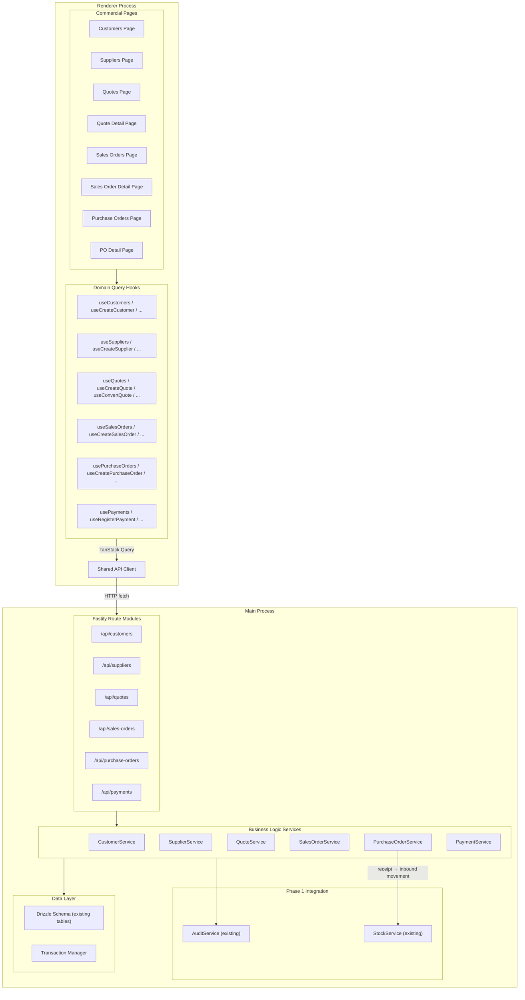
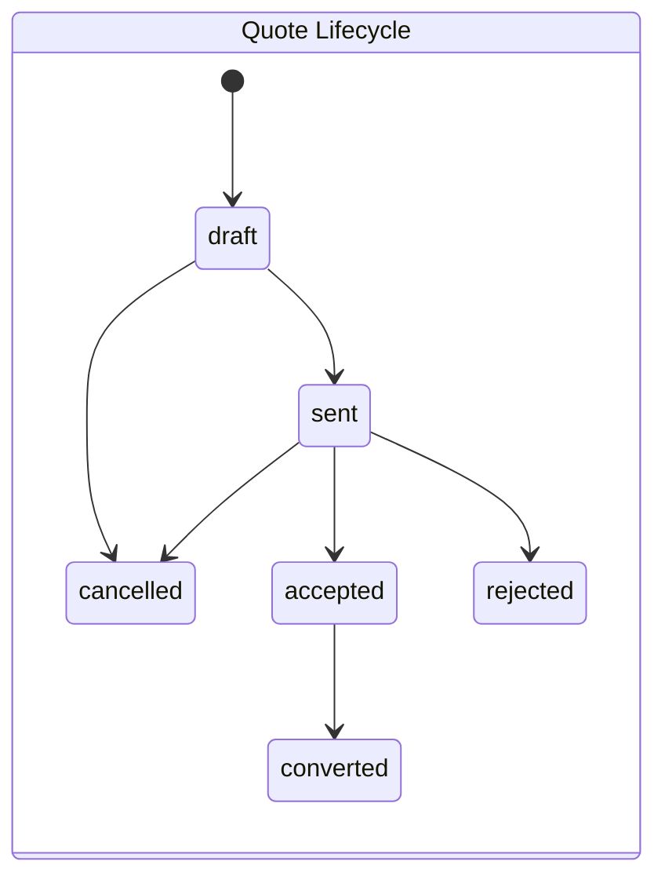
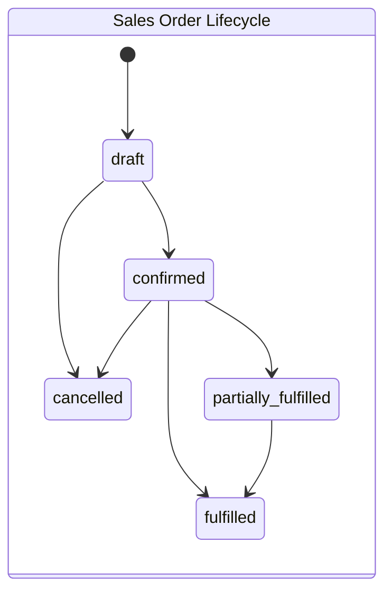
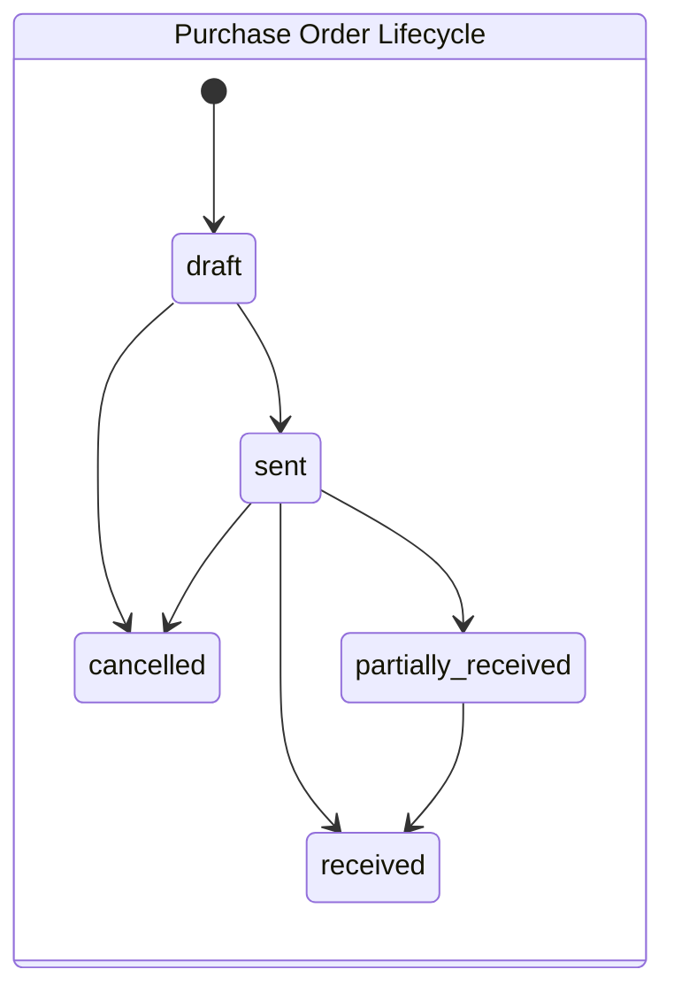
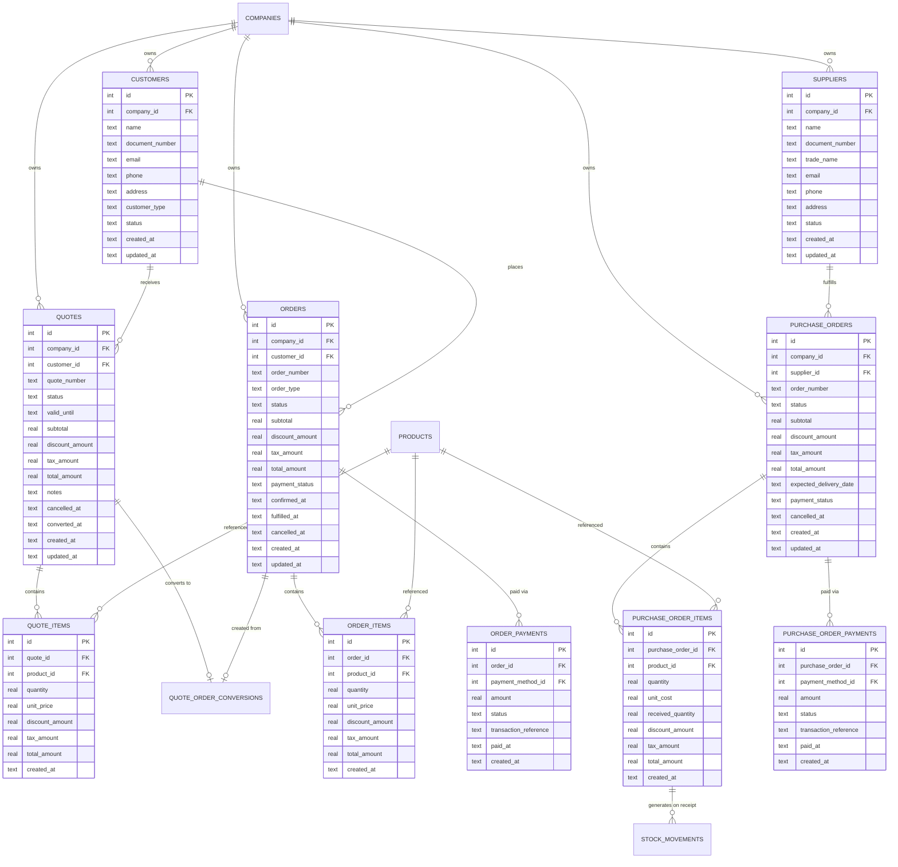

# Design Document: Phase 2 - Sales and Purchasing Flows

## Overview

Phase 2 delivers the commercial operations layer for Stockando Desktop, covering the complete sales cycle (customer management, quoting, quote-to-order conversion, sales order fulfillment) and procurement cycle (supplier management, purchase orders, partial receipts with inventory integration, payment tracking).

The module builds on Phase 0's foundation (Fastify HTTP API, SQLite via Drizzle ORM, TanStack Query/Router, shared UI primitives) and Phase 1's inventory system (stock movements, balance maintenance, transactional consistency). Commercial operations integrate with inventory through purchase order receipts that generate inbound stock movements.

Key architectural principles:

- **Atomic document operations**: Quote-to-order conversions and purchase receipts execute within a single SQLite transaction, preventing partial state.
- **Deterministic calculations**: Line totals and document totals are computed server-side using a consistent formula, stored with 2 decimal precision (half-up rounding).
- **Validated status transitions**: Document lifecycle is governed by explicit state machines — invalid transitions are rejected before any mutation.
- **Company-scoped isolation**: All commercial entities and queries are filtered by the active company ID.
- **Inventory integration**: Purchase order receipts delegate to Phase 1's StockService to generate inbound movements, maintaining the existing balance invariant.

## Architecture



### Key Design Decisions

1. **Reuse existing schema tables**: The database already defines `customers`, `suppliers`, `quotes`, `quoteItems`, `orders` (as sales orders), `orderItems`, `purchaseOrders`, `purchaseOrderItems`, `orderPayments`, and `quoteOrderConversions`. The service layer adapts to the existing column structure rather than migrating.

2. **Discount model — absolute amounts**: The existing schema stores `discountAmount` (absolute value) on item rows rather than a percentage. The line total formula becomes `(quantity × unitPrice) - discountAmount`. This is a per-item absolute discount, consistent across quotes, sales orders, and purchase orders.

3. **Document totals stored as `totalAmount`**: Each document (quote, order, purchase order) has `subtotal`, `discountAmount`, `taxAmount`, and `totalAmount` columns. The service layer recomputes these on every item mutation.

4. **Status transitions via ts-pattern**: Status transition validation uses `match` from `ts-pattern` with exhaustive checks, ensuring compile-time completeness when new statuses are added.

5. **Payment tracking through `orderPayments`**: The existing `orderPayments` table stores payments for sales orders. For purchase orders, a new `purchaseOrderPayments` table (or reusing `orderPayments` with a polymorphic reference) is needed. Given the existing schema has `orderPayments` referencing `orders.id`, we'll create a parallel `purchaseOrderPayments` table for purchase order payments to maintain clean foreign keys.

6. **Purchase receipts via `purchaseOrderItems.quantity` tracking**: The existing `purchaseOrderItems` table has a `quantity` field (ordered quantity). To track received quantities, a `receivedQuantity` column needs to be added. Receipt recording updates this field and calls StockService.recordInbound within the same transaction.

7. **Service layer for business logic**: Route handlers remain thin — all validation, calculation, and transaction orchestration lives in service functions.

8. **Pagination via limit/offset on all list endpoints**: Consistent with Phase 1, all commercial list endpoints accept `limit` and `offset` query parameters with a default page size of 20.

### Schema Adaptations Required

The existing schema covers most needs but requires minor additions:

| Change | Table | Description |
|--------|-------|-------------|
| Add column | `purchase_order_items` | `received_quantity REAL NOT NULL DEFAULT 0` — tracks partial receipts |
| New table | `purchase_order_payments` | Payment records for purchase orders (mirrors `order_payments` structure) |
| Add column | `orders` | `confirmed_at TEXT`, `fulfilled_at TEXT`, `cancelled_at TEXT` — lifecycle timestamps |
| Add column | `quotes` | `cancelled_at TEXT`, `converted_at TEXT` — lifecycle timestamps |
| Add column | `purchase_orders` | `cancelled_at TEXT` — lifecycle timestamp |

## Components and Interfaces

### Main Process — Route Modules

#### Customers API (`/api/customers`)

| Endpoint | Method | Purpose |
|----------|--------|---------|
| `/api/customers` | GET | Paginated customer list with search |
| `/api/customers` | POST | Create a new customer |
| `/api/customers/:id` | GET | Customer detail with document summary counts |
| `/api/customers/:id` | PUT | Update a customer |
| `/api/customers/:id` | DELETE | Delete a customer (if unreferenced) |

Query parameters for GET list:
- `limit` (default: 20), `offset` (default: 0)
- `search` (optional: matches name or documentNumber)
- `status` (optional filter: `active`, `inactive`)

#### Suppliers API (`/api/suppliers`)

| Endpoint | Method | Purpose |
|----------|--------|---------|
| `/api/suppliers` | GET | Paginated supplier list with search |
| `/api/suppliers` | POST | Create a new supplier |
| `/api/suppliers/:id` | GET | Supplier detail with purchase order summary counts |
| `/api/suppliers/:id` | PUT | Update a supplier |
| `/api/suppliers/:id` | DELETE | Delete a supplier (if unreferenced) |

Query parameters for GET list:
- `limit` (default: 20), `offset` (default: 0)
- `search` (optional: matches name or documentNumber)
- `status` (optional filter: `active`, `inactive`)

#### Quotes API (`/api/quotes`)

| Endpoint | Method | Purpose |
|----------|--------|---------|
| `/api/quotes` | GET | Paginated quote list with filters |
| `/api/quotes` | POST | Create a new quote with items |
| `/api/quotes/:id` | GET | Quote detail with items |
| `/api/quotes/:id` | PUT | Update quote (header + items) |
| `/api/quotes/:id/status` | PATCH | Transition quote status |
| `/api/quotes/:id/convert` | POST | Convert accepted quote to sales order |

Query parameters for GET list:
- `limit`, `offset`
- `customerId` (optional)
- `status` (optional)
- `search` (optional: matches quoteNumber)

#### Sales Orders API (`/api/sales-orders`)

| Endpoint | Method | Purpose |
|----------|--------|---------|
| `/api/sales-orders` | GET | Paginated sales order list with filters |
| `/api/sales-orders` | POST | Create a new sales order with items |
| `/api/sales-orders/:id` | GET | Sales order detail with items and payments |
| `/api/sales-orders/:id` | PUT | Update sales order (draft only) |
| `/api/sales-orders/:id/status` | PATCH | Transition sales order status |
| `/api/sales-orders/:id/payments` | GET | List payments for a sales order |
| `/api/sales-orders/:id/payments` | POST | Register a payment |

Query parameters for GET list:
- `limit`, `offset`
- `customerId` (optional)
- `status` (optional)
- `paymentStatus` (optional)
- `search` (optional: matches orderNumber)

#### Purchase Orders API (`/api/purchase-orders`)

| Endpoint | Method | Purpose |
|----------|--------|---------|
| `/api/purchase-orders` | GET | Paginated purchase order list with filters |
| `/api/purchase-orders` | POST | Create a new purchase order with items |
| `/api/purchase-orders/:id` | GET | Purchase order detail with items and payments |
| `/api/purchase-orders/:id` | PUT | Update purchase order (draft only) |
| `/api/purchase-orders/:id/status` | PATCH | Transition purchase order status |
| `/api/purchase-orders/:id/receive` | POST | Record receipt of items |
| `/api/purchase-orders/:id/payments` | GET | List payments for a purchase order |
| `/api/purchase-orders/:id/payments` | POST | Register a payment |

Query parameters for GET list:
- `limit`, `offset`
- `supplierId` (optional)
- `status` (optional)
- `paymentStatus` (optional)
- `search` (optional: matches orderNumber)

### Main Process — Service Layer

```typescript
// src/main/services/customer-service.ts
interface CustomerService {
  list(companyId: number, filters: CustomerListFilters): Promise<PaginatedResult<CustomerListItem>>
  detail(companyId: number, id: number): Promise<CustomerDetail>
  create(companyId: number, input: CreateCustomerInput): Promise<Customer>
  update(companyId: number, id: number, input: UpdateCustomerInput): Promise<Customer>
  delete(companyId: number, id: number): Promise<void>
}

// src/main/services/supplier-service.ts
interface SupplierService {
  list(companyId: number, filters: SupplierListFilters): Promise<PaginatedResult<SupplierListItem>>
  detail(companyId: number, id: number): Promise<SupplierDetail>
  create(companyId: number, input: CreateSupplierInput): Promise<Supplier>
  update(companyId: number, id: number, input: UpdateSupplierInput): Promise<Supplier>
  delete(companyId: number, id: number): Promise<void>
}

// src/main/services/quote-service.ts
interface QuoteService {
  list(companyId: number, filters: QuoteListFilters): Promise<PaginatedResult<QuoteListItem>>
  detail(companyId: number, id: number): Promise<QuoteDetail>
  create(companyId: number, input: CreateQuoteInput): Promise<QuoteDetail>
  update(companyId: number, id: number, input: UpdateQuoteInput): Promise<QuoteDetail>
  transitionStatus(companyId: number, id: number, targetStatus: QuoteStatus): Promise<Quote>
  convertToOrder(companyId: number, id: number): Promise<{ quote: Quote; salesOrder: SalesOrderDetail }>
}

// src/main/services/sales-order-service.ts
interface SalesOrderService {
  list(companyId: number, filters: SalesOrderListFilters): Promise<PaginatedResult<SalesOrderListItem>>
  detail(companyId: number, id: number): Promise<SalesOrderDetail>
  create(companyId: number, input: CreateSalesOrderInput): Promise<SalesOrderDetail>
  update(companyId: number, id: number, input: UpdateSalesOrderInput): Promise<SalesOrderDetail>
  transitionStatus(companyId: number, id: number, targetStatus: SalesOrderStatus): Promise<SalesOrder>
}

// src/main/services/purchase-order-service.ts
interface PurchaseOrderService {
  list(companyId: number, filters: PurchaseOrderListFilters): Promise<PaginatedResult<PurchaseOrderListItem>>
  detail(companyId: number, id: number): Promise<PurchaseOrderDetail>
  create(companyId: number, input: CreatePurchaseOrderInput): Promise<PurchaseOrderDetail>
  update(companyId: number, id: number, input: UpdatePurchaseOrderInput): Promise<PurchaseOrderDetail>
  transitionStatus(companyId: number, id: number, targetStatus: PurchaseOrderStatus): Promise<PurchaseOrder>
  recordReceipt(companyId: number, id: number, input: ReceiptInput): Promise<PurchaseOrderDetail>
}

// src/main/services/payment-service.ts
interface PaymentService {
  listForSalesOrder(companyId: number, orderId: number): Promise<PaymentSummary>
  listForPurchaseOrder(companyId: number, purchaseOrderId: number): Promise<PaymentSummary>
  registerForSalesOrder(companyId: number, orderId: number, input: RegisterPaymentInput): Promise<PaymentRecord>
  registerForPurchaseOrder(companyId: number, purchaseOrderId: number, input: RegisterPaymentInput): Promise<PaymentRecord>
}
```

### Status Transition State Machines







### Renderer — Query Hooks

```typescript
// Customer hooks
function useCustomers(companyId: number, filters: CustomerListFilters): UseQueryResult<PaginatedResult<CustomerListItem>>
function useCustomerDetail(companyId: number, id: number): UseQueryResult<CustomerDetail>
function useCreateCustomer(): UseMutationResult<Customer, ApiError, CreateCustomerInput>
function useUpdateCustomer(): UseMutationResult<Customer, ApiError, UpdateCustomerInput & { id: number }>
function useDeleteCustomer(): UseMutationResult<void, ApiError, number>

// Supplier hooks
function useSuppliers(companyId: number, filters: SupplierListFilters): UseQueryResult<PaginatedResult<SupplierListItem>>
function useSupplierDetail(companyId: number, id: number): UseQueryResult<SupplierDetail>
function useCreateSupplier(): UseMutationResult<Supplier, ApiError, CreateSupplierInput>
function useUpdateSupplier(): UseMutationResult<Supplier, ApiError, UpdateSupplierInput & { id: number }>
function useDeleteSupplier(): UseMutationResult<void, ApiError, number>

// Quote hooks
function useQuotes(companyId: number, filters: QuoteListFilters): UseQueryResult<PaginatedResult<QuoteListItem>>
function useQuoteDetail(companyId: number, id: number): UseQueryResult<QuoteDetail>
function useCreateQuote(): UseMutationResult<QuoteDetail, ApiError, CreateQuoteInput>
function useUpdateQuote(): UseMutationResult<QuoteDetail, ApiError, UpdateQuoteInput & { id: number }>
function useTransitionQuoteStatus(): UseMutationResult<Quote, ApiError, { id: number; status: QuoteStatus }>
function useConvertQuoteToOrder(): UseMutationResult<{ quote: Quote; salesOrder: SalesOrderDetail }, ApiError, number>

// Sales Order hooks
function useSalesOrders(companyId: number, filters: SalesOrderListFilters): UseQueryResult<PaginatedResult<SalesOrderListItem>>
function useSalesOrderDetail(companyId: number, id: number): UseQueryResult<SalesOrderDetail>
function useCreateSalesOrder(): UseMutationResult<SalesOrderDetail, ApiError, CreateSalesOrderInput>
function useUpdateSalesOrder(): UseMutationResult<SalesOrderDetail, ApiError, UpdateSalesOrderInput & { id: number }>
function useTransitionSalesOrderStatus(): UseMutationResult<SalesOrder, ApiError, { id: number; status: SalesOrderStatus }>

// Purchase Order hooks
function usePurchaseOrders(companyId: number, filters: PurchaseOrderListFilters): UseQueryResult<PaginatedResult<PurchaseOrderListItem>>
function usePurchaseOrderDetail(companyId: number, id: number): UseQueryResult<PurchaseOrderDetail>
function useCreatePurchaseOrder(): UseMutationResult<PurchaseOrderDetail, ApiError, CreatePurchaseOrderInput>
function useUpdatePurchaseOrder(): UseMutationResult<PurchaseOrderDetail, ApiError, UpdatePurchaseOrderInput & { id: number }>
function useTransitionPurchaseOrderStatus(): UseMutationResult<PurchaseOrder, ApiError, { id: number; status: PurchaseOrderStatus }>
function useRecordReceipt(): UseMutationResult<PurchaseOrderDetail, ApiError, { id: number; items: ReceiptItemInput[] }>

// Payment hooks
function useSalesOrderPayments(companyId: number, orderId: number): UseQueryResult<PaymentSummary>
function usePurchaseOrderPayments(companyId: number, purchaseOrderId: number): UseQueryResult<PaymentSummary>
function useRegisterSalesOrderPayment(): UseMutationResult<PaymentRecord, ApiError, { orderId: number } & RegisterPaymentInput>
function useRegisterPurchaseOrderPayment(): UseMutationResult<PaymentRecord, ApiError, { purchaseOrderId: number } & RegisterPaymentInput>
```

### Renderer — Page Components

| Page | Route | Purpose |
|------|-------|---------|
| CustomersPage | `/customers` | Paginated customer list with search |
| CustomerDetailPage | `/customers/:id` | Customer detail with quote/order summaries |
| SuppliersPage | `/suppliers` | Paginated supplier list with search |
| SupplierDetailPage | `/suppliers/:id` | Supplier detail with PO summaries |
| QuotesPage | `/quotes` | Paginated quote list with filters |
| QuoteDetailPage | `/quotes/:id` | Quote editor with items, status actions, convert |
| SalesOrdersPage | `/sales-orders` | Paginated sales order list with filters |
| SalesOrderDetailPage | `/sales-orders/:id` | Order editor with items, status, payments |
| PurchaseOrdersPage | `/purchase-orders` | Paginated PO list with filters |
| PurchaseOrderDetailPage | `/purchase-orders/:id` | PO editor with items, receipts, payments |

### Renderer — Shared Components (new or extended)

| Component | Purpose |
|-----------|---------|
| DocumentItemsEditor | Reusable multi-item line editor (add, edit, remove) with live total |
| StatusBadge | Colored badge displaying document lifecycle status |
| StatusTransitionActions | Contextual action buttons for valid status transitions |
| PaymentForm | Payment registration form with amount validation |
| PaymentHistory | Payment list with running balance display |
| ReceiptForm | Item receipt quantity entry with validation |

## Data Models

### Entity Relationships



### Type Definitions

```typescript
// === Status Types (as const discriminants) ===

const QUOTE_STATUSES = {
  draft: 'draft',
  sent: 'sent',
  accepted: 'accepted',
  rejected: 'rejected',
  converted: 'converted',
  cancelled: 'cancelled',
} as const

type QuoteStatus = (typeof QUOTE_STATUSES)[keyof typeof QUOTE_STATUSES]

const SALES_ORDER_STATUSES = {
  draft: 'draft',
  confirmed: 'confirmed',
  partially_fulfilled: 'partially_fulfilled',
  fulfilled: 'fulfilled',
  cancelled: 'cancelled',
} as const

type SalesOrderStatus = (typeof SALES_ORDER_STATUSES)[keyof typeof SALES_ORDER_STATUSES]

const PURCHASE_ORDER_STATUSES = {
  draft: 'draft',
  sent: 'sent',
  partially_received: 'partially_received',
  received: 'received',
  cancelled: 'cancelled',
} as const

type PurchaseOrderStatus = (typeof PURCHASE_ORDER_STATUSES)[keyof typeof PURCHASE_ORDER_STATUSES]

const PAYMENT_STATUSES = {
  unpaid: 'unpaid',
  partially_paid: 'partially_paid',
  paid: 'paid',
} as const

type PaymentStatus = (typeof PAYMENT_STATUSES)[keyof typeof PAYMENT_STATUSES]

// === Inferred Schema Types ===

type Customer = typeof customers.$inferSelect
type Supplier = typeof suppliers.$inferSelect
type Quote = typeof quotes.$inferSelect
type QuoteItem = typeof quoteItems.$inferSelect
type SalesOrder = typeof orders.$inferSelect
type OrderItem = typeof orderItems.$inferSelect
type PurchaseOrder = typeof purchaseOrders.$inferSelect
type PurchaseOrderItem = typeof purchaseOrderItems.$inferSelect
type OrderPayment = typeof orderPayments.$inferSelect

// === API Request Types ===

interface CreateCustomerInput {
  name: string
  documentNumber?: string | null
  email?: string | null
  phone?: string | null
  address?: string | null
  customerType?: 'individual' | 'business'
}

interface UpdateCustomerInput {
  name?: string
  documentNumber?: string | null
  email?: string | null
  phone?: string | null
  address?: string | null
  status?: 'active' | 'inactive'
}

interface CreateSupplierInput {
  name: string
  documentNumber: string
  tradeName?: string | null
  email?: string | null
  phone?: string | null
  address?: string | null
}

interface UpdateSupplierInput {
  name?: string
  tradeName?: string | null
  email?: string | null
  phone?: string | null
  address?: string | null
  status?: 'active' | 'inactive'
}

interface QuoteItemInput {
  productId: number
  quantity: number
  unitPrice: number
  discountAmount?: number
}

interface CreateQuoteInput {
  customerId: number
  validUntil?: string | null
  notes?: string | null
  items: QuoteItemInput[]
}

interface UpdateQuoteInput {
  customerId?: number
  validUntil?: string | null
  notes?: string | null
  items?: QuoteItemInput[]
}

interface OrderItemInput {
  productId: number
  quantity: number
  unitPrice: number
  discountAmount?: number
}

interface CreateSalesOrderInput {
  customerId: number
  items: OrderItemInput[]
}

interface UpdateSalesOrderInput {
  customerId?: number
  items?: OrderItemInput[]
}

interface PurchaseOrderItemInput {
  productId: number
  quantity: number
  unitCost: number
  discountAmount?: number
}

interface CreatePurchaseOrderInput {
  supplierId: number
  expectedDeliveryDate?: string | null
  items: PurchaseOrderItemInput[]
}

interface UpdatePurchaseOrderInput {
  supplierId?: number
  expectedDeliveryDate?: string | null
  items?: PurchaseOrderItemInput[]
}

interface ReceiptItemInput {
  purchaseOrderItemId: number
  receivedQuantity: number
  warehouseId: number
}

interface ReceiptInput {
  items: ReceiptItemInput[]
  notes?: string
}

interface RegisterPaymentInput {
  paymentMethodId: number
  amount: number
  transactionReference?: string | null
  paidAt: string
}

// === API Response Types ===

interface CustomerListItem {
  id: number
  name: string
  documentNumber: string | null
  email: string | null
  phone: string | null
  status: string
}

interface CustomerDetail extends Customer {
  quoteCount: number
  salesOrderCount: number
}

interface SupplierListItem {
  id: number
  name: string
  documentNumber: string
  tradeName: string | null
  email: string | null
  status: string
}

interface SupplierDetail extends Supplier {
  purchaseOrderCount: number
}

interface QuoteListItem {
  id: number
  quoteNumber: string
  customerName: string
  status: QuoteStatus
  totalAmount: number
  validUntil: string | null
  createdAt: string
}

interface QuoteDetail extends Quote {
  customerName: string
  items: (QuoteItem & { productName: string; productSku: string })[]
}

interface SalesOrderListItem {
  id: number
  orderNumber: string
  customerName: string
  status: SalesOrderStatus
  totalAmount: number
  paymentStatus: PaymentStatus
  createdAt: string
}

interface SalesOrderDetail extends SalesOrder {
  customerName: string
  items: (OrderItem & { productName: string; productSku: string })[]
  payments: OrderPayment[]
  totalPaid: number
  remainingBalance: number
}

interface PurchaseOrderListItem {
  id: number
  orderNumber: string
  supplierName: string
  status: PurchaseOrderStatus
  totalAmount: number
  paymentStatus: PaymentStatus
  expectedDeliveryDate: string | null
  createdAt: string
}

interface PurchaseOrderDetail extends PurchaseOrder {
  supplierName: string
  items: (PurchaseOrderItem & { productName: string; productSku: string; receivedQuantity: number })[]
  payments: PurchaseOrderPayment[]
  totalPaid: number
  remainingBalance: number
}

interface PaymentRecord {
  id: number
  amount: number
  paymentMethodId: number
  transactionReference: string | null
  paidAt: string
  createdAt: string
}

interface PaymentSummary {
  payments: PaymentRecord[]
  documentTotal: number
  totalPaid: number
  remainingBalance: number
  paymentStatus: PaymentStatus
}

// === Pagination & Filters ===

interface CustomerListFilters extends Pagination {
  search?: string
  status?: string
}

interface SupplierListFilters extends Pagination {
  search?: string
  status?: string
}

interface QuoteListFilters extends Pagination {
  customerId?: number
  status?: QuoteStatus
  search?: string
}

interface SalesOrderListFilters extends Pagination {
  customerId?: number
  status?: SalesOrderStatus
  paymentStatus?: PaymentStatus
  search?: string
}

interface PurchaseOrderListFilters extends Pagination {
  supplierId?: number
  status?: PurchaseOrderStatus
  paymentStatus?: PaymentStatus
  search?: string
}

interface Pagination {
  limit: number
  offset: number
}

interface PaginatedResult<T> {
  data: T[]
  total: number
  limit: number
  offset: number
}
```

### Line Total Calculation Logic

```typescript
/**
 * Computes the line total for a sales/quote item.
 * Formula: (quantity × unitPrice) - discountAmount
 * Rounded to 2 decimal places (half-up).
 */
function computeSalesLineTotal(quantity: number, unitPrice: number, discountAmount: number): number {
  const raw = quantity * unitPrice - discountAmount
  return roundHalfUp(raw, 2)
}

/**
 * Computes the line total for a purchase order item.
 * Formula: (quantity × unitCost) - discountAmount
 * Rounded to 2 decimal places (half-up).
 */
function computePurchaseLineTotal(quantity: number, unitCost: number, discountAmount: number): number {
  const raw = quantity * unitCost - discountAmount
  return roundHalfUp(raw, 2)
}

/**
 * Computes document totals from item rows.
 * subtotal = sum of (quantity × unitPrice) for each item
 * discountAmount = sum of item discount amounts
 * totalAmount = subtotal - discountAmount (+ taxAmount when applicable)
 */
function computeDocumentTotals(items: readonly { quantity: number; unitPrice: number; discountAmount: number; taxAmount: number }[]): DocumentTotals {
  const subtotal = roundHalfUp(items.reduce((sum, item) => sum + item.quantity * item.unitPrice, 0), 2)
  const discountAmount = roundHalfUp(items.reduce((sum, item) => sum + item.discountAmount, 0), 2)
  const taxAmount = roundHalfUp(items.reduce((sum, item) => sum + item.taxAmount, 0), 2)
  const totalAmount = roundHalfUp(subtotal - discountAmount + taxAmount, 2)
  return { subtotal, discountAmount, taxAmount, totalAmount }
}

/**
 * Round half-up to the specified number of decimal places.
 */
function roundHalfUp(value: number, decimals: number): number {
  const factor = Math.pow(10, decimals)
  return Math.round(value * factor + Number.EPSILON) / factor
}
```

### Status Transition Validation

```typescript
import { match } from 'ts-pattern'

const VALID_QUOTE_TRANSITIONS: Record<QuoteStatus, readonly QuoteStatus[]> = {
  draft: ['sent', 'cancelled'],
  sent: ['accepted', 'rejected', 'cancelled'],
  accepted: ['converted'],
  rejected: [],
  converted: [],
  cancelled: [],
} as const

const VALID_SALES_ORDER_TRANSITIONS: Record<SalesOrderStatus, readonly SalesOrderStatus[]> = {
  draft: ['confirmed', 'cancelled'],
  confirmed: ['partially_fulfilled', 'fulfilled', 'cancelled'],
  partially_fulfilled: ['fulfilled'],
  fulfilled: [],
  cancelled: [],
} as const

const VALID_PURCHASE_ORDER_TRANSITIONS: Record<PurchaseOrderStatus, readonly PurchaseOrderStatus[]> = {
  draft: ['sent', 'cancelled'],
  sent: ['partially_received', 'received', 'cancelled'],
  partially_received: ['received'],
  received: [],
  cancelled: [],
} as const

function validateTransition<T extends string>(
  currentStatus: T,
  targetStatus: T,
  validTransitions: Record<T, readonly T[]>
): { valid: true } | { valid: false; allowed: readonly T[] } {
  const allowed = validTransitions[currentStatus]
  if (allowed.includes(targetStatus)) {
    return { valid: true }
  }
  return { valid: false, allowed }
}
```

### Quote-to-Order Conversion (Transaction Flow)

```typescript
async function convertQuoteToOrder(db: DrizzleDB, companyId: number, quoteId: number): Promise<ConversionResult> {
  return db.transaction(async (tx) => {
    // 1. Load quote and validate status is "accepted"
    const quote = await loadQuote(tx, companyId, quoteId)
    if (quote.status !== 'accepted') {
      throw new BusinessError('INVALID_STATUS', 'Quote must be in accepted status to convert')
    }

    // 2. Load quote items
    const items = await loadQuoteItems(tx, quoteId)

    // 3. Generate sales order number
    const orderNumber = await generateNextNumber(tx, companyId, 'sales_order')

    // 4. Create sales order with items copied from quote
    const salesOrder = await tx.insert(orders).values({
      companyId,
      customerId: quote.customerId,
      orderNumber,
      orderType: 'sale',
      status: 'draft',
      subtotal: quote.subtotal,
      discountAmount: quote.discountAmount,
      taxAmount: quote.taxAmount,
      totalAmount: quote.totalAmount,
      paymentStatus: 'pending',
      createdAt: now(),
      updatedAt: now(),
    }).returning()

    // 5. Copy items
    for (const item of items) {
      await tx.insert(orderItems).values({
        orderId: salesOrder[0].id,
        productId: item.productId,
        quantity: item.quantity,
        unitPrice: item.unitPrice,
        discountAmount: item.discountAmount,
        taxAmount: item.taxAmount,
        totalAmount: item.totalAmount,
        createdAt: now(),
      })
    }

    // 6. Record conversion link
    await tx.insert(quoteOrderConversions).values({
      quoteId,
      orderId: salesOrder[0].id,
      convertedAt: now(),
      createdAt: now(),
    })

    // 7. Update quote status to "converted"
    await tx.update(quotes)
      .set({ status: 'converted', convertedAt: now(), updatedAt: now() })
      .where(eq(quotes.id, quoteId))

    // 8. Audit log
    await auditLog(tx, companyId, 'quote', quoteId, 'converted', { salesOrderId: salesOrder[0].id })

    return { quote: updatedQuote, salesOrder: salesOrder[0] }
  })
}
```

### Purchase Order Receipt (Transaction Flow)

```typescript
async function recordReceipt(
  db: DrizzleDB,
  companyId: number,
  purchaseOrderId: number,
  input: ReceiptInput,
  stockService: StockService
): Promise<PurchaseOrderDetail> {
  return db.transaction(async (tx) => {
    // 1. Load PO and validate status is "sent" or "partially_received"
    const po = await loadPurchaseOrder(tx, companyId, purchaseOrderId)
    if (po.status !== 'sent' && po.status !== 'partially_received') {
      throw new BusinessError('INVALID_STATUS', 'PO must be in sent or partially_received status')
    }

    // 2. Load PO items
    const poItems = await loadPurchaseOrderItems(tx, purchaseOrderId)

    // 3. Validate and apply received quantities
    for (const receiptItem of input.items) {
      const poItem = poItems.find(i => i.id === receiptItem.purchaseOrderItemId)
      if (!poItem) throw new BusinessError('NOT_FOUND', 'PO item not found')

      const newReceived = poItem.receivedQuantity + receiptItem.receivedQuantity
      if (newReceived > poItem.quantity) {
        throw new BusinessError('EXCEEDS_ORDERED', `Received quantity would exceed ordered for item ${poItem.id}`)
      }

      // Update received quantity
      await tx.update(purchaseOrderItems)
        .set({ receivedQuantity: newReceived })
        .where(eq(purchaseOrderItems.id, poItem.id))

      // Generate inbound stock movement via StockService
      await stockService.recordInbound(companyId, {
        productId: poItem.productId,
        warehouseId: receiptItem.warehouseId,
        quantity: receiptItem.receivedQuantity,
        unitCost: poItem.unitCost,
        referenceType: 'purchase_order',
        referenceId: String(purchaseOrderId),
        notes: input.notes,
      })
    }

    // 4. Determine new status
    const updatedItems = await loadPurchaseOrderItems(tx, purchaseOrderId)
    const allReceived = updatedItems.every(i => i.receivedQuantity >= i.quantity)
    const anyReceived = updatedItems.some(i => i.receivedQuantity > 0)

    const newStatus = allReceived ? 'received' : anyReceived ? 'partially_received' : po.status

    // 5. Update PO status
    await tx.update(purchaseOrders)
      .set({ status: newStatus, updatedAt: now() })
      .where(eq(purchaseOrders.id, purchaseOrderId))

    // 6. Audit log
    await auditLog(tx, companyId, 'purchase_order', purchaseOrderId, `receipt:${po.status}→${newStatus}`)

    return loadPurchaseOrderDetail(tx, companyId, purchaseOrderId)
  })
}
```

## Correctness Properties

*A property is a characteristic or behavior that should hold true across all valid executions of a system — essentially, a formal statement about what the system should do. Properties serve as the bridge between human-readable specifications and machine-verifiable correctness guarantees.*

### Property 1: Line total determinism

*For any* item line with quantity > 0, unitPrice > 0, and discountAmount >= 0, the computed line total SHALL equal `roundHalfUp((quantity × unitPrice) - discountAmount, 2)` and this result SHALL be identical regardless of the order items are processed.

**Validates: Requirements 3.3, 6.3, 8.2, 11.1, 11.2, 11.4**

### Property 2: Document total equals sum of line totals

*For any* document (quote, sales order, or purchase order) with one or more items, the persisted `totalAmount` SHALL equal `subtotal - discountAmount + taxAmount`, where `subtotal` is the sum of `(quantity × unitPrice)` for each item, `discountAmount` is the sum of item discount amounts, and `taxAmount` is the sum of item tax amounts — all rounded to 2 decimal places.

**Validates: Requirements 3.4, 6.4, 8.3, 11.3, 11.5**

### Property 3: Quote status transition validity

*For any* quote in a given status, only the transitions defined in the valid transition map SHALL succeed. All other status change requests SHALL be rejected, leaving the quote unchanged.

**Validates: Requirements 4.1, 4.2**

### Property 4: Sales order status transition validity

*For any* sales order in a given status, only the transitions defined in the valid transition map SHALL succeed. All other status change requests SHALL be rejected, leaving the order unchanged.

**Validates: Requirements 7.1, 7.2**

### Property 5: Purchase order status transition validity

*For any* purchase order in a given status, only the transitions defined in the valid transition map SHALL succeed. All other status change requests SHALL be rejected, leaving the purchase order unchanged.

**Validates: Requirements 8.6, 8.7**

### Property 6: Quote-to-order conversion preserves items

*For any* quote in "accepted" status with N items, after conversion the resulting sales order SHALL contain exactly N items with the same productId, quantity, unitPrice, discountAmount, and totalAmount as the original quote items, and the sales order totalAmount SHALL equal the quote totalAmount.

**Validates: Requirements 5.1, 5.3**

### Property 7: Quote-to-order conversion atomicity

*For any* quote-to-order conversion that fails at any intermediate step, the quote status SHALL remain "accepted", no sales order SHALL exist for that quote, and no conversion record SHALL be created.

**Validates: Requirements 5.5, 5.6**

### Property 8: Receipt does not exceed ordered quantity

*For any* sequence of receipt operations on a purchase order item, the cumulative received quantity SHALL never exceed the ordered quantity.

**Validates: Requirements 9.5**

### Property 9: Receipt generates matching stock movements

*For any* receipt recording with K items, exactly K inbound stock movements SHALL be created, each with the correct productId, warehouseId, quantity, and a reference to the purchase order.

**Validates: Requirements 9.2**

### Property 10: Receipt status auto-transition

*For any* purchase order, when a receipt causes all items to have receivedQuantity equal to ordered quantity, the status SHALL be "received". When at least one item has receivedQuantity > 0 but not all are fully received, the status SHALL be "partially_received".

**Validates: Requirements 9.3, 9.4**

### Property 11: Payment cannot exceed document total

*For any* order (sales or purchase), the sum of all registered payment amounts SHALL never exceed the document's totalAmount.

**Validates: Requirements 10.4**

### Property 12: Payment status derivation

*For any* order with payments, the payment status SHALL be "unpaid" when total paid is 0, "partially_paid" when total paid is between 0 and totalAmount (exclusive), and "paid" when total paid equals totalAmount.

**Validates: Requirements 10.6**

### Property 13: Company data isolation

*For any* two distinct companies A and B, a query executed in company A's context SHALL NOT return customers, suppliers, quotes, orders, or purchase orders belonging to company B.

**Validates: Requirements 12.1, 12.2, 12.3, 12.4**

### Property 14: Referential integrity on deletion

*For any* customer referenced by quotes or sales orders, deletion SHALL be rejected and the database SHALL remain unchanged. *For any* supplier referenced by purchase orders, deletion SHALL be rejected and the database SHALL remain unchanged.

**Validates: Requirements 1.6, 2.6**

### Property 15: Duplicate document number rejection

*For any* customer creation with a documentNumber that already exists for the same company, the operation SHALL be rejected with a conflict error. The same applies to supplier documentNumber uniqueness per company.

**Validates: Requirements 1.2, 2.2**

### Property 16: Editable only in draft/allowed status

*For any* quote not in "draft" or "sent" status, update requests SHALL be rejected. *For any* sales order not in "draft" status, update requests SHALL be rejected. *For any* purchase order not in "draft" status, update requests SHALL be rejected.

**Validates: Requirements 3.6, 6.6, 8.5**

## Error Handling

### Error Classification

| Category | HTTP Status | Scenario | User Experience |
|----------|-------------|----------|-----------------|
| Validation | 400 | Missing required fields, invalid format, zero/negative amounts | Inline field errors |
| Not Found | 404 | Entity doesn't exist or belongs to another company | Toast notification |
| Conflict | 409 | Duplicate documentNumber for customer/supplier | Inline error on field |
| Business Rule | 422 | Invalid status transition, receipt exceeds ordered, payment exceeds total, edit on non-editable status | Toast with explanation |
| System | 500 | Database failure, unexpected error | Error notification + retry |

### Error Response Format

All errors follow the standard API envelope:

```typescript
interface ApiErrorResponse {
  success: false
  error: {
    code: string
    message: string
    fields?: Record<string, string>
  }
}
```

Error codes for Phase 2:

| Code | Meaning |
|------|---------|
| `VALIDATION_ERROR` | Input failed validation (missing fields, invalid format) |
| `NOT_FOUND` | Entity not found in active company scope |
| `CONFLICT` | Duplicate natural key (documentNumber) |
| `INVALID_STATUS_TRANSITION` | Requested transition not allowed from current status |
| `DOCUMENT_NOT_EDITABLE` | Document is past editable status |
| `RECEIPT_EXCEEDS_ORDERED` | Received quantity would exceed ordered quantity |
| `PAYMENT_EXCEEDS_TOTAL` | Payment would cause overpayment |
| `INVALID_PAYMENT_AMOUNT` | Zero or negative payment amount |
| `ENTITY_REFERENCED` | Cannot delete — entity has dependent documents |
| `INVALID_ITEM` | Item quantity or price is zero/negative |
| `CONVERSION_INVALID_STATUS` | Quote not in "accepted" status for conversion |
| `SYSTEM_ERROR` | Unexpected internal failure |

### Error Handling by Layer

**Service Layer (Main Process)**:
- Validate all inputs before starting transactions
- Map database constraint violations (UNIQUE, FOREIGN KEY) to structured error codes
- Validate status transitions before attempting mutations
- Validate payment amounts against remaining balance before creating records
- Never expose raw SQLite errors to the API consumer

**Route Layer (Fastify)**:
- Return structured `ApiErrorResponse` with correct HTTP status
- Log full error context (stack trace, parameters) in development
- Validate request parameters and body before delegating to services

**Renderer (React)**:
- TanStack Query `onError` callbacks display Sonner toasts for system/business errors
- Form mutations display inline validation errors using the `fields` map
- Confirmation dialogs for destructive actions and quote-to-order conversion
- Loading states shown during mutations to prevent double-submission
- Optimistic updates only for safe read-after-write patterns (not for status transitions or financial operations)

### Critical Error Paths

1. **Invalid status transition**: Return `INVALID_STATUS_TRANSITION` with current status and list of allowed transitions
2. **Receipt exceeds ordered**: Return `RECEIPT_EXCEEDS_ORDERED` with item details showing ordered vs already received
3. **Payment exceeds total**: Return `PAYMENT_EXCEEDS_TOTAL` with document total and current paid amount
4. **Duplicate document number**: Return `CONFLICT` identifying the conflicting field
5. **Conversion on wrong status**: Return `CONVERSION_INVALID_STATUS` with current quote status
6. **Transaction failure mid-operation**: Full rollback, return `SYSTEM_ERROR` with operation context

## Architectural Conventions

All cross-cutting implementation conventions are defined in the Phase 0 design document (`.kiro/specs/phase-0-foundation/design.md` — "Architectural Conventions" section). Apply all rules from that section when implementing Phase 2 tasks. The conventions cover:

1. **Feature-Sliced Design** — pages/ + shared/ structure, domain-based naming
2. **Error Handling** — AppError hierarchy, Result<T,E>, no silent swallowing
3. **Zod Validation** — Schema-first at boundaries, z.infer for types
4. **TanStack Query** — Key factories with company prefix, custom hooks only
5. **Compound Components** — Context + guard hook + Provider pattern
6. **TypeScript Advanced Types** — Discriminated unions, branded types, satisfies

### Phase 2 Specific Guidance

**FSD Structure for Commercial Pages:**
```
src/renderer/src/pages/
  customers/
    ui/customers-page.tsx
    ui/customer-detail-page.tsx
    api/use-customers.ts
    model/customer.ts
  suppliers/
    ui/suppliers-page.tsx
    ui/supplier-detail-page.tsx
    api/use-suppliers.ts
    model/supplier.ts
  quotes/
    ui/quotes-page.tsx
    ui/quote-detail-page.tsx
    api/use-quotes.ts
    model/quote.ts
  sales-orders/
    ui/sales-orders-page.tsx
    ui/sales-order-detail-page.tsx
    api/use-sales-orders.ts
    api/use-payments.ts
    model/sales-order.ts
  purchase-orders/
    ui/purchase-orders-page.tsx
    ui/purchase-order-detail-page.tsx
    api/use-purchase-orders.ts
    model/purchase-order.ts
```

**Zod Schemas for Status Transitions:**
```typescript
// src/main/routes/quotes/schema.ts
import { z } from 'zod'

export const quoteStatus = z.enum(['draft', 'sent', 'accepted', 'rejected', 'converted', 'cancelled'])
export type QuoteStatus = z.infer<typeof quoteStatus>

export const transitionQuoteStatusSchema = z.object({
  targetStatus: quoteStatus,
}).strict()

export const createQuoteSchema = z.object({
  customerId: z.number().int().positive(),
  validUntil: z.string().datetime().optional().nullable(),
  notes: z.string().max(1000).optional().nullable(),
  items: z.array(z.object({
    productId: z.number().int().positive(),
    quantity: z.number().positive(),
    unitPrice: z.number().positive(),
    discountAmount: z.number().nonnegative().default(0),
  })).min(1),
}).strict()

export type CreateQuoteInput = z.infer<typeof createQuoteSchema>
```

**TanStack Query Key Factories:**
```typescript
export const quoteKeys = {
  all: (companyId: number) => [companyId, 'quotes'] as const,
  lists: (companyId: number) => [...quoteKeys.all(companyId), 'list'] as const,
  list: (companyId: number, filters: QuoteListFilters) => [...quoteKeys.lists(companyId), filters] as const,
  details: (companyId: number) => [...quoteKeys.all(companyId), 'detail'] as const,
  detail: (companyId: number, id: number) => [...quoteKeys.details(companyId), id] as const,
}

export const salesOrderKeys = {
  all: (companyId: number) => [companyId, 'sales-orders'] as const,
  lists: (companyId: number) => [...salesOrderKeys.all(companyId), 'list'] as const,
  list: (companyId: number, filters: SalesOrderListFilters) => [...salesOrderKeys.lists(companyId), filters] as const,
  details: (companyId: number) => [...salesOrderKeys.all(companyId), 'detail'] as const,
  detail: (companyId: number, id: number) => [...salesOrderKeys.details(companyId), id] as const,
}

export const purchaseOrderKeys = {
  all: (companyId: number) => [companyId, 'purchase-orders'] as const,
  lists: (companyId: number) => [...purchaseOrderKeys.all(companyId), 'list'] as const,
  list: (companyId: number, filters: PurchaseOrderListFilters) => [...purchaseOrderKeys.lists(companyId), filters] as const,
  details: (companyId: number) => [...purchaseOrderKeys.all(companyId), 'detail'] as const,
  detail: (companyId: number, id: number) => [...purchaseOrderKeys.details(companyId), id] as const,
}
```

**Compound Component — DocumentItemsEditor:**
The `DocumentItemsEditor` is a compound component used across quotes, sales orders, and purchase orders:
```typescript
// shared/ui/document-items-editor/index.ts
export const DocumentItemsEditor = Object.assign(DocumentItemsEditorRoot, {
  Header: DocumentItemsHeader,
  Row: DocumentItemsRow,
  AddButton: DocumentItemsAddButton,
  Totals: DocumentItemsTotals,
})
```

Context value: `{ state: { items, documentTotals }, actions: { addItem, updateItem, removeItem }, meta: {} }`

Since this component is used across 3+ pages (quotes, sales orders, purchase orders), it lives in `shared/ui/` per FSD rules.

**Status Transition Validation with satisfies:**
```typescript
const VALID_QUOTE_TRANSITIONS = {
  draft: ['sent', 'cancelled'],
  sent: ['accepted', 'rejected', 'cancelled'],
  accepted: ['converted'],
  rejected: [],
  converted: [],
  cancelled: [],
} as const satisfies Record<QuoteStatus, readonly QuoteStatus[]>
```

**Error Handling for Conversions:**
- `BusinessRuleError('CONVERSION_INVALID_STATUS', ...)` for wrong-status conversion attempts
- `BusinessRuleError('INVALID_STATUS_TRANSITION', ...)` with current status and allowed transitions in details
- `BusinessRuleError('RECEIPT_EXCEEDS_ORDERED', ...)` with item details
- `BusinessRuleError('PAYMENT_EXCEEDS_TOTAL', ...)` with document total and current paid amount
- No optimistic updates for status transitions, conversions, or payment operations

## Testing Strategy

### Unit Tests

- **CustomerService**: CRUD operations, duplicate documentNumber rejection, deletion with references, pagination, search filtering
- **SupplierService**: CRUD operations, duplicate documentNumber rejection, deletion with references, pagination, search filtering
- **QuoteService**: Create with items, update items (recalculate totals), status transitions (all valid/invalid paths), editability guards
- **SalesOrderService**: Create with items, update items, status transitions, editability guards
- **PurchaseOrderService**: Create with items, update items, status transitions, receipt recording, editability guards
- **PaymentService**: Register payment, reject overpayment, reject zero/negative, payment status derivation
- **Quote-to-order conversion**: Full happy path, wrong status rejection, transaction rollback on failure, item copying fidelity
- **Receipt recording**: Partial receipt, full receipt, over-receipt rejection, stock movement creation, status auto-transition
- **Calculation functions**: Line total computation, document total computation, rounding behavior for edge cases
- **Status transition validation**: All valid transitions, all invalid transitions for each document type
- **Company scoping**: Query filtering, cross-company access rejection

### Integration Tests

- **Full quote lifecycle**: Create quote → add items → send → accept → convert → verify sales order
- **Full purchase lifecycle**: Create PO → send → partial receipt → full receipt → verify stock movements
- **Payment flow**: Create order → confirm → register partial payment → verify remaining → register full → verify paid status
- **Conversion atomicity**: Inject failure mid-conversion → verify quote unchanged, no orphan order
- **Receipt atomicity**: Inject failure mid-receipt → verify PO items unchanged, no orphan stock movements
- **Deletion guards**: Attempt to delete customer with orders, supplier with POs — verify rejection
- **Cross-company isolation**: Create data in company A, query from company B — verify empty results
- **Pagination**: Verify correct page sizes, total counts, and offset handling

### Property-Based Tests

Using `fast-check` for the correctness properties defined above:

- **Property 1 (Line total determinism)**: Generate random quantity/price/discount combinations, verify computation matches formula exactly
- **Property 2 (Document total = sum of lines)**: Generate random item arrays, verify document total equals recomputed sum
- **Property 3-5 (Status transitions)**: Generate random status and target status pairs, verify acceptance/rejection matches the transition map
- **Property 6 (Conversion preserves items)**: Generate random quote item sets, convert, verify all fields preserved in resulting order
- **Property 7 (Conversion atomicity)**: Generate quote then simulate failures at various transaction steps, verify clean state
- **Property 8 (Receipt ≤ ordered)**: Generate sequences of receipt amounts for a PO item, verify total never exceeds ordered
- **Property 9 (Receipt → movements)**: Generate receipt operations, verify exact matching stock movements
- **Property 10 (Receipt auto-transition)**: Generate PO with items and receipt sequences, verify status matches expected state
- **Property 11 (Payment ≤ total)**: Generate payment sequences, verify cumulative sum never exceeds document total
- **Property 12 (Payment status)**: Generate payment sequences, verify derived status matches expected classification
- **Property 13 (Company isolation)**: Generate operations for multiple companies, verify cross-company queries return empty
- **Property 14 (Referential integrity)**: Create customers/suppliers with dependent documents, attempt deletion, verify rejection
- **Property 15 (Duplicate rejection)**: Generate entities with duplicate keys, verify conflict errors
- **Property 16 (Editability guards)**: Generate documents in various statuses, attempt updates, verify only draft/allowed succeeds

Each property test runs minimum 100 iterations.

Tag format: **Feature: phase-2-sales-purchasing, Property {number}: {property_text}**

### Component Tests (Renderer)

- **CustomersPage**: List rendering, search filtering, create/edit forms, delete confirmation with dependency warning
- **SuppliersPage**: List rendering, search filtering, create/edit forms, delete confirmation
- **QuotesPage / QuoteDetailPage**: Document editor with item lines, live total display, status actions, convert button (only on accepted)
- **SalesOrdersPage / SalesOrderDetailPage**: Document editor, status progression, payment registration, payment history
- **PurchaseOrdersPage / PurchaseOrderDetailPage**: Document editor, status progression, receipt form, payment registration
- **DocumentItemsEditor**: Add/edit/remove rows, live total recalculation, validation feedback, handling of 200 item lines
- **StatusTransitionActions**: Shows only valid transitions, confirm dialogs on destructive actions
- **PaymentForm**: Amount validation against remaining balance, rejection of negative values
- **ReceiptForm**: Quantity validation against remaining expected, rejection of over-receipt

### Performance Validation

- Customer/supplier list query returns within 200ms for 5,000 records (indexed by companyId + search)
- Quote/order list query returns within 200ms for 10,000 documents (indexed by companyId + status)
- Document detail with items and payments returns within 200ms for 200 line items
- DocumentItemsEditor remains responsive when editing 200 item lines (virtualization or memoization)
- Form state updates propagate without perceptible lag on item addition/modification
- Pagination transitions complete without full page reload
