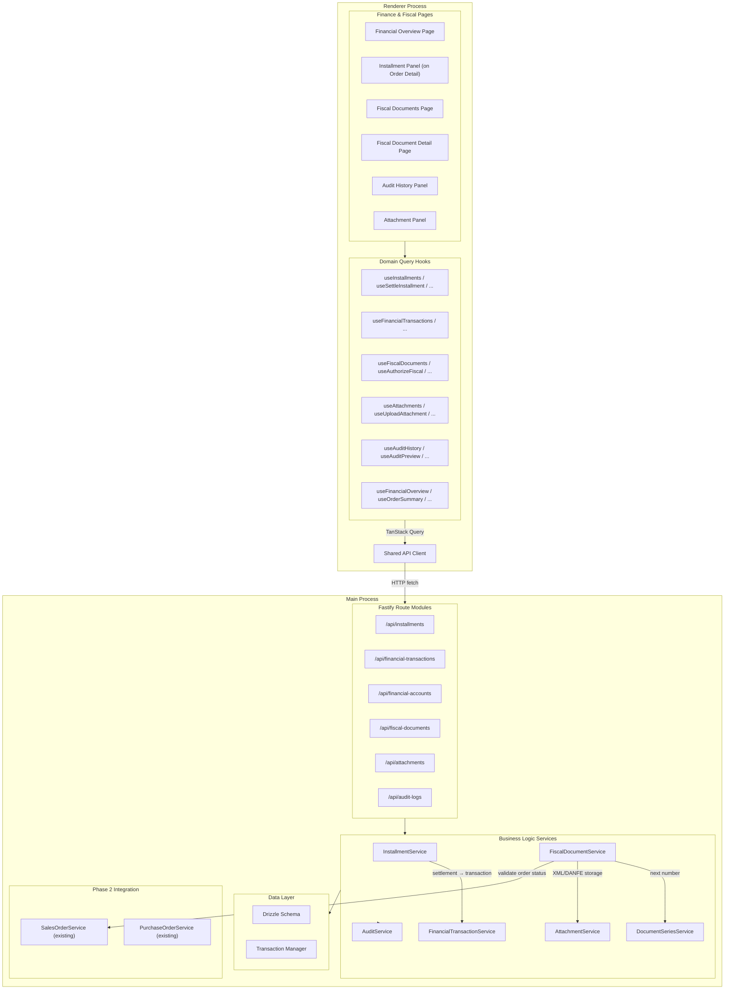
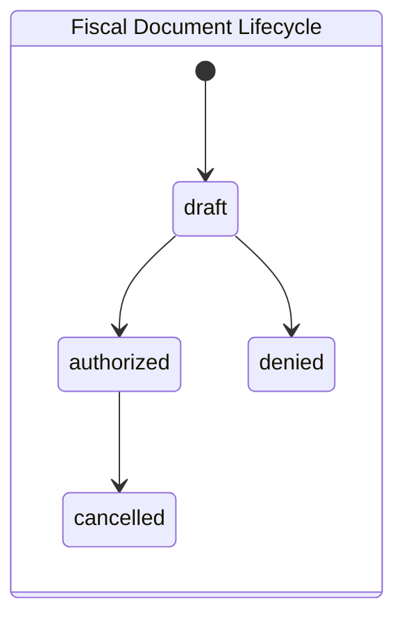
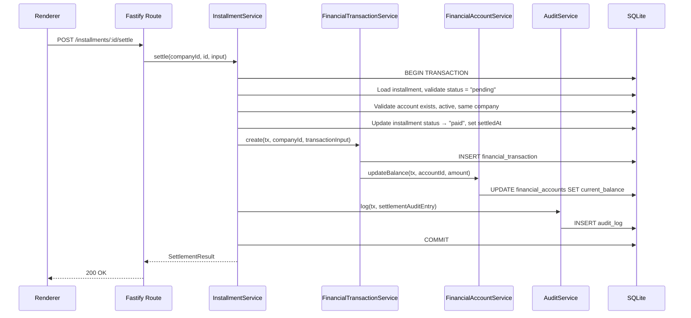
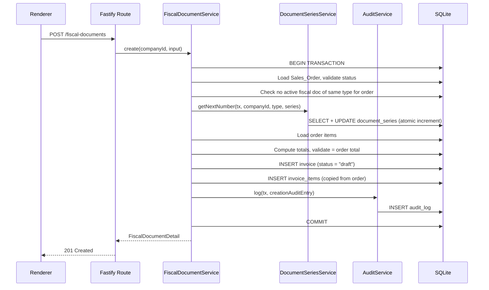
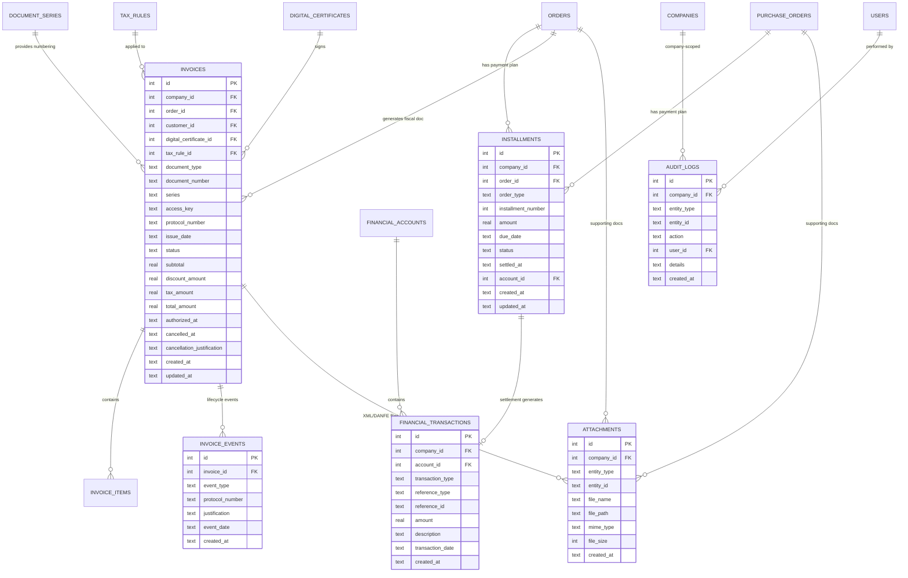

# Design Document: Phase 3 - Finance, Fiscal, and Auditability

## Overview

Phase 3 delivers the financial control, fiscal compliance, and audit traceability layer for Stockando Desktop. It builds on Phase 2's commercial operations to provide:

- **Payment installment management** with plan creation, settlement tracking, and financial status derivation at the order level.
- **Financial transaction recording** linked to accounts with balance maintenance and inbound/outbound classification.
- **Fiscal document lifecycle** (NF-e/NFC-e) with creation from sales orders, sequential numbering via Document Series, authorization with access key and protocol, cancellation with justification, and XML/DANFE storage.
- **Attachment handling** for orders, fiscal documents, and payments — non-blocking to the main workflow.
- **Audit logging** for critical operations with lazy-loaded history views and compact previews.

The module preserves the architecture established in prior phases: Fastify HTTP API in the Electron main process, SQLite via Drizzle ORM (WAL mode), TanStack Query/Router/Table in the renderer, service-layer pattern, and company-scoped isolation.

Key architectural principles:

- **Transactional settlement**: Installment settlement, Financial_Transaction creation, and account balance update execute atomically within a single SQLite transaction.
- **Fiscal integrity**: Fiscal documents validate totals against the source Sales_Order, enforce status transition rules, and preserve data immutably after leaving draft status.
- **Atomic numbering**: Document series numbers are acquired within the creation transaction to prevent gaps or duplicates.
- **Lazy audit loading**: Audit history panels default to a compact preview (last 5 entries) and load full paginated history only on user request.
- **Non-blocking attachments**: File operations happen asynchronously where possible so the main user flow remains responsive.
- **Company-scoped isolation**: All queries and mutations filter by the active company identifier.

## Architecture



### Key Design Decisions

1. **Installments table as a new schema addition**: The existing `orderPayments` table tracks individual payments without a scheduled plan. A new `installments` table models the payment plan concept with due dates, expected amounts, and settlement tracking. The `orderPayments` table from Phase 2 is superseded for orders using installment plans.

2. **Financial_Transaction linked to accounts**: Each settlement creates a `financialTransactions` record referencing the target `financialAccounts` entry. The account's `currentBalance` is updated atomically within the same transaction.

3. **Fiscal document = `invoices` table**: The existing `invoices` table serves as the Fiscal_Document store. A new `invoiceEvents` table tracks lifecycle events (authorization, cancellation). The `invoices` table already has `accessKey`, `documentType`, `documentNumber`, and status fields.

4. **Document Series via existing `documentSeries` table**: Sequential numbering uses the `documentSeries` table with atomic increment within the creation transaction. The unique index on `(companyId, documentType, series)` prevents duplicates.

5. **Attachment storage model**: The existing `attachments` table stores metadata (entityType, entityId, fileName, filePath, mimeType). Physical files are stored on the local filesystem in a structured directory layout compatible with the backup archive.

6. **Audit logging via existing `auditLogs` table**: All critical operations write to `auditLogs` with entityType, entityId, action, userId, companyId, and a JSON `details` field.

7. **Fiscal file organization**: XML and DANFE files follow the pattern `{dataDir}/{companyId}/fiscal/{year}/{month}/{documentType}/{documentNumber}/` to align with the backup feature archive structure.

8. **Status transitions via ts-pattern**: Fiscal document lifecycle transitions use `match` from `ts-pattern` with exhaustive checks, consistent with Phase 2's approach.

### Schema Additions Required

| Change | Table | Description |
|--------|-------|-------------|
| New table | `installments` | Payment plan entries with orderId, orderType, dueDate, amount, status, settledAt, accountId |
| New table | `invoice_events` | Fiscal document lifecycle events with invoiceId, eventType, protocolNumber, justification, timestamp |
| Add column | `invoices` | `protocol_number TEXT` — SEFAZ protocol for authorization/cancellation |
| Add column | `invoices` | `cancellation_justification TEXT` — reason for cancellation |
| Add column | `invoices` | `authorized_at TEXT` — authorization timestamp |
| Add column | `invoices` | `cancelled_at TEXT` — cancellation timestamp |
| Add column | `invoices` | `series TEXT` — document series identifier |
| Add column | `invoices` | `discount_amount REAL NOT NULL DEFAULT 0` — discount amount for fiscal doc |
| Add column | `attachments` | `file_size INTEGER` — file size in bytes for max size enforcement |

## Components and Interfaces

### Main Process — Route Modules

#### Installments API (`/api/installments`)

| Endpoint | Method | Purpose |
|----------|--------|---------|
| `/api/installments/order/:orderType/:orderId` | GET | List installments for an order with computed totals |
| `/api/installments/order/:orderType/:orderId` | POST | Create a payment plan (set of installments) |
| `/api/installments/:id/settle` | POST | Settle an installment |

#### Financial Transactions API (`/api/financial-transactions`)

| Endpoint | Method | Purpose |
|----------|--------|---------|
| `/api/financial-transactions/account/:accountId` | GET | Paginated transaction list with running balance |

#### Financial Accounts API (`/api/financial-accounts`)

| Endpoint | Method | Purpose |
|----------|--------|---------|
| `/api/financial-accounts` | GET | List financial accounts for active company |
| `/api/financial-accounts/:id` | GET | Account detail with summary |
| `/api/financial-accounts/overview` | GET | Financial overview (receivables, payables, overdue) |

#### Fiscal Documents API (`/api/fiscal-documents`)

| Endpoint | Method | Purpose |
|----------|--------|---------|
| `/api/fiscal-documents` | GET | Paginated fiscal document list with filters |
| `/api/fiscal-documents` | POST | Create a fiscal document from a Sales_Order |
| `/api/fiscal-documents/:id` | GET | Fiscal document detail with items and events |
| `/api/fiscal-documents/:id/authorize` | POST | Record authorization (access key, protocol) |
| `/api/fiscal-documents/:id/cancel` | POST | Record cancellation (protocol, justification) |
| `/api/fiscal-documents/:id/danfe` | POST | Generate DANFE PDF |
| `/api/fiscal-documents/:id/xml` | GET | Retrieve stored XML |
| `/api/fiscal-documents/:id/danfe` | GET | Retrieve DANFE file path |
| `/api/fiscal-documents/search-by-key` | GET | Search by access key |

#### Attachments API (`/api/attachments`)

| Endpoint | Method | Purpose |
|----------|--------|---------|
| `/api/attachments/:entityType/:entityId` | GET | List attachments for an entity |
| `/api/attachments/:entityType/:entityId` | POST | Upload attachment |
| `/api/attachments/:id` | DELETE | Delete attachment (record + file) |

#### Audit Logs API (`/api/audit-logs`)

| Endpoint | Method | Purpose |
|----------|--------|---------|
| `/api/audit-logs/:entityType/:entityId` | GET | Paginated audit history for an entity |
| `/api/audit-logs/:entityType/:entityId/preview` | GET | Last 5 entries for compact display |
| `/api/audit-logs` | GET | Company-wide audit log with filters |

### Main Process — Service Layer

```typescript
// src/main/services/installment-service.ts
interface InstallmentService {
  listForOrder(companyId: number, orderType: OrderType, orderId: number): Promise<InstallmentSummary>
  createPlan(companyId: number, input: CreatePaymentPlanInput): Promise<InstallmentSummary>
  settle(companyId: number, installmentId: number, input: SettleInstallmentInput): Promise<SettlementResult>
}

// src/main/services/financial-transaction-service.ts
interface FinancialTransactionService {
  listForAccount(companyId: number, accountId: number, pagination: Pagination): Promise<TransactionListResult>
  create(tx: DrizzleTx, companyId: number, input: CreateTransactionInput): Promise<FinancialTransaction>
}

// src/main/services/financial-account-service.ts
interface FinancialAccountService {
  list(companyId: number): Promise<FinancialAccountListItem[]>
  detail(companyId: number, id: number): Promise<FinancialAccountDetail>
  overview(companyId: number): Promise<FinancialOverview>
  updateBalance(tx: DrizzleTx, accountId: number, amount: number): Promise<void>
}

// src/main/services/fiscal-document-service.ts
interface FiscalDocumentService {
  list(companyId: number, filters: FiscalDocumentListFilters): Promise<PaginatedResult<FiscalDocumentListItem>>
  detail(companyId: number, id: number): Promise<FiscalDocumentDetail>
  create(companyId: number, input: CreateFiscalDocumentInput): Promise<FiscalDocumentDetail>
  authorize(companyId: number, id: number, input: AuthorizeFiscalInput): Promise<FiscalDocumentDetail>
  cancel(companyId: number, id: number, input: CancelFiscalInput): Promise<FiscalDocumentDetail>
  generateDanfe(companyId: number, id: number): Promise<AttachmentRecord>
  getXml(companyId: number, id: number): Promise<string>
  getDanfePath(companyId: number, id: number): Promise<string>
  searchByAccessKey(companyId: number, accessKey: string): Promise<FiscalDocumentDetail | null>
}

// src/main/services/document-series-service.ts
interface DocumentSeriesService {
  getNextNumber(tx: DrizzleTx, companyId: number, documentType: string, series: string): Promise<number>
}

// src/main/services/attachment-service.ts
interface AttachmentService {
  listForEntity(companyId: number, entityType: string, entityId: string): Promise<AttachmentRecord[]>
  create(companyId: number, input: CreateAttachmentInput): Promise<AttachmentRecord>
  delete(companyId: number, id: number): Promise<void>
  getFilePath(companyId: number, entityType: string, entityId: string, fileName: string): string
}

// src/main/services/audit-service.ts
interface AuditService {
  log(tx: DrizzleTx, entry: AuditLogEntry): Promise<void>
  historyForEntity(companyId: number, entityType: string, entityId: string, pagination: Pagination): Promise<PaginatedResult<AuditLogItem>>
  previewForEntity(companyId: number, entityType: string, entityId: string): Promise<AuditLogItem[]>
  listForCompany(companyId: number, filters: AuditListFilters): Promise<PaginatedResult<AuditLogItem>>
}
```

### Fiscal Document Status Machine



Valid transitions:

| From | To | Trigger |
|------|----|---------|
| draft | authorized | `authorize` endpoint with valid access key + protocol |
| draft | denied | Authorization attempt rejected by SEFAZ |
| authorized | cancelled | `cancel` endpoint with protocol + justification |

### Installment Settlement Flow (Transaction)



### Fiscal Document Creation Flow (Transaction)



### Renderer — Query Hooks

```typescript
// Installment hooks
function useInstallments(companyId: number, orderType: OrderType, orderId: number): UseQueryResult<InstallmentSummary>
function useCreatePaymentPlan(): UseMutationResult<InstallmentSummary, ApiError, CreatePaymentPlanInput>
function useSettleInstallment(): UseMutationResult<SettlementResult, ApiError, { installmentId: number } & SettleInstallmentInput>

// Financial account hooks
function useFinancialAccounts(companyId: number): UseQueryResult<FinancialAccountListItem[]>
function useFinancialAccountDetail(companyId: number, id: number): UseQueryResult<FinancialAccountDetail>
function useFinancialOverview(companyId: number): UseQueryResult<FinancialOverview>

// Financial transaction hooks
function useFinancialTransactions(companyId: number, accountId: number, pagination: Pagination): UseQueryResult<TransactionListResult>

// Fiscal document hooks
function useFiscalDocuments(companyId: number, filters: FiscalDocumentListFilters): UseQueryResult<PaginatedResult<FiscalDocumentListItem>>
function useFiscalDocumentDetail(companyId: number, id: number): UseQueryResult<FiscalDocumentDetail>
function useCreateFiscalDocument(): UseMutationResult<FiscalDocumentDetail, ApiError, CreateFiscalDocumentInput>
function useAuthorizeFiscalDocument(): UseMutationResult<FiscalDocumentDetail, ApiError, { id: number } & AuthorizeFiscalInput>
function useCancelFiscalDocument(): UseMutationResult<FiscalDocumentDetail, ApiError, { id: number } & CancelFiscalInput>
function useGenerateDanfe(): UseMutationResult<AttachmentRecord, ApiError, number>
function useFiscalDocumentXml(companyId: number, id: number): UseQueryResult<string>
function useSearchFiscalByAccessKey(companyId: number, accessKey: string): UseQueryResult<FiscalDocumentDetail | null>

// Attachment hooks
function useAttachments(companyId: number, entityType: string, entityId: string): UseQueryResult<AttachmentRecord[]>
function useUploadAttachment(): UseMutationResult<AttachmentRecord, ApiError, CreateAttachmentInput>
function useDeleteAttachment(): UseMutationResult<void, ApiError, number>

// Audit hooks
function useAuditHistory(companyId: number, entityType: string, entityId: string, pagination: Pagination): UseQueryResult<PaginatedResult<AuditLogItem>>
function useAuditPreview(companyId: number, entityType: string, entityId: string): UseQueryResult<AuditLogItem[]>
function useCompanyAuditLogs(companyId: number, filters: AuditListFilters): UseQueryResult<PaginatedResult<AuditLogItem>>
```

### Renderer — Page Components

| Page / Panel | Route / Location | Purpose |
|--------------|-----------------|---------|
| FinancialOverviewPage | `/finance` | Dashboard with receivables, payables, overdue, recent activity |
| InstallmentPanel | Embedded in Order Detail | Payment plan management, settlement actions |
| FiscalDocumentsPage | `/fiscal-documents` | Paginated list with filters (type, status, date, customer) |
| FiscalDocumentDetailPage | `/fiscal-documents/:id` | Metadata, items, events, XML/DANFE links, status actions |
| AttachmentPanel | Embedded in entity detail pages | File upload, listing, deletion |
| AuditHistoryPanel | Embedded in entity detail pages | Compact preview (5 entries) + expandable full history |

### Renderer — Shared Components (new or extended)

| Component | Purpose |
|-----------|---------|
| InstallmentTimeline | Visual timeline of installments with status indicators and due dates |
| SettlementForm | Settlement dialog with account selection and amount confirmation |
| FiscalStatusBadge | Colored badge for fiscal document lifecycle status |
| FiscalTransitionActions | Contextual action buttons (authorize, cancel, generate DANFE) |
| AttachmentDropzone | File upload area with drag-and-drop and size validation |
| AttachmentList | List of attached files with download/delete actions |
| AuditEntryCard | Compact card for a single audit log entry |
| AuditExpandablePanel | Collapsible panel with preview + "load more" pagination |
| FinancialSummaryCard | Card showing totals (paid, pending, overdue) for an order |
| RunningBalanceTable | Transaction list with computed running balance column |

## Data Models

### Entity Relationships



### Type Definitions

```typescript
// === Status Types ===

const INSTALLMENT_STATUSES = {
  pending: 'pending',
  paid: 'paid',
  overdue: 'overdue', // derived, not persisted
} as const

type InstallmentStatus = 'pending' | 'paid'

const FISCAL_DOCUMENT_STATUSES = {
  draft: 'draft',
  authorized: 'authorized',
  cancelled: 'cancelled',
  denied: 'denied',
} as const

type FiscalDocumentStatus = (typeof FISCAL_DOCUMENT_STATUSES)[keyof typeof FISCAL_DOCUMENT_STATUSES]

const FISCAL_DOCUMENT_TYPES = {
  nfe: 'NF-e',
  nfce: 'NFC-e',
} as const

type FiscalDocumentType = (typeof FISCAL_DOCUMENT_TYPES)[keyof typeof FISCAL_DOCUMENT_TYPES]

const TRANSACTION_TYPES = {
  inbound: 'inbound',
  outbound: 'outbound',
} as const

type TransactionType = (typeof TRANSACTION_TYPES)[keyof typeof TRANSACTION_TYPES]

const ORDER_TYPES = {
  sales_order: 'sales_order',
  purchase_order: 'purchase_order',
} as const

type OrderType = (typeof ORDER_TYPES)[keyof typeof ORDER_TYPES]

const FINANCIAL_STATUSES = {
  unpaid: 'unpaid',
  partially_paid: 'partially_paid',
  paid: 'paid',
} as const

type FinancialStatus = (typeof FINANCIAL_STATUSES)[keyof typeof FINANCIAL_STATUSES]

const ATTACHMENT_ENTITY_TYPES = {
  sales_order: 'sales_order',
  purchase_order: 'purchase_order',
  fiscal_document: 'fiscal_document',
  payment: 'payment',
} as const

type AttachmentEntityType = (typeof ATTACHMENT_ENTITY_TYPES)[keyof typeof ATTACHMENT_ENTITY_TYPES]

// === API Request Types ===

interface CreatePaymentPlanInput {
  orderType: OrderType
  orderId: number
  installments: InstallmentInput[]
}

interface InstallmentInput {
  amount: number
  dueDate: string // ISO date
}

interface SettleInstallmentInput {
  accountId: number
  transactionDate: string // ISO date
  description?: string
}

interface CreateFiscalDocumentInput {
  orderId: number
  documentType: FiscalDocumentType
  series: string
  taxRuleId?: number
  digitalCertificateId?: number
  issueDate: string
}

interface AuthorizeFiscalInput {
  accessKey: string // 44-digit string
  protocolNumber: string
  xmlContent: string
  authorizedAt: string
}

interface CancelFiscalInput {
  protocolNumber: string
  justification: string
  cancelledAt: string
}

interface CreateAttachmentInput {
  entityType: AttachmentEntityType
  entityId: string
  fileName: string
  filePath: string // temp path for upload
  mimeType: string
}

interface CreateTransactionInput {
  accountId: number
  transactionType: TransactionType
  referenceType: string
  referenceId: string
  amount: number
  description?: string
  transactionDate: string
}

// === API Response Types ===

interface InstallmentSummary {
  orderId: number
  orderType: OrderType
  documentTotal: number
  totalExpected: number
  totalPaid: number
  totalOverdue: number
  remainingBalance: number
  financialStatus: FinancialStatus
  installments: InstallmentItem[]
}

interface InstallmentItem {
  id: number
  installmentNumber: number
  amount: number
  dueDate: string
  status: InstallmentStatus
  isOverdue: boolean
  settledAt: string | null
  accountId: number | null
}

interface SettlementResult {
  installment: InstallmentItem
  transaction: FinancialTransaction
  updatedSummary: InstallmentSummary
}

interface FinancialOverview {
  totalReceivable: number
  totalPayable: number
  totalOverdueReceivables: number
  totalOverduePayables: number
  recentTransactions: FinancialTransaction[]
}

interface FinancialAccountListItem {
  id: number
  name: string
  accountType: string
  bankName: string | null
  currentBalance: number
  status: string
}

interface FinancialAccountDetail {
  id: number
  name: string
  accountType: string
  bankName: string | null
  initialBalance: number
  currentBalance: number
  status: string
  recentTransactionCount: number
}

interface TransactionListResult {
  transactions: TransactionWithBalance[]
  total: number
  limit: number
  offset: number
}

interface TransactionWithBalance {
  id: number
  transactionType: TransactionType
  referenceType: string | null
  referenceId: string | null
  amount: number
  description: string | null
  transactionDate: string
  runningBalance: number
  createdAt: string
}

interface FiscalDocumentListItem {
  id: number
  documentType: FiscalDocumentType
  documentNumber: string
  series: string
  accessKey: string | null
  customerName: string | null
  status: FiscalDocumentStatus
  totalAmount: number
  issueDate: string
  createdAt: string
}

interface FiscalDocumentDetail {
  id: number
  companyId: number
  orderId: number | null
  customerId: number | null
  customerName: string | null
  digitalCertificateId: number | null
  taxRuleId: number | null
  documentType: FiscalDocumentType
  documentNumber: string
  series: string
  accessKey: string | null
  protocolNumber: string | null
  issueDate: string
  status: FiscalDocumentStatus
  subtotal: number
  discountAmount: number
  taxAmount: number
  totalAmount: number
  authorizedAt: string | null
  cancelledAt: string | null
  cancellationJustification: string | null
  items: FiscalDocumentItem[]
  events: FiscalDocumentEvent[]
  orderNumber: string | null
}

interface FiscalDocumentItem {
  id: number
  productId: number
  productName: string
  productSku: string
  quantity: number
  unitPrice: number
  taxAmount: number
  totalAmount: number
}

interface FiscalDocumentEvent {
  id: number
  eventType: string
  protocolNumber: string | null
  justification: string | null
  eventDate: string
  createdAt: string
}

interface AttachmentRecord {
  id: number
  entityType: string
  entityId: string
  fileName: string
  filePath: string
  mimeType: string | null
  fileSize: number | null
  createdAt: string
}

interface AuditLogItem {
  id: number
  entityType: string
  entityId: string
  action: string
  userId: number | null
  userName: string | null
  details: Record<string, unknown> | null
  createdAt: string
}

interface AuditListFilters extends Pagination {
  entityType?: string
  action?: string
  userId?: number
  startDate?: string
  endDate?: string
}

interface FiscalDocumentListFilters extends Pagination {
  documentType?: FiscalDocumentType
  status?: FiscalDocumentStatus
  customerId?: number
  startDate?: string
  endDate?: string
  search?: string
}

interface Pagination {
  limit: number
  offset: number
}

interface PaginatedResult<T> {
  data: T[]
  total: number
  limit: number
  offset: number
}
```

### Settlement Business Logic

```typescript
async function settleInstallment(
  db: DrizzleDB,
  companyId: number,
  installmentId: number,
  input: SettleInstallmentInput,
  userId: number
): Promise<SettlementResult> {
  return db.transaction(async (tx) => {
    // 1. Load installment and validate
    const installment = await loadInstallment(tx, companyId, installmentId)
    if (installment.status !== 'pending') {
      throw new BusinessError('INVALID_STATUS', 'Installment must be in pending status to settle')
    }

    // 2. Validate account
    const account = await loadFinancialAccount(tx, companyId, input.accountId)
    if (!account || account.status !== 'active') {
      throw new BusinessError('INVALID_ACCOUNT', 'Financial account must exist and be active')
    }

    // 3. Determine transaction type
    const transactionType: TransactionType = match(installment.orderType)
      .with('sales_order', () => 'inbound' as const)
      .with('purchase_order', () => 'outbound' as const)
      .exhaustive()

    // 4. Compute signed amount for balance
    const signedAmount = transactionType === 'inbound' ? installment.amount : -installment.amount

    // 5. Update installment status
    await tx.update(installments)
      .set({ status: 'paid', settledAt: input.transactionDate, accountId: input.accountId, updatedAt: now() })
      .where(eq(installments.id, installmentId))

    // 6. Create financial transaction
    const transaction = await tx.insert(financialTransactions).values({
      companyId,
      accountId: input.accountId,
      transactionType,
      referenceType: installment.orderType,
      referenceId: String(installment.orderId),
      amount: installment.amount,
      description: input.description ?? `Settlement of installment #${installment.installmentNumber}`,
      transactionDate: input.transactionDate,
      createdAt: now(),
    }).returning()

    // 7. Update account balance
    await tx.update(financialAccounts)
      .set({ currentBalance: sql`current_balance + ${signedAmount}`, updatedAt: now() })
      .where(eq(financialAccounts.id, input.accountId))

    // 8. Audit log
    await tx.insert(auditLogs).values({
      companyId,
      entityType: 'installment',
      entityId: String(installmentId),
      action: 'settled',
      userId,
      details: JSON.stringify({
        amount: installment.amount,
        accountId: input.accountId,
        transactionId: transaction[0].id,
        orderType: installment.orderType,
        orderId: installment.orderId,
      }),
      createdAt: now(),
    })

    return buildSettlementResult(tx, companyId, installment, transaction[0])
  })
}
```

### Fiscal Document Totals Validation

```typescript
function validateFiscalDocumentTotals(
  orderItems: readonly OrderItemRow[],
  orderTotal: number
): { valid: true; totals: DocumentTotals } | { valid: false; error: string } {
  const subtotal = roundHalfUp(
    orderItems.reduce((sum, item) => sum + item.quantity * item.unitPrice, 0), 2
  )
  const discountAmount = roundHalfUp(
    orderItems.reduce((sum, item) => sum + item.discountAmount, 0), 2
  )
  const taxAmount = roundHalfUp(
    orderItems.reduce((sum, item) => sum + item.taxAmount, 0), 2
  )
  const totalAmount = roundHalfUp(subtotal - discountAmount + taxAmount, 2)

  if (totalAmount !== orderTotal) {
    return {
      valid: false,
      error: `Fiscal document total (${totalAmount}) differs from order total (${orderTotal})`,
    }
  }

  return { valid: true, totals: { subtotal, discountAmount, taxAmount, totalAmount } }
}
```

### Fiscal Document Status Transitions

```typescript
import { match } from 'ts-pattern'

const VALID_FISCAL_TRANSITIONS: Record<FiscalDocumentStatus, readonly FiscalDocumentStatus[]> = {
  draft: ['authorized', 'denied'],
  authorized: ['cancelled'],
  cancelled: [],
  denied: [],
} as const

function validateFiscalTransition(
  currentStatus: FiscalDocumentStatus,
  targetStatus: FiscalDocumentStatus
): { valid: true } | { valid: false; allowed: readonly FiscalDocumentStatus[] } {
  const allowed = VALID_FISCAL_TRANSITIONS[currentStatus]
  if (allowed.includes(targetStatus)) {
    return { valid: true }
  }
  return { valid: false, allowed }
}

function validateAccessKey(accessKey: string): boolean {
  return /^\d{44}$/.test(accessKey)
}
```

### Financial Status Derivation

```typescript
function deriveFinancialStatus(installments: readonly { status: InstallmentStatus }[]): FinancialStatus {
  if (installments.length === 0) return 'unpaid'

  const allPaid = installments.every(i => i.status === 'paid')
  const somePaid = installments.some(i => i.status === 'paid')

  return match({ allPaid, somePaid })
    .with({ allPaid: true }, () => 'paid' as const)
    .with({ somePaid: true }, () => 'partially_paid' as const)
    .otherwise(() => 'unpaid' as const)
}

function classifyOverdue(installment: { status: InstallmentStatus; dueDate: string }, referenceDate: string): boolean {
  return installment.status === 'pending' && installment.dueDate < referenceDate
}
```

### Fiscal File Path Generation

```typescript
function getFiscalFilePath(
  dataDir: string,
  companyId: number,
  issueDate: string,
  documentType: FiscalDocumentType,
  documentNumber: string,
  fileName: string
): string {
  const date = new Date(issueDate)
  const year = date.getFullYear().toString()
  const month = (date.getMonth() + 1).toString().padStart(2, '0')
  const typeDir = documentType === 'NF-e' ? 'nfe' : 'nfce'

  return join(dataDir, String(companyId), 'fiscal', year, month, typeDir, documentNumber, fileName)
}
```

## Correctness Properties

*A property is a characteristic or behavior that should hold true across all valid executions of a system — essentially, a formal statement about what the system should do. Properties serve as the bridge between human-readable specifications and machine-verifiable correctness guarantees.*

### Property 1: Installment sum equals document total

*For any* payment plan creation with a set of installment amounts and a target order, the sum of all installment amounts SHALL equal the order's Document_Total. Plans where the sum differs SHALL be rejected.

**Validates: Requirements 1.2, 1.4**

### Property 2: Settlement creates transaction and updates balance

*For any* installment settlement on a valid pending installment with a valid active account, the operation SHALL produce a Financial_Transaction with the installment amount, and the account's currentBalance SHALL change by exactly +amount (inbound/sales) or -amount (outbound/purchase).

**Validates: Requirements 1.3, 2.1, 2.3**

### Property 3: Financial status derivation

*For any* order with installments, the derived financial status SHALL be "unpaid" when zero installments are settled, "partially_paid" when at least one but not all are settled, and "paid" when all installments are settled.

**Validates: Requirements 1.7**

### Property 4: Overdue classification

*For any* installment with status "pending" and due date strictly before the current reference date, the installment SHALL be classified as overdue in query results. Installments with status "paid" or due date on or after the reference date SHALL NOT be classified as overdue.

**Validates: Requirements 1.6**

### Property 5: Financial summary remaining balance

*For any* order with a payment plan, the remaining balance SHALL equal the Document_Total minus the sum of all settled installment amounts. This holds regardless of the number or distribution of installments.

**Validates: Requirements 3.1, 3.2**

### Property 6: Financial overview aggregation

*For any* company with installments across multiple orders, the total receivable SHALL equal the sum of pending sales order installment amounts, the total payable SHALL equal the sum of pending purchase order installment amounts, total overdue receivables SHALL equal the sum of overdue sales installment amounts, and total overdue payables SHALL equal the sum of overdue purchase installment amounts.

**Validates: Requirements 3.4**

### Property 7: Transaction type classification

*For any* installment settlement, the generated Financial_Transaction type SHALL be "inbound" when the installment belongs to a sales order, and "outbound" when it belongs to a purchase order.

**Validates: Requirements 2.4**

### Property 8: Running balance computation

*For any* financial account with N transactions ordered by transaction date, the running balance at position K SHALL equal the account's initial balance plus the signed sum of all transactions from position 1 through K (positive for inbound, negative for outbound).

**Validates: Requirements 2.5**

### Property 9: Fiscal document status transition validity

*For any* fiscal document in a given status, only the transitions defined in the valid transition map (draft→authorized, draft→denied, authorized→cancelled) SHALL succeed. All other status change requests SHALL be rejected, leaving the document unchanged.

**Validates: Requirements 5.3, 5.4**

### Property 10: Access key format validation

*For any* string provided as an access key during fiscal document authorization, the system SHALL accept it only if it consists of exactly 44 numeric digits. All other strings SHALL be rejected.

**Validates: Requirements 5.5**

### Property 11: Fiscal document creation copies items faithfully

*For any* sales order with N items, the resulting fiscal document SHALL contain exactly N invoice_items with matching productId, quantity, unitPrice, and taxAmount for each corresponding order item.

**Validates: Requirements 4.2**

### Property 12: Fiscal document total computation

*For any* fiscal document with items, the persisted totalAmount SHALL equal `subtotal - discountAmount + taxAmount`, where subtotal is the sum of `(quantity × unitPrice)` for each item, discountAmount is the sum of item discount amounts, and taxAmount is the sum of item tax amounts — all rounded to 2 decimal places.

**Validates: Requirements 4.3, 11.1**

### Property 13: Sequential document numbering

*For any* sequence of fiscal document creations within the same company, document type, and series, the document numbers SHALL be strictly sequential (each number = previous + 1) with no gaps or duplicates.

**Validates: Requirements 4.6, 16.1, 16.2**

### Property 14: Duplicate fiscal document rejection

*For any* sales order that already has an active (non-cancelled) fiscal document of a given type, a subsequent creation request for the same type SHALL be rejected with a conflict error.

**Validates: Requirements 4.7**

### Property 15: Fiscal document item immutability after draft

*For any* fiscal document not in "draft" status, any request to modify its items SHALL be rejected, and the items SHALL remain unchanged.

**Validates: Requirements 11.4**

### Property 16: Order cancellation blocked by authorized fiscal document

*For any* sales order with an associated fiscal document in "authorized" status, a cancellation request for the order SHALL be rejected with a validation error.

**Validates: Requirements 11.3**

### Property 17: Fiscal data preservation on cancellation

*For any* fiscal document that transitions from "authorized" to "cancelled", the original items, totals, and XML attachment SHALL remain unchanged after the cancellation.

**Validates: Requirements 11.5**

### Property 18: Fiscal file path structure compliance

*For any* fiscal document file (XML or DANFE), the storage path SHALL follow the pattern `{companyId}/fiscal/{year}/{month}/{typeDir}/{documentNumber}/{fileName}` where year/month are derived from the issue date and typeDir is "nfe" or "nfce".

**Validates: Requirements 6.5**

### Property 19: Access key lookup round-trip

*For any* authorized fiscal document with a stored access key, searching by that exact access key within the same company SHALL return that document.

**Validates: Requirements 7.3**

### Property 20: Date range filter correctness

*For any* fiscal document list request with a start date and end date, all returned documents SHALL have an issue date >= start date AND <= end date (inclusive on both ends). No documents outside the range SHALL appear in results.

**Validates: Requirements 7.5**

### Property 21: Attachment listing returns correct entity attachments

*For any* entity with K attachments, a list request for that entity type and ID SHALL return exactly K attachments, all belonging to the queried entity and the active company.

**Validates: Requirements 8.3**

### Property 22: Audit log completeness and format

*For any* audit-producing operation (settlement, fiscal transition, transaction creation), the resulting audit log entry SHALL include a non-null companyId, a non-null userId, and a details field that is valid parseable JSON.

**Validates: Requirements 9.5, 9.6**

### Property 23: Audit history ordering

*For any* entity's audit history with N entries, the returned list SHALL be ordered by creation date descending (most recent first), and each successive entry SHALL have a createdAt <= the previous entry's createdAt.

**Validates: Requirements 10.1**

### Property 24: Audit preview returns at most 5 entries

*For any* entity with N audit log entries where N > 5, an audit preview request SHALL return exactly 5 entries (the most recent). For entities with N <= 5 entries, it SHALL return exactly N entries.

**Validates: Requirements 10.4**

### Property 25: Company data isolation

*For any* two distinct companies A and B, financial, fiscal, attachment, and audit queries executed in company A's context SHALL NOT return data belonging to company B. Attempting to reference company B's entities SHALL return a not-found error.

**Validates: Requirements 12.1, 12.2, 12.3, 12.4**

## Error Handling

### Error Classification

| Category | HTTP Status | Scenario | User Experience |
|----------|-------------|----------|-----------------|
| Validation | 400 | Missing fields, invalid format, invalid amounts, non-44-digit access key | Inline field errors |
| Not Found | 404 | Entity doesn't exist or belongs to another company | Toast notification |
| Conflict | 409 | Duplicate fiscal document for order, duplicate document number in series | Toast with explanation |
| Business Rule | 422 | Invalid status transition, installment sum mismatch, settlement on non-pending, order cancellation with active fiscal doc, DANFE for non-authorized doc, modification of non-draft fiscal items | Toast with explanation |
| System | 500 | Database failure, file I/O error, unexpected error | Error notification + retry |

### Error Response Format

All errors follow the standard API envelope:

```typescript
interface ApiErrorResponse {
  success: false
  error: {
    code: string
    message: string
    fields?: Record<string, string>
  }
}
```

Error codes for Phase 3:

| Code | Meaning |
|------|---------|
| `VALIDATION_ERROR` | Input failed validation (missing fields, invalid format) |
| `NOT_FOUND` | Entity not found in active company scope |
| `CONFLICT` | Duplicate fiscal document for order or duplicate number in series |
| `INVALID_STATUS_TRANSITION` | Fiscal document transition not allowed from current status |
| `INSTALLMENT_SUM_MISMATCH` | Installment amounts do not sum to order total |
| `INSTALLMENT_NOT_PENDING` | Attempt to settle a non-pending installment |
| `INVALID_ACCOUNT` | Financial account not found, inactive, or wrong company |
| `INVALID_SETTLEMENT_AMOUNT` | Zero or negative settlement amount |
| `INVALID_ACCESS_KEY` | Access key is not exactly 44 numeric digits |
| `FISCAL_DOC_NOT_EDITABLE` | Cannot modify fiscal document items after leaving draft |
| `ORDER_HAS_ACTIVE_FISCAL_DOC` | Cannot cancel order with authorized fiscal document |
| `DANFE_INVALID_STATUS` | DANFE generation requested for non-authorized document |
| `SERIES_NOT_CONFIGURED` | Document series not found for company/type/series combo |
| `FILE_TOO_LARGE` | Attachment exceeds maximum file size |
| `INVALID_ENTITY_TYPE` | Unsupported attachment entity type |
| `FISCAL_TOTAL_MISMATCH` | Fiscal document total differs from order total |
| `SYSTEM_ERROR` | Unexpected internal failure |

### Error Handling by Layer

**Service Layer (Main Process)**:
- Validate all inputs before starting transactions
- Validate installment sum against order total before persisting payment plan
- Validate fiscal document status before transitions
- Validate access key format (44 digits) before storing
- Validate fiscal document total against source order total
- Map database constraint violations to structured error codes
- Never expose raw SQLite errors to the API consumer
- Roll back entire transaction on any step failure

**Route Layer (Fastify)**:
- Return structured `ApiErrorResponse` with correct HTTP status
- Validate request parameters and body before delegating to services
- Log full error context in development

**Renderer (React)**:
- TanStack Query `onError` callbacks display Sonner toasts for system/business errors
- Form mutations display inline validation errors using the `fields` map
- Confirmation dialogs for fiscal document transitions (authorize, cancel)
- Loading states shown during mutations to prevent double-submission
- No optimistic updates for financial or fiscal operations (data integrity over speed)

### Critical Error Paths

1. **Installment sum mismatch**: Return `INSTALLMENT_SUM_MISMATCH` with expected total and actual sum
2. **Invalid fiscal transition**: Return `INVALID_STATUS_TRANSITION` with current status and allowed transitions
3. **Access key format**: Return `INVALID_ACCESS_KEY` with format requirement
4. **Fiscal total mismatch**: Return `FISCAL_TOTAL_MISMATCH` with both totals for comparison
5. **Settlement transaction failure**: Full rollback, return `SYSTEM_ERROR` with operation context
6. **Order cancellation blocked**: Return `ORDER_HAS_ACTIVE_FISCAL_DOC` with fiscal document reference

## Architectural Conventions

All cross-cutting implementation conventions are defined in the Phase 0 design document (`.kiro/specs/phase-0-foundation/design.md` — "Architectural Conventions" section). Apply all rules from that section when implementing Phase 3 tasks. The conventions cover:

1. **Feature-Sliced Design** — pages/ + shared/ structure, domain-based naming
2. **Error Handling** — AppError hierarchy, Result<T,E>, no silent swallowing
3. **Zod Validation** — Schema-first at boundaries, z.infer for types
4. **TanStack Query** — Key factories with company prefix, custom hooks only
5. **Compound Components** — Context + guard hook + Provider pattern
6. **TypeScript Advanced Types** — Discriminated unions, branded types, satisfies

### Phase 3 Specific Guidance

**FSD Structure for Finance and Fiscal Pages:**
```
src/renderer/src/pages/
  finance/
    ui/financial-overview-page.tsx
    api/use-financial-overview.ts
    api/use-financial-accounts.ts
    api/use-installments.ts
    model/financial.ts
  fiscal-documents/
    ui/fiscal-documents-page.tsx
    ui/fiscal-document-detail-page.tsx
    api/use-fiscal-documents.ts
    model/fiscal-document.ts
```

Shared panels (used across 2+ entity detail pages):
```
src/renderer/src/shared/
  ui/
    attachment-panel/         ← compound: AttachmentPanel.Dropzone, .List, .Item
    audit-history-panel/      ← compound: AuditPanel.Preview, .FullHistory, .Entry
    installment-timeline/     ← compound: InstallmentTimeline.Item, .Settle
```

**Zod Schemas for Fiscal Operations:**
```typescript
// src/main/routes/fiscal-documents/schema.ts
import { z } from 'zod'

export const fiscalDocumentType = z.enum(['NF-e', 'NFC-e'])
export const fiscalDocumentStatus = z.enum(['draft', 'authorized', 'cancelled', 'denied'])

export const accessKeySchema = z.string().regex(/^\d{44}$/, 'Access key must be exactly 44 numeric digits')

export const authorizeFiscalSchema = z.object({
  accessKey: accessKeySchema,
  protocolNumber: z.string().min(1).max(50),
  xmlContent: z.string().min(1),
  authorizedAt: z.string().datetime(),
}).strict()

export type AuthorizeFiscalInput = z.infer<typeof authorizeFiscalSchema>

export const cancelFiscalSchema = z.object({
  protocolNumber: z.string().min(1).max(50),
  justification: z.string().min(15).max(255),
  cancelledAt: z.string().datetime(),
}).strict()

export type CancelFiscalInput = z.infer<typeof cancelFiscalSchema>
```

**TanStack Query Key Factories:**
```typescript
export const fiscalDocKeys = {
  all: (companyId: number) => [companyId, 'fiscal-documents'] as const,
  lists: (companyId: number) => [...fiscalDocKeys.all(companyId), 'list'] as const,
  list: (companyId: number, filters: FiscalDocumentListFilters) => [...fiscalDocKeys.lists(companyId), filters] as const,
  details: (companyId: number) => [...fiscalDocKeys.all(companyId), 'detail'] as const,
  detail: (companyId: number, id: number) => [...fiscalDocKeys.details(companyId), id] as const,
}

export const installmentKeys = {
  all: (companyId: number) => [companyId, 'installments'] as const,
  forOrder: (companyId: number, orderType: string, orderId: number) => [...installmentKeys.all(companyId), orderType, orderId] as const,
}

export const auditKeys = {
  all: (companyId: number) => [companyId, 'audit-logs'] as const,
  entity: (companyId: number, entityType: string, entityId: string) => [...auditKeys.all(companyId), entityType, entityId] as const,
  preview: (companyId: number, entityType: string, entityId: string) => [...auditKeys.entity(companyId, entityType, entityId), 'preview'] as const,
}

export const attachmentKeys = {
  all: (companyId: number) => [companyId, 'attachments'] as const,
  forEntity: (companyId: number, entityType: string, entityId: string) => [...attachmentKeys.all(companyId), entityType, entityId] as const,
}
```

**Compound Components — AttachmentPanel and AuditPanel:**
Since attachment panels and audit panels are embedded in multiple entity detail pages (orders, fiscal documents, payments), they live in `shared/ui/` as compound components:

```typescript
// shared/ui/attachment-panel/index.ts
export const AttachmentPanel = Object.assign(AttachmentPanelRoot, {
  Dropzone: AttachmentDropzone,
  List: AttachmentList,
  Item: AttachmentItem,
})

// shared/ui/audit-history-panel/index.ts
export const AuditPanel = Object.assign(AuditPanelRoot, {
  Preview: AuditPreview,        // Last 5 entries, compact
  FullHistory: AuditFullHistory, // Paginated, expandable
  Entry: AuditEntry,            // Single entry card
})
```

Context for AuditPanel: `{ state: { entries, isExpanded }, actions: { expand, loadMore }, meta: {} }`

The AuditPanel defaults to collapsed (preview mode showing last 5) and loads full history only when expanded — this is the lazy-loading pattern from the requirements.

**Fiscal Document Status with satisfies:**
```typescript
const VALID_FISCAL_TRANSITIONS = {
  draft: ['authorized', 'denied'],
  authorized: ['cancelled'],
  cancelled: [],
  denied: [],
} as const satisfies Record<FiscalDocumentStatus, readonly FiscalDocumentStatus[]>
```

**Error Handling for Financial and Fiscal Operations:**
- `BusinessRuleError('INSTALLMENT_SUM_MISMATCH', ...)` with expected total and actual sum
- `BusinessRuleError('INSTALLMENT_NOT_PENDING', ...)` for settling non-pending installments
- `BusinessRuleError('INVALID_ACCESS_KEY', ...)` — Zod handles the 44-digit regex validation
- `BusinessRuleError('FISCAL_TOTAL_MISMATCH', ...)` with both totals for comparison
- `BusinessRuleError('ORDER_HAS_ACTIVE_FISCAL_DOC', ...)` blocking order cancellation
- No optimistic updates for any financial or fiscal operation (data integrity is paramount)

## Testing Strategy

### Unit Tests

- **InstallmentService**: Plan creation (valid/invalid sums), settlement (happy path, non-pending rejection, invalid account), financial status derivation, overdue classification
- **FinancialTransactionService**: Transaction creation, type classification (inbound/outbound), running balance computation
- **FinancialAccountService**: Balance update, overview aggregation, account validation
- **FiscalDocumentService**: Creation from order (item copy fidelity, total validation, number generation), authorization (access key validation, status update), cancellation (status guard, data preservation), duplicate rejection
- **DocumentSeriesService**: Sequential increment, missing series rejection
- **AttachmentService**: Create/delete, entity validation, file path generation, size validation
- **AuditService**: Log entry creation (companyId + userId presence, JSON details), history pagination, preview limiting, ordering
- **Status transitions**: All valid/invalid paths for fiscal document lifecycle
- **Financial calculations**: Summary computation, remaining balance, installment sum validation
- **File path generation**: Correct pattern for various dates/types/companies

### Integration Tests

- **Full settlement lifecycle**: Create order → create plan → settle installments → verify balance + status progression
- **Full fiscal lifecycle**: Create fiscal doc → authorize → store XML → generate DANFE → cancel → verify preservation
- **Settlement atomicity**: Inject failure at balance update step → verify rollback (installment stays pending, no transaction, balance unchanged)
- **Fiscal creation atomicity**: Inject failure after number increment → verify rollback (no orphan document, series not incremented)
- **Order cancellation guard**: Create order + authorized fiscal doc → attempt order cancellation → verify rejection
- **Cross-company isolation**: Create data in company A, query from company B → verify empty results
- **Attachment lifecycle**: Upload → list → delete → verify file removed from disk
- **Concurrent numbering**: Parallel fiscal document creations → verify no duplicate numbers

### Property-Based Tests

Using `fast-check` for the correctness properties defined above:

- **Property 1 (Installment sum = total)**: Generate random order totals and installment splits, verify acceptance only when sum equals total, rejection otherwise
- **Property 2 (Settlement creates transaction + balance)**: Generate random installments and accounts, settle, verify transaction amount and balance delta match
- **Property 3 (Financial status derivation)**: Generate arrays of installment statuses, verify derived status matches classification rules
- **Property 4 (Overdue classification)**: Generate installments with random due dates and statuses, verify overdue flag correctness relative to reference date
- **Property 5 (Remaining balance)**: Generate orders with various settled/pending installments, verify remaining = total - sum(settled amounts)
- **Property 6 (Overview aggregation)**: Generate multiple orders with mixed types and installment states, verify aggregated totals match filtered sums
- **Property 7 (Transaction type)**: Generate settlements for sales and purchase orders, verify type classification
- **Property 8 (Running balance)**: Generate transaction sequences, verify running balance at each position = initial + signed sum of preceding
- **Property 9 (Fiscal transitions)**: Generate random (currentStatus, targetStatus) pairs, verify acceptance/rejection matches transition map
- **Property 10 (Access key format)**: Generate random strings of varying lengths and content, verify only 44-digit numeric strings accepted
- **Property 11 (Item copy fidelity)**: Generate random order item sets, create fiscal documents, verify field-by-field equality
- **Property 12 (Fiscal total computation)**: Generate random item arrays, verify document total = recomputed sum with rounding
- **Property 13 (Sequential numbering)**: Generate sequences of document creations, verify strict +1 incrementing
- **Property 14 (Duplicate rejection)**: Create fiscal documents, attempt duplicates, verify conflict error
- **Property 15 (Item immutability)**: Generate documents in non-draft statuses, attempt item changes, verify rejection
- **Property 16 (Order cancellation blocked)**: Generate orders with authorized docs, attempt cancellation, verify rejection
- **Property 17 (Data preservation)**: Authorize then cancel documents, verify items/totals/attachments unchanged
- **Property 18 (File path structure)**: Generate varied company/date/type combinations, verify path matches expected pattern
- **Property 19 (Access key round-trip)**: Authorize documents with random 44-digit keys, search by key, verify correct document returned
- **Property 20 (Date range filter)**: Generate documents with various dates, apply filters, verify all results within range
- **Property 21 (Attachment listing)**: Create attachments for multiple entities, verify list returns only correct entity's attachments
- **Property 22 (Audit completeness)**: Generate operations, verify all audit entries have companyId, userId, and valid JSON details
- **Property 23 (Audit ordering)**: Generate entries with various dates, verify descending order
- **Property 24 (Audit preview limit)**: Generate entities with N > 5 entries, verify preview returns exactly 5 most recent
- **Property 25 (Company isolation)**: Generate operations across companies, verify no cross-company leaks

Each property test runs minimum 100 iterations.

Tag format: **Feature: phase-3-finance-fiscal, Property {number}: {property_text}**

### Component Tests (Renderer)

- **FinancialOverviewPage**: Summary cards rendering, loading/empty/error states, recent activity display
- **InstallmentPanel**: Timeline rendering, settlement form validation (account required, positive amount), success refresh
- **FiscalDocumentsPage**: List with filters (type, status, date range, customer), pagination, search by number/name
- **FiscalDocumentDetailPage**: Metadata display, items table, events timeline, status actions (authorize visible only for draft, cancel only for authorized), XML/DANFE links
- **AttachmentPanel**: Upload dropzone, file size validation, list rendering, delete confirmation
- **AuditHistoryPanel**: Compact preview (5 entries), expand to load more, pagination, user name display
- **SettlementForm**: Account selection, amount display, confirmation dialog
- **FiscalTransitionActions**: Action visibility based on current status, confirmation dialogs

### Performance Validation

- Fiscal document list query returns within 200ms for 10,000 documents (indexed by companyId + status + issueDate)
- Fiscal document detail with 200 items and events returns within 200ms
- Audit history for entity returns first page within 200ms for 10,000 entries (indexed by entityType + entityId)
- Attachment list returns within 100ms for 100 attachments (indexed by entityType + entityId)
- Financial overview aggregation returns within 300ms for 50,000 installments (aggregation query with indexed companyId + orderType + status)
- Transaction list with running balance returns within 200ms for accounts with 10,000 transactions
