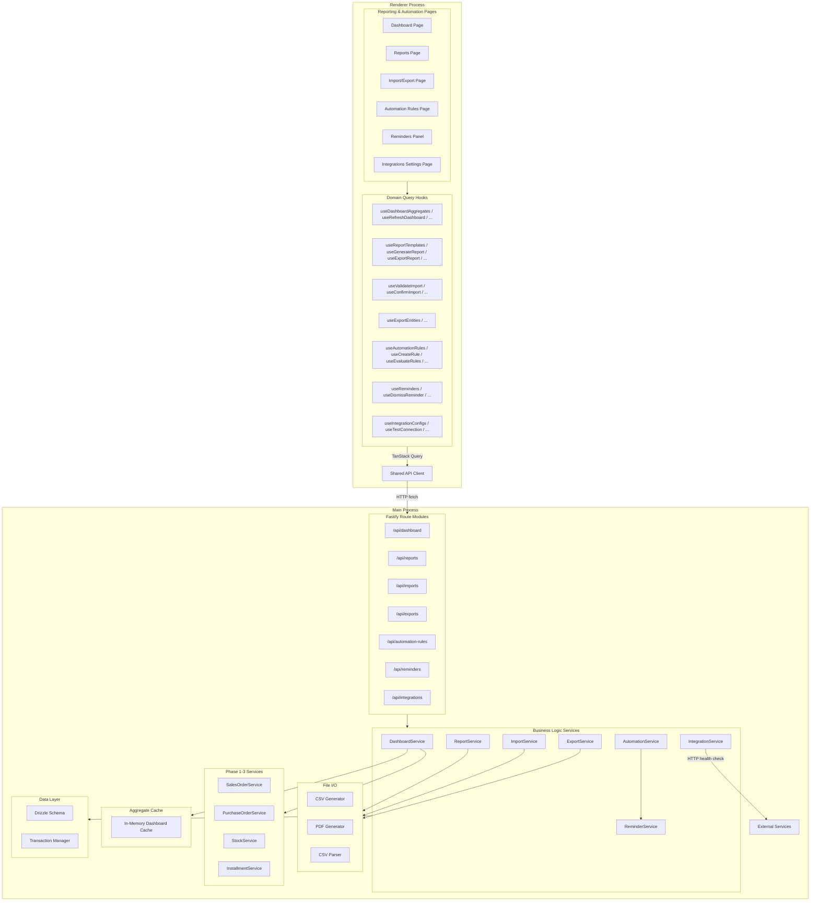
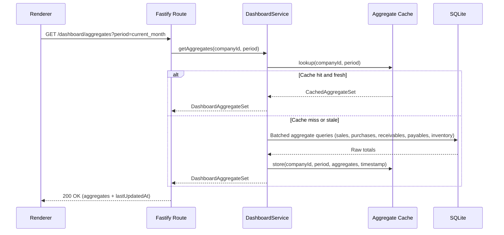
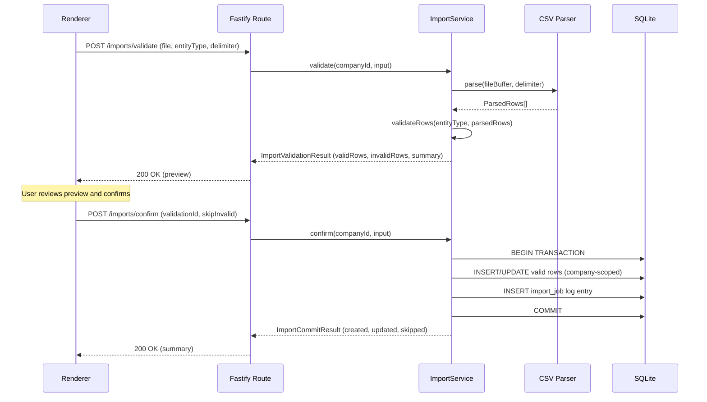
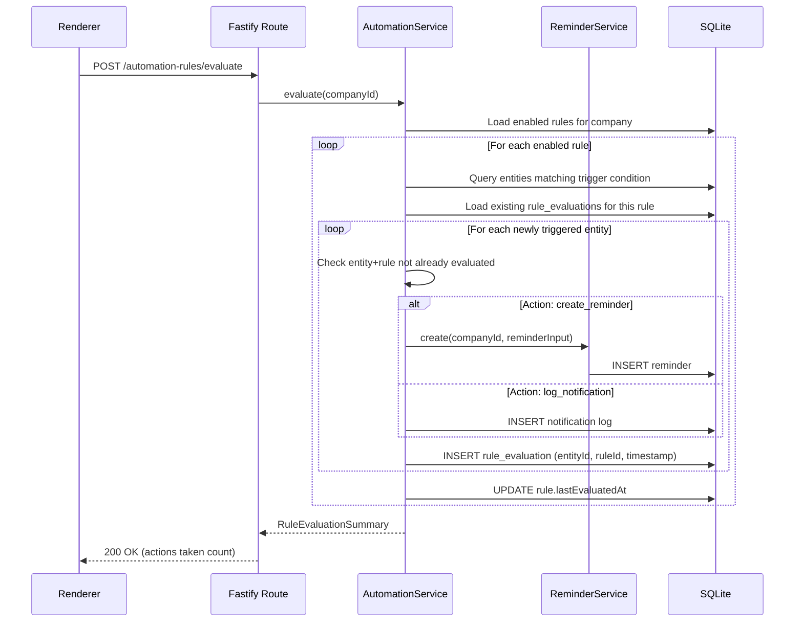
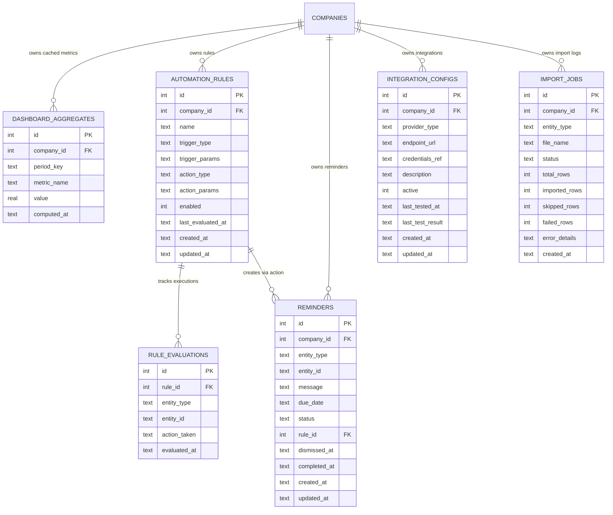

# Design Document: Phase 4 - Reporting, Automation, and Integrations

## Overview

Phase 4 transforms Stockando Desktop from a transactional tool into a business intelligence and operational platform. It delivers:

- **Dashboard aggregate computation** with cached metrics refreshed on demand or when stale, covering sales, purchases, receivables, payables, overdue amounts, inventory value, and low-stock alerts.
- **Business report generation** from predefined templates with flexible date/entity/status filters, grouping with subtotals, and paginated results returned within performance thresholds.
- **Report export** to CSV (UTF-8 BOM) and PDF formats, generated off the renderer thread with structured file storage.
- **Bulk data import** from CSV files with a two-phase flow: validate-preview then transactional commit, supporting partial imports (skip invalid rows).
- **Bulk data export** for entity backup/sharing, using the same column structure as import (round-trip compatibility).
- **Automation rules** with configurable triggers (overdue installments, low stock, pending orders) and actions (create reminder, log notification), evaluated periodically in the main process with idempotent execution.
- **Reminder management** for tracking overdue payments, low stock, and pending actions with dismiss/complete lifecycle.
- **Integration point configuration** for external services (fiscal providers, payment gateways, custom webhooks), isolated behind the main-process boundary with connection health testing.

The module preserves the architecture established in prior phases: Fastify HTTP API in the Electron main process, SQLite via Drizzle ORM (WAL mode), TanStack Query/Router/Table in the renderer, service-layer pattern, and company-scoped isolation.

Key architectural principles:

- **Cached aggregates**: Dashboard metrics are precomputed and stored with a timestamp. Served from cache when fresh; recomputed on demand or when stale.
- **Off-thread heavy operations**: Report generation, export file creation, import parsing, and automation evaluation all execute in the main process without blocking the renderer.
- **Two-phase import**: Validation returns a preview with row-level errors. Only after user confirmation does the transactional commit execute.
- **Idempotent automation**: Rules are evaluated against current state, but the same action is not re-executed for the same entity+rule pair until the trigger condition resets.
- **Integration isolation**: External HTTP calls are isolated in the main process. Failures in external services do not propagate to the renderer.
- **Company-scoped isolation**: All queries and mutations filter by the active company identifier.

## Architecture



### Key Design Decisions

1. **In-memory aggregate cache**: Dashboard aggregates are stored in a simple in-memory map keyed by `(companyId, periodKey)`. This avoids a dedicated cache table while leveraging the single-process nature of Electron. The cache is invalidated on explicit refresh or when the staleness threshold (configurable, default 5 minutes) is exceeded.

2. **Report templates as code**: Report_Templates are defined as static configuration objects in the service layer (not in the database). This keeps them versioned with the application and avoids migration complexity. Each template specifies the data source, available columns, filter definitions, and grouping options.

3. **CSV parsing with streaming**: Import files are parsed using a streaming approach to handle large files without loading the entire content into memory. Validation happens row-by-row, accumulating results.

4. **Export file organization**: Exported files follow `{userData}/{companyId}/exports/{reportType}/{year}/{month}/{filename}` for reports and `{userData}/{companyId}/exports/entities/{entityType}/{filename}` for entity exports.

5. **Automation evaluation as a batch operation**: Rule evaluation scans all enabled rules for the active company, evaluates trigger conditions against current data, and executes actions for newly-triggered entities. A `rule_evaluations` table tracks which entity+rule combinations have already fired to prevent duplicates.

6. **Integration credential isolation**: The `integrationConfigs` table stores only a `credentialsRef` (a filename). Actual credentials live in a separate JSON file on disk in a restricted directory, never exposed through the API response.

7. **PDF generation via existing libraries**: PDF reports use the existing `@nfewizard/danfe` infrastructure pattern (generate structured content programmatically). For generic reports, a lightweight PDF table renderer produces formatted output.

8. **Debounced dashboard filters**: The renderer debounces filter changes by 300ms before requesting updated aggregates, preventing excessive recomputation during rapid user interaction.

### Schema Additions Required

| Change | Table | Description |
|--------|-------|-------------|
| New table | `dashboard_aggregates` | Cached metric values with companyId, periodKey, metricName, value, computedAt |
| New table | `automation_rules` | Rule configuration with triggerType, triggerParams, actionType, actionParams, enabled, lastEvaluatedAt |
| New table | `rule_evaluations` | Tracks entity+rule execution to prevent duplicates |
| New table | `reminders` | Reminder records with entityType, entityId, message, dueDate, status |
| New table | `integration_configs` | External service configurations with providerType, endpointUrl, credentialsRef, status |
| New table | `import_jobs` | Import operation log with entityType, fileName, status, summary |

## Components and Interfaces

### Main Process — Route Modules

#### Dashboard API (`/api/dashboard`)

| Endpoint | Method | Purpose |
|----------|--------|---------|
| `/api/dashboard/aggregates` | GET | Return cached aggregates for active company and period |
| `/api/dashboard/aggregates/refresh` | POST | Force recomputation of all aggregates |

#### Reports API (`/api/reports`)

| Endpoint | Method | Purpose |
|----------|--------|---------|
| `/api/reports/templates` | GET | List available report templates |
| `/api/reports/generate` | POST | Generate report data with filters and pagination |
| `/api/reports/export/csv` | POST | Export report to CSV file |
| `/api/reports/export/pdf` | POST | Export report to PDF file |

#### Import API (`/api/imports`)

| Endpoint | Method | Purpose |
|----------|--------|---------|
| `/api/imports/validate` | POST | Validate CSV file and return preview |
| `/api/imports/confirm` | POST | Commit validated import transactionally |

#### Export API (`/api/exports`)

| Endpoint | Method | Purpose |
|----------|--------|---------|
| `/api/exports/entities` | POST | Export entity data to CSV |

#### Automation Rules API (`/api/automation-rules`)

| Endpoint | Method | Purpose |
|----------|--------|---------|
| `/api/automation-rules` | GET | List all rules for active company |
| `/api/automation-rules` | POST | Create a new automation rule |
| `/api/automation-rules/:id` | PUT | Update rule configuration |
| `/api/automation-rules/:id/toggle` | POST | Enable or disable a rule |
| `/api/automation-rules/evaluate` | POST | Trigger manual rule evaluation |

#### Reminders API (`/api/reminders`)

| Endpoint | Method | Purpose |
|----------|--------|---------|
| `/api/reminders` | GET | List reminders with status/entity filters |
| `/api/reminders/count` | GET | Count of active reminders (for badge) |
| `/api/reminders/:id/dismiss` | POST | Dismiss a reminder |
| `/api/reminders/:id/complete` | POST | Mark reminder as completed |

#### Integrations API (`/api/integrations`)

| Endpoint | Method | Purpose |
|----------|--------|---------|
| `/api/integrations` | GET | List integration configs for active company |
| `/api/integrations` | POST | Create integration config |
| `/api/integrations/:id` | PUT | Update integration config |
| `/api/integrations/:id/toggle` | POST | Activate or deactivate integration |
| `/api/integrations/:id/test` | POST | Test connection health |

### Main Process — Service Layer

```typescript
// src/main/services/dashboard-service.ts
interface DashboardService {
  getAggregates(companyId: number, period: DashboardPeriod): Promise<DashboardAggregateSet>
  refreshAggregates(companyId: number, period: DashboardPeriod): Promise<DashboardAggregateSet>
}

// src/main/services/report-service.ts
interface ReportService {
  listTemplates(): ReportTemplateDefinition[]
  generate(companyId: number, input: GenerateReportInput): Promise<ReportResult>
  exportCsv(companyId: number, input: ExportReportInput): Promise<ExportFileResult>
  exportPdf(companyId: number, input: ExportReportInput): Promise<ExportFileResult>
}

// src/main/services/import-service.ts
interface ImportService {
  validate(companyId: number, input: ValidateImportInput): Promise<ImportValidationResult>
  confirm(companyId: number, input: ConfirmImportInput): Promise<ImportCommitResult>
}

// src/main/services/export-service.ts
interface ExportService {
  exportEntities(companyId: number, input: ExportEntitiesInput): Promise<ExportFileResult>
}

// src/main/services/automation-service.ts
interface AutomationService {
  list(companyId: number): Promise<AutomationRuleListItem[]>
  create(companyId: number, input: CreateAutomationRuleInput): Promise<AutomationRuleDetail>
  update(companyId: number, id: number, input: UpdateAutomationRuleInput): Promise<AutomationRuleDetail>
  toggle(companyId: number, id: number, enabled: boolean): Promise<AutomationRuleDetail>
  evaluate(companyId: number): Promise<RuleEvaluationSummary>
}

// src/main/services/reminder-service.ts
interface ReminderService {
  list(companyId: number, filters: ReminderListFilters): Promise<PaginatedResult<ReminderListItem>>
  countActive(companyId: number): Promise<number>
  dismiss(companyId: number, id: number): Promise<ReminderListItem>
  complete(companyId: number, id: number): Promise<ReminderListItem>
  create(companyId: number, input: CreateReminderInput): Promise<ReminderListItem>
}

// src/main/services/integration-service.ts
interface IntegrationService {
  list(companyId: number): Promise<IntegrationConfigListItem[]>
  create(companyId: number, input: CreateIntegrationInput): Promise<IntegrationConfigDetail>
  update(companyId: number, id: number, input: UpdateIntegrationInput): Promise<IntegrationConfigDetail>
  toggle(companyId: number, id: number, active: boolean): Promise<IntegrationConfigDetail>
  testConnection(companyId: number, id: number): Promise<ConnectionTestResult>
}
```

### Dashboard Aggregation Flow



### Import Two-Phase Flow



### Automation Rule Evaluation Flow



### Renderer — Query Hooks

```typescript
// Dashboard hooks
function useDashboardAggregates(companyId: number, period: DashboardPeriod): UseQueryResult<DashboardAggregateSet>
function useRefreshDashboard(): UseMutationResult<DashboardAggregateSet, ApiError, DashboardPeriod>

// Report hooks
function useReportTemplates(): UseQueryResult<ReportTemplateDefinition[]>
function useGenerateReport(): UseMutationResult<ReportResult, ApiError, GenerateReportInput>
function useExportReportCsv(): UseMutationResult<ExportFileResult, ApiError, ExportReportInput>
function useExportReportPdf(): UseMutationResult<ExportFileResult, ApiError, ExportReportInput>

// Import hooks
function useValidateImport(): UseMutationResult<ImportValidationResult, ApiError, ValidateImportInput>
function useConfirmImport(): UseMutationResult<ImportCommitResult, ApiError, ConfirmImportInput>

// Export hooks
function useExportEntities(): UseMutationResult<ExportFileResult, ApiError, ExportEntitiesInput>

// Automation hooks
function useAutomationRules(companyId: number): UseQueryResult<AutomationRuleListItem[]>
function useCreateAutomationRule(): UseMutationResult<AutomationRuleDetail, ApiError, CreateAutomationRuleInput>
function useUpdateAutomationRule(): UseMutationResult<AutomationRuleDetail, ApiError, { id: number } & UpdateAutomationRuleInput>
function useToggleAutomationRule(): UseMutationResult<AutomationRuleDetail, ApiError, { id: number; enabled: boolean }>
function useEvaluateRules(): UseMutationResult<RuleEvaluationSummary, ApiError, void>

// Reminder hooks
function useReminders(companyId: number, filters: ReminderListFilters): UseQueryResult<PaginatedResult<ReminderListItem>>
function useActiveReminderCount(companyId: number): UseQueryResult<number>
function useDismissReminder(): UseMutationResult<ReminderListItem, ApiError, number>
function useCompleteReminder(): UseMutationResult<ReminderListItem, ApiError, number>

// Integration hooks
function useIntegrationConfigs(companyId: number): UseQueryResult<IntegrationConfigListItem[]>
function useCreateIntegration(): UseMutationResult<IntegrationConfigDetail, ApiError, CreateIntegrationInput>
function useUpdateIntegration(): UseMutationResult<IntegrationConfigDetail, ApiError, { id: number } & UpdateIntegrationInput>
function useToggleIntegration(): UseMutationResult<IntegrationConfigDetail, ApiError, { id: number; active: boolean }>
function useTestConnection(): UseMutationResult<ConnectionTestResult, ApiError, number>
```

### Renderer — Page Components

| Page / Panel | Route / Location | Purpose |
|--------------|-----------------|---------|
| DashboardPage | `/dashboard` | Summary cards, date range filter, manual refresh, "last updated" indicator |
| ReportsPage | `/reports` | Template list, filter panel, paginated table results, export actions |
| ImportExportPage | `/import-export` | File upload for import, entity/format selection for export, progress feedback |
| AutomationRulesPage | `/settings/automation` | Rule list with toggle, create/edit form, manual evaluate button |
| RemindersPanel | Global navigation panel | Active reminders ordered by due date, dismiss/complete actions, badge count |
| IntegrationsPage | `/settings/integrations` | Config list, create/edit form, test connection, toggle active status |

### Renderer — Shared Components (new or extended)

| Component | Purpose |
|-----------|---------|
| SummaryCard | Metric card with label, value, optional trend indicator, and click-through |
| DateRangeFilter | Period selector (current month, last 30 days, custom range) |
| ReportTable | Paginated table with column sorting, expandable groups, subtotals |
| ImportPreview | Table showing validated rows with success/error status per row |
| ImportProgressBar | Progress indicator during import validation and commit |
| ExportFormatSelector | Format choice (CSV/PDF) with entity type and filter options |
| AutomationRuleForm | Trigger type/params + action type/params configuration form |
| ReminderCard | Compact card with entity context, due date, dismiss/complete actions |
| ReminderBadge | Navigation badge showing active reminder count |
| IntegrationConfigForm | Provider type, endpoint, credentials, description form |
| ConnectionStatusIndicator | Inline result display for connection tests (success/failure/loading) |

## Data Models

### Entity Relationships



### Type Definitions

```typescript
// === Dashboard Types ===

const DASHBOARD_PERIODS = {
  current_month: 'current_month',
  last_30_days: 'last_30_days',
  custom: 'custom',
} as const

type DashboardPeriod =
  | { type: 'current_month' }
  | { type: 'last_30_days' }
  | { type: 'custom'; startDate: string; endDate: string }

interface DashboardAggregateSet {
  companyId: number
  period: DashboardPeriod
  lastUpdatedAt: string
  metrics: {
    totalSales: number
    totalPurchases: number
    totalReceivables: number
    totalPayables: number
    totalOverdueReceivables: number
    totalOverduePayables: number
    currentInventoryValue: number
    lowStockProductCount: number
  }
}

// === Report Types ===

const REPORT_TEMPLATE_IDS = {
  sales_by_period: 'sales_by_period',
  sales_by_product: 'sales_by_product',
  sales_by_customer: 'sales_by_customer',
  purchases_by_period: 'purchases_by_period',
  purchases_by_supplier: 'purchases_by_supplier',
  inventory_movements: 'inventory_movements',
  stock_levels: 'stock_levels',
  receivables_aging: 'receivables_aging',
  payables_aging: 'payables_aging',
} as const

type ReportTemplateId = (typeof REPORT_TEMPLATE_IDS)[keyof typeof REPORT_TEMPLATE_IDS]

interface ReportTemplateDefinition {
  id: ReportTemplateId
  name: string
  description: string
  availableFilters: ReportFilterDefinition[]
  availableGroupings: string[]
  columns: ReportColumnDefinition[]
}

interface ReportFilterDefinition {
  key: string
  label: string
  type: 'date_range' | 'entity_select' | 'status_select' | 'category_select'
}

interface ReportColumnDefinition {
  key: string
  label: string
  type: 'string' | 'number' | 'date' | 'currency'
  sortable: boolean
}

interface GenerateReportInput {
  templateId: ReportTemplateId
  filters: ReportFilters
  groupBy?: string
  pagination: Pagination
  sortBy?: string
  sortDirection?: 'asc' | 'desc'
}

interface ReportFilters {
  startDate?: string
  endDate?: string
  customerId?: number
  supplierId?: number
  productId?: number
  categoryId?: number
  status?: string
}

interface ReportResult {
  templateId: ReportTemplateId
  filters: ReportFilters
  data: ReportRow[]
  groups?: ReportGroup[]
  summary: ReportSummary
  total: number
  limit: number
  offset: number
}

interface ReportRow {
  [key: string]: string | number | null
}

interface ReportGroup {
  groupKey: string
  groupLabel: string
  subtotal: number
  count: number
  rows: ReportRow[]
}

interface ReportSummary {
  totalAmount: number
  totalCount: number
  averageAmount: number
}

// === Export Types ===

interface ExportReportInput {
  templateId: ReportTemplateId
  filters: ReportFilters
  groupBy?: string
  format: 'csv' | 'pdf'
}

interface ExportEntitiesInput {
  entityType: ExportableEntityType
  filters?: EntityExportFilters
}

const EXPORTABLE_ENTITY_TYPES = {
  products: 'products',
  customers: 'customers',
  suppliers: 'suppliers',
  categories: 'categories',
  sales_orders: 'sales_orders',
  purchase_orders: 'purchase_orders',
  inventory_movements: 'inventory_movements',
} as const

type ExportableEntityType = (typeof EXPORTABLE_ENTITY_TYPES)[keyof typeof EXPORTABLE_ENTITY_TYPES]

interface EntityExportFilters {
  startDate?: string
  endDate?: string
  status?: string
  categoryId?: number
}

interface ExportFileResult {
  filePath: string
  fileSize: number
  recordCount: number
}

// === Import Types ===

const IMPORTABLE_ENTITY_TYPES = {
  products: 'products',
  customers: 'customers',
  suppliers: 'suppliers',
  categories: 'categories',
} as const

type ImportableEntityType = (typeof IMPORTABLE_ENTITY_TYPES)[keyof typeof IMPORTABLE_ENTITY_TYPES]

interface ValidateImportInput {
  entityType: ImportableEntityType
  fileBuffer: Buffer
  delimiter: ',' | ';'
}

interface ImportValidationResult {
  validationId: string
  entityType: ImportableEntityType
  totalRows: number
  validRows: number
  invalidRows: number
  rows: ImportRowValidation[]
  expectedChanges: {
    creates: number
    updates: number
  }
}

interface ImportRowValidation {
  rowNumber: number
  status: 'valid' | 'invalid'
  data: Record<string, string>
  errors: ImportRowError[]
}

interface ImportRowError {
  column: string
  message: string
}

interface ConfirmImportInput {
  validationId: string
  skipInvalid: boolean
}

interface ImportCommitResult {
  entityType: ImportableEntityType
  totalRows: number
  importedRows: number
  skippedRows: number
  failedRows: number
  createdRecords: number
  updatedRecords: number
}

// === Automation Types ===

const AUTOMATION_TRIGGER_TYPES = {
  installment_overdue: 'installment_overdue',
  stock_below_minimum: 'stock_below_minimum',
  order_pending_too_long: 'order_pending_too_long',
} as const

type AutomationTriggerType = (typeof AUTOMATION_TRIGGER_TYPES)[keyof typeof AUTOMATION_TRIGGER_TYPES]

const AUTOMATION_ACTION_TYPES = {
  create_reminder: 'create_reminder',
  log_notification: 'log_notification',
} as const

type AutomationActionType = (typeof AUTOMATION_ACTION_TYPES)[keyof typeof AUTOMATION_ACTION_TYPES]

interface AutomationTriggerParams {
  installment_overdue: { overdueDays: number }
  stock_below_minimum: { minimumQuantity: number }
  order_pending_too_long: { pendingDays: number }
}

interface AutomationActionParams {
  create_reminder: { messageTemplate: string }
  log_notification: { notificationTemplate: string }
}

interface CreateAutomationRuleInput {
  name: string
  triggerType: AutomationTriggerType
  triggerParams: AutomationTriggerParams[AutomationTriggerType]
  actionType: AutomationActionType
  actionParams: AutomationActionParams[AutomationActionType]
}

interface UpdateAutomationRuleInput {
  name?: string
  triggerParams?: AutomationTriggerParams[AutomationTriggerType]
  actionParams?: AutomationActionParams[AutomationActionType]
}

interface AutomationRuleListItem {
  id: number
  name: string
  triggerType: AutomationTriggerType
  triggerDescription: string
  actionType: AutomationActionType
  actionDescription: string
  enabled: boolean
  lastEvaluatedAt: string | null
}

interface AutomationRuleDetail extends AutomationRuleListItem {
  triggerParams: AutomationTriggerParams[AutomationTriggerType]
  actionParams: AutomationActionParams[AutomationActionType]
  createdAt: string
  updatedAt: string
}

interface RuleEvaluationSummary {
  rulesEvaluated: number
  actionsExecuted: number
  actionsFailed: number
  details: RuleEvaluationDetail[]
}

interface RuleEvaluationDetail {
  ruleId: number
  ruleName: string
  entitiesTriggered: number
  actionsExecuted: number
  errors: string[]
}

// === Reminder Types ===

const REMINDER_STATUSES = {
  active: 'active',
  dismissed: 'dismissed',
  completed: 'completed',
} as const

type ReminderStatus = (typeof REMINDER_STATUSES)[keyof typeof REMINDER_STATUSES]

interface ReminderListItem {
  id: number
  entityType: string
  entityId: string
  entitySummary: string
  message: string
  dueDate: string
  status: ReminderStatus
  ruleId: number | null
  createdAt: string
}

interface ReminderListFilters extends Pagination {
  status?: ReminderStatus
  entityType?: string
}

interface CreateReminderInput {
  entityType: string
  entityId: string
  message: string
  dueDate: string
  ruleId?: number
}

// === Integration Types ===

const INTEGRATION_PROVIDER_TYPES = {
  fiscal_provider: 'fiscal_provider',
  payment_gateway: 'payment_gateway',
  custom_webhook: 'custom_webhook',
} as const

type IntegrationProviderType = (typeof INTEGRATION_PROVIDER_TYPES)[keyof typeof INTEGRATION_PROVIDER_TYPES]

interface IntegrationConfigListItem {
  id: number
  providerType: IntegrationProviderType
  endpointUrl: string
  description: string | null
  active: boolean
  lastTestedAt: string | null
  lastTestResult: 'success' | 'failure' | null
}

interface IntegrationConfigDetail extends IntegrationConfigListItem {
  credentialsRef: string | null
  createdAt: string
  updatedAt: string
}

interface CreateIntegrationInput {
  providerType: IntegrationProviderType
  endpointUrl: string
  credentials?: string
  description?: string
}

interface UpdateIntegrationInput {
  endpointUrl?: string
  credentials?: string
  description?: string
}

interface ConnectionTestResult {
  success: boolean
  responseTimeMs: number | null
  error: string | null
  testedAt: string
}

// === Shared Types (from prior phases) ===

interface Pagination {
  limit: number
  offset: number
}

interface PaginatedResult<T> {
  data: T[]
  total: number
  limit: number
  offset: number
}
```

### Dashboard Aggregate Computation Logic

```typescript
import { match } from 'ts-pattern'

async function computeAggregates(
  db: DrizzleDB,
  companyId: number,
  period: DashboardPeriod
): Promise<DashboardAggregateSet> {
  const { startDate, endDate } = resolvePeriodBounds(period)

  // Batched indexed queries — each targets a specific summary
  const [salesTotal, purchasesTotal, receivables, payables, inventoryValue, lowStockCount] =
    await Promise.all([
      computeTotalSales(db, companyId, startDate, endDate),
      computeTotalPurchases(db, companyId, startDate, endDate),
      computeReceivables(db, companyId),
      computePayables(db, companyId),
      computeInventoryValue(db, companyId),
      computeLowStockCount(db, companyId),
    ])

  return {
    companyId,
    period,
    lastUpdatedAt: new Date().toISOString(),
    metrics: {
      totalSales: salesTotal,
      totalPurchases: purchasesTotal,
      totalReceivables: receivables.total,
      totalPayables: payables.total,
      totalOverdueReceivables: receivables.overdue,
      totalOverduePayables: payables.overdue,
      currentInventoryValue: inventoryValue,
      lowStockProductCount: lowStockCount,
    },
  }
}

function resolvePeriodBounds(period: DashboardPeriod): { startDate: string; endDate: string } {
  return match(period)
    .with({ type: 'current_month' }, () => {
      const now = new Date()
      const start = new Date(now.getFullYear(), now.getMonth(), 1)
      return { startDate: start.toISOString(), endDate: now.toISOString() }
    })
    .with({ type: 'last_30_days' }, () => {
      const now = new Date()
      const start = new Date(now.getTime() - 30 * 24 * 60 * 60 * 1000)
      return { startDate: start.toISOString(), endDate: now.toISOString() }
    })
    .with({ type: 'custom' }, ({ startDate, endDate }) => ({ startDate, endDate }))
    .exhaustive()
}
```

### Import Validation Logic

```typescript
function validateImportRow(
  entityType: ImportableEntityType,
  row: Record<string, string>,
  rowNumber: number,
  existingKeys: Set<string>
): ImportRowValidation {
  const errors: ImportRowError[] = []
  const schema = getEntityImportSchema(entityType)

  for (const field of schema.requiredFields) {
    if (!row[field.column] || row[field.column].trim() === '') {
      errors.push({ column: field.column, message: `Required field "${field.label}" is empty` })
    }
  }

  for (const field of schema.typedFields) {
    const value = row[field.column]
    if (value && !field.validate(value)) {
      errors.push({ column: field.column, message: `Invalid ${field.type} format for "${field.label}"` })
    }
  }

  // Determine create vs update based on natural key presence
  const naturalKey = schema.getNaturalKey(row)
  const isUpdate = naturalKey !== null && existingKeys.has(naturalKey)

  return {
    rowNumber,
    status: errors.length === 0 ? 'valid' : 'invalid',
    data: row,
    errors,
  }
}
```

### Automation Rule Evaluation Logic

```typescript
import { match } from 'ts-pattern'

async function evaluateTrigger(
  db: DrizzleDB,
  companyId: number,
  rule: AutomationRuleRecord,
  existingEvaluations: Set<string>
): Promise<TriggeredEntity[]> {
  const params = JSON.parse(rule.triggerParams)
  const today = new Date().toISOString().slice(0, 10)

  const entities = await match(rule.triggerType as AutomationTriggerType)
    .with('installment_overdue', async () => {
      const cutoffDate = subtractDays(today, params.overdueDays)
      return db.select()
        .from(installments)
        .where(and(
          eq(installments.companyId, companyId),
          eq(installments.status, 'pending'),
          lte(installments.dueDate, cutoffDate)
        ))
        .all()
        .then(rows => rows.map(r => ({ entityType: 'installment', entityId: String(r.id) })))
    })
    .with('stock_below_minimum', async () => {
      return db.select()
        .from(stock)
        .innerJoin(products, eq(stock.productId, products.id))
        .where(and(
          eq(stock.companyId, companyId),
          lt(stock.quantity, params.minimumQuantity),
          eq(products.trackInventory, true)
        ))
        .all()
        .then(rows => rows.map(r => ({ entityType: 'product', entityId: String(r.stock.productId) })))
    })
    .with('order_pending_too_long', async () => {
      const cutoffDate = subtractDays(today, params.pendingDays)
      return db.select()
        .from(orders)
        .where(and(
          eq(orders.companyId, companyId),
          eq(orders.status, 'pending'),
          lte(orders.createdAt, cutoffDate)
        ))
        .all()
        .then(rows => rows.map(r => ({ entityType: 'order', entityId: String(r.id) })))
    })
    .exhaustive()

  // Filter out entities that have already been evaluated for this rule
  return entities.filter(e => !existingEvaluations.has(`${rule.id}:${e.entityType}:${e.entityId}`))
}
```

### CSV Export with UTF-8 BOM

```typescript
function generateCsvContent(
  columns: ReportColumnDefinition[],
  rows: ReportRow[],
  delimiter: string = ','
): Buffer {
  const BOM = '\uFEFF'
  const header = columns.map(c => escapeCSV(c.label)).join(delimiter)
  const dataRows = rows.map(row =>
    columns.map(c => escapeCSV(formatCellValue(row[c.key], c.type))).join(delimiter)
  )
  const content = BOM + [header, ...dataRows].join('\n')
  return Buffer.from(content, 'utf-8')
}

function escapeCSV(value: string): string {
  if (value.includes(',') || value.includes('"') || value.includes('\n') || value.includes(';')) {
    return `"${value.replace(/"/g, '""')}"`
  }
  return value
}
```

## Correctness Properties

*A property is a characteristic or behavior that should hold true across all valid executions of a system — essentially, a formal statement about what the system should do. Properties serve as the bridge between human-readable specifications and machine-verifiable correctness guarantees.*

### Property 1: Dashboard aggregate cache freshness

*For any* dashboard request where the cache is empty or older than the staleness threshold, the system SHALL recompute aggregates from current data and return results with a `lastUpdatedAt` timestamp equal to or after the request time.

**Validates: Requirements 1.2, 1.5**

### Property 2: Dashboard aggregate correctness — sales total

*For any* company with N sales orders in a given period, the totalSales aggregate SHALL equal the sum of `totalAmount` for all confirmed/completed sales orders with `createdAt` within the period bounds.

**Validates: Requirements 1.1**

### Property 3: Dashboard aggregate correctness — receivables

*For any* company with pending installments on sales orders, the totalReceivables aggregate SHALL equal the sum of amounts of all installments with status "pending" and orderType "sales_order", and totalOverdueReceivables SHALL equal the subset of those with dueDate before today.

**Validates: Requirements 1.1**

### Property 4: Report date range filter correctness

*For any* report generation request with a startDate and endDate, all returned rows SHALL have their date field >= startDate AND <= endDate (inclusive). No records outside the range SHALL appear in results.

**Validates: Requirements 3.2**

### Property 5: Report grouping subtotals consistency

*For any* grouped report result, the sum of all group subtotals SHALL equal the report's summary totalAmount, and each group's subtotal SHALL equal the sum of amounts in that group's rows.

**Validates: Requirements 3.4**

### Property 6: CSV export round-trip compatibility

*For any* entity type supporting both import and export, exporting all records of that type and then importing the resulting CSV file SHALL produce an ImportValidationResult with zero invalid rows and all rows classified as updates (matching existing records).

**Validates: Requirements 6.3**

### Property 7: Import validation rejects empty required fields

*For any* CSV import row where a required field is empty or contains only whitespace, the validation SHALL classify that row as "invalid" with an error referencing the specific column. The total valid row count SHALL exclude all such rows.

**Validates: Requirements 5.2, 5.4**

### Property 8: Import transaction atomicity

*For any* confirmed full import (skipInvalid = false) that encounters a database failure during insertion, the system SHALL roll back all changes and return zero imported records. The database state after rollback SHALL be identical to the state before the import attempt.

**Validates: Requirements 5.7, 17.1, 17.3**

### Property 9: Partial import correctness

*For any* confirmed partial import (skipInvalid = true) with V valid rows and I invalid rows, the commit SHALL insert/update exactly V records, skip exactly I rows, and the importedRows + skippedRows SHALL equal the total row count from validation.

**Validates: Requirements 5.5, 17.2, 17.4**

### Property 10: Import company scoping

*For any* import operation, all inserted records SHALL have their companyId set to the active company, regardless of any company-related data present in the import file.

**Validates: Requirements 16.5**

### Property 11: Automation rule idempotent execution

*For any* automation rule evaluated twice in succession without the trigger condition resetting, the second evaluation SHALL produce zero new actions for entities that were already triggered in the first evaluation.

**Validates: Requirements 8.4**

### Property 12: Automation trigger correctness — installment_overdue

*For any* company with installments, evaluating an "installment_overdue" rule with threshold N days SHALL trigger only for installments with status "pending" AND dueDate strictly more than N days before today. Settled installments or those within the threshold SHALL NOT trigger.

**Validates: Requirements 7.2, 8.1, 8.2**

### Property 13: Automation trigger correctness — stock_below_minimum

*For any* company with tracked-inventory products, evaluating a "stock_below_minimum" rule with threshold Q SHALL trigger only for products where total stock quantity < Q AND trackInventory is true. Products at or above Q or with trackInventory false SHALL NOT trigger.

**Validates: Requirements 7.2, 8.1**

### Property 14: Reminder status lifecycle

*For any* reminder, the valid transitions are: active → dismissed, active → completed. Dismissed or completed reminders SHALL NOT be modifiable back to active. Dismissing SHALL set dismissedAt, completing SHALL set completedAt.

**Validates: Requirements 9.3, 9.4**

### Property 15: Reminder list ordering

*For any* list of active reminders for a company, the returned results SHALL be ordered by dueDate ascending. Each reminder's dueDate SHALL be <= the dueDate of the next reminder in the list.

**Validates: Requirements 9.2**

### Property 16: Integration connection test isolation

*For any* connection test execution, a failure in the external service SHALL NOT affect the renderer process stability. The test SHALL return a descriptive error result and update lastTestedAt/lastTestResult on the config record without throwing an unhandled exception.

**Validates: Requirements 10.7, 11.1**

### Property 17: Company data isolation for reporting

*For any* two distinct companies A and B, dashboard aggregate, report, automation rule, reminder, and integration queries executed in company A's context SHALL NOT return data belonging to company B. Referencing company B's entities SHALL return a not-found error.

**Validates: Requirements 16.1, 16.2, 16.3, 16.4**

### Property 18: Export file UTF-8 BOM encoding

*For any* CSV export file, the first 3 bytes SHALL be the UTF-8 BOM sequence (EF BB BF), and the file content SHALL be valid UTF-8. This ensures compatibility with spreadsheet applications that require BOM for proper encoding detection.

**Validates: Requirements 4.7**

### Property 19: Report summary totals consistency

*For any* generated report, the summary totalCount SHALL equal the number of data rows (or the sum of group row counts if grouped), and the summary averageAmount SHALL equal totalAmount divided by totalCount (with proper handling of zero count).

**Validates: Requirements 3.3**

### Property 20: Automation rule validation

*For any* automation rule creation request, the system SHALL accept only combinations where triggerType is one of the defined trigger types AND actionType is one of the defined action types AND all required parameters for both trigger and action are present. Invalid combinations SHALL be rejected.

**Validates: Requirements 7.4**

## Error Handling

### Error Classification

| Category | HTTP Status | Scenario | User Experience |
|----------|-------------|----------|-----------------|
| Validation | 400 | Missing fields, invalid format, unsupported entity type, invalid delimiter, malformed CSV | Inline field errors or toast |
| Not Found | 404 | Entity doesn't exist or belongs to another company | Toast notification |
| Conflict | 409 | Duplicate automation rule name, import in progress for same entity type | Toast with explanation |
| Business Rule | 422 | Invalid trigger/action combination, file size exceeded, incompatible import columns, reminder already dismissed/completed | Toast with explanation |
| Timeout | 408 | Integration connection test timeout | Inline status indicator |
| System | 500 | Database failure, file I/O error, unexpected error | Error notification + retry |

### Error Response Format

All errors follow the standard API envelope:

```typescript
interface ApiErrorResponse {
  success: false
  error: {
    code: string
    message: string
    fields?: Record<string, string>
  }
}
```

Error codes for Phase 4:

| Code | Meaning |
|------|---------|
| `VALIDATION_ERROR` | Input failed validation (missing fields, invalid format) |
| `NOT_FOUND` | Entity not found in active company scope |
| `INVALID_TEMPLATE_ID` | Report template identifier not recognized |
| `INVALID_ENTITY_TYPE` | Entity type not supported for import/export |
| `INVALID_CSV_STRUCTURE` | CSV file missing required columns or has wrong delimiter |
| `FILE_TOO_LARGE` | Import file exceeds maximum allowed size |
| `IMPORT_TRANSACTION_FAILED` | Import commit failed, all changes rolled back |
| `IMPORT_IN_PROGRESS` | Another import for same entity type is already executing |
| `INVALID_TRIGGER_ACTION` | Trigger type and action type combination is not valid |
| `MISSING_TRIGGER_PARAMS` | Required trigger parameters are missing or invalid |
| `MISSING_ACTION_PARAMS` | Required action parameters are missing or invalid |
| `REMINDER_NOT_ACTIVE` | Attempt to dismiss/complete a non-active reminder |
| `INVALID_ENDPOINT_URL` | Integration endpoint URL is malformed |
| `CONNECTION_TIMEOUT` | Integration connection test exceeded timeout |
| `CONNECTION_AUTH_FAILED` | Integration connection rejected due to authentication |
| `DISK_SPACE_ERROR` | Export failed due to insufficient disk space |
| `WRITE_PERMISSION_ERROR` | Export failed due to write permission restriction |
| `SYSTEM_ERROR` | Unexpected internal failure |

### Error Handling by Layer

**Service Layer (Main Process)**:
- Validate all inputs before starting operations
- Validate CSV structure (expected columns) before row-level validation
- Enforce file size limits before parsing
- Map database constraint violations to structured error codes
- Wrap integration HTTP calls in try/catch with timeout handling
- Roll back import transactions on any failure
- Never expose raw SQLite errors or credential values to the API consumer

**Route Layer (Fastify)**:
- Return structured `ApiErrorResponse` with correct HTTP status
- Validate request parameters and body before delegating to services
- Set appropriate timeout for integration test routes
- Log full error context in development

**Renderer (React)**:
- TanStack Query `onError` callbacks display Sonner toasts for system/business errors
- Import validation errors displayed inline in the preview table
- Export errors shown as toast with failure reason (disk space, permissions)
- Integration test failures shown inline on the specific config entry
- Loading states shown during mutations to prevent double-submission
- No optimistic updates for import/automation operations (data integrity over speed)

## Architectural Conventions

All cross-cutting implementation conventions are defined in the Phase 0 design document (`.kiro/specs/phase-0-foundation/design.md` — "Architectural Conventions" section). Apply all rules from that section when implementing Phase 4 tasks. The conventions cover:

1. **Feature-Sliced Design** — pages/ + shared/ structure, domain-based naming
2. **Error Handling** — AppError hierarchy, Result<T,E>, no silent swallowing
3. **Zod Validation** — Schema-first at boundaries, z.infer for types
4. **TanStack Query** — Key factories with company prefix, custom hooks only
5. **Compound Components** — Context + guard hook + Provider pattern
6. **TypeScript Advanced Types** — Discriminated unions, branded types, satisfies

### Phase 4 Specific Guidance

**FSD Structure for Reporting and Automation Pages:**
```
src/renderer/src/pages/
  dashboard/
    ui/dashboard-page.tsx
    api/use-dashboard.ts
    model/dashboard.ts
  reports/
    ui/reports-page.tsx
    api/use-reports.ts
    model/report.ts
  import-export/
    ui/import-export-page.tsx
    api/use-imports.ts
    api/use-exports.ts
    model/import.ts
  settings/
    automation/
      ui/automation-rules-page.tsx
      api/use-automation.ts
      model/automation.ts
    integrations/
      ui/integrations-page.tsx
      api/use-integrations.ts
      model/integration.ts
```

Shared components (reused across pages):
```
src/renderer/src/shared/
  ui/
    summary-card/         ← simple component (no compound needed)
    date-range-filter/    ← simple component
    report-table/         ← compound: ReportTable.Header, .Body, .GroupRow, .Totals, .Pagination
    reminder-panel/       ← compound: ReminderPanel.Badge, .List, .Card
```

**Zod Schemas for Automation Rules:**
```typescript
// src/main/routes/automation-rules/schema.ts
import { z } from 'zod'

export const automationTriggerType = z.enum(['installment_overdue', 'stock_below_minimum', 'order_pending_too_long'])
export const automationActionType = z.enum(['create_reminder', 'log_notification'])

const triggerParams = z.discriminatedUnion('type', [
  z.object({ type: z.literal('installment_overdue'), overdueDays: z.number().int().positive() }),
  z.object({ type: z.literal('stock_below_minimum'), minimumQuantity: z.number().positive() }),
  z.object({ type: z.literal('order_pending_too_long'), pendingDays: z.number().int().positive() }),
])

const actionParams = z.discriminatedUnion('type', [
  z.object({ type: z.literal('create_reminder'), messageTemplate: z.string().min(1).max(500) }),
  z.object({ type: z.literal('log_notification'), notificationTemplate: z.string().min(1).max(500) }),
])

export const createAutomationRuleSchema = z.object({
  name: z.string().min(1).max(200),
  triggerType: automationTriggerType,
  triggerParams,
  actionType: automationActionType,
  actionParams,
}).strict()

export type CreateAutomationRuleInput = z.infer<typeof createAutomationRuleSchema>
```

**TanStack Query Key Factories:**
```typescript
export const dashboardKeys = {
  all: (companyId: number) => [companyId, 'dashboard'] as const,
  aggregates: (companyId: number, period: DashboardPeriod) => [...dashboardKeys.all(companyId), 'aggregates', period] as const,
}

export const reportKeys = {
  all: (companyId: number) => [companyId, 'reports'] as const,
  templates: () => ['report-templates'] as const,
}

export const automationKeys = {
  all: (companyId: number) => [companyId, 'automation-rules'] as const,
  list: (companyId: number) => [...automationKeys.all(companyId), 'list'] as const,
}

export const reminderKeys = {
  all: (companyId: number) => [companyId, 'reminders'] as const,
  active: (companyId: number) => [...reminderKeys.all(companyId), 'active'] as const,
  count: (companyId: number) => [...reminderKeys.all(companyId), 'count'] as const,
}

export const integrationKeys = {
  all: (companyId: number) => [companyId, 'integrations'] as const,
  list: (companyId: number) => [...integrationKeys.all(companyId), 'list'] as const,
}
```

**Compound Component — ReportTable and ReminderPanel:**
```typescript
// shared/ui/report-table/index.ts
export const ReportTable = Object.assign(ReportTableRoot, {
  Header: ReportTableHeader,
  Body: ReportTableBody,
  GroupRow: ReportTableGroupRow,
  Totals: ReportTableTotals,
  Pagination: ReportTablePagination,
})

// shared/ui/reminder-panel/index.ts
export const ReminderPanel = Object.assign(ReminderPanelRoot, {
  Badge: ReminderBadge,     // Navigation badge with count
  List: ReminderList,       // Active reminders ordered by due date
  Card: ReminderCard,       // Single reminder with dismiss/complete
})
```

**Report Templates with satisfies:**
```typescript
const REPORT_TEMPLATES = {
  sales_by_period: { name: 'Sales by Period', ... },
  sales_by_product: { name: 'Sales by Product', ... },
  // ...
} as const satisfies Record<ReportTemplateId, ReportTemplateDefinition>
```

**Error Handling for Import/Export and Automation:**
- `ValidationError` with Zod-parsed field-level errors for malformed CSV rows
- `BusinessRuleError('INVALID_CSV_STRUCTURE', ...)` for missing columns or wrong delimiter
- `BusinessRuleError('FILE_TOO_LARGE', ...)` for oversized imports
- `BusinessRuleError('IMPORT_TRANSACTION_FAILED', ...)` after rollback
- `BusinessRuleError('INVALID_TRIGGER_ACTION', ...)` for incompatible automation configurations
- `SystemError('DISK_SPACE_ERROR', ...)` and `SystemError('WRITE_PERMISSION_ERROR', ...)` for export failures
- Integration test failures isolated: `ConnectionTestResult` with success/failure — never propagated to renderer as unhandled errors

**Dashboard staleTime Configuration:**
```typescript
// Dashboard aggregates use longer staleTime since they're cached in main process
const DASHBOARD_STALE_TIME = 5 * 60 * 1000 // 5 minutes — matches server cache threshold

// Import/export mutations don't use staleTime (one-shot operations)
// Automation rules list: moderate staleTime since changes are infrequent
const AUTOMATION_STALE_TIME = 2 * 60 * 1000 // 2 minutes
```

## Testing Strategy

### Unit Tests

- **DashboardService**: Aggregate computation correctness (sales, purchases, receivables, payables, inventory, low stock), cache hit/miss behavior, period bounds resolution
- **ReportService**: Template-based query generation, filter application, grouping with subtotals, summary computation, pagination
- **ImportService**: CSV parsing (comma/semicolon delimiters), row validation (required fields, type checks), partial import logic, natural key detection (create vs update)
- **ExportService**: CSV generation with UTF-8 BOM, column header matching, cell value formatting and escaping, file path generation
- **AutomationService**: Trigger evaluation per type (overdue, low stock, pending orders), idempotent execution (skip already-evaluated entities), rule validation (trigger/action compatibility)
- **ReminderService**: Status transitions (active → dismissed, active → completed), list ordering by due date, entity summary resolution
- **IntegrationService**: Connection test with timeout handling, credential reference storage (not raw values), endpoint URL validation
- **Company scoping**: All services reject cross-company entity references

### Integration Tests

- **Full import lifecycle**: Upload CSV → validate → preview → confirm → verify records created in DB with correct companyId
- **Import rollback**: Inject failure mid-transaction → verify zero records modified
- **Partial import**: CSV with mix of valid/invalid rows → confirm with skipInvalid=true → verify only valid rows imported
- **Export-Import round-trip**: Export entity data → import the resulting file → verify all rows validate as updates
- **Automation evaluation cycle**: Create rule → insert matching entities → evaluate → verify reminders created → evaluate again → verify no duplicates
- **Dashboard cache lifecycle**: Request aggregates (compute) → request again (cache hit) → force refresh → verify recomputation
- **Integration connection test**: Mock HTTP endpoint → test connection → verify result stored on config
- **Cross-company isolation**: Create data in company A, query from company B → verify empty results

### Property-Based Tests

Using `fast-check` for the correctness properties defined above:

- **Property 1 (Cache freshness)**: Generate random staleness thresholds and cache ages, verify recomputation decision
- **Property 2 (Sales total)**: Generate random sets of orders with various statuses and dates, verify totalSales matches filtered sum
- **Property 3 (Receivables)**: Generate random installments with mixed statuses and due dates, verify receivables and overdue totals
- **Property 4 (Date range filter)**: Generate random report data with dates and various filter ranges, verify all results within bounds
- **Property 5 (Grouping subtotals)**: Generate random grouped report data, verify subtotal sums equal overall total
- **Property 6 (CSV round-trip)**: Generate random entity records, export to CSV string, parse back, verify all rows valid
- **Property 7 (Required field validation)**: Generate CSV rows with random empty required fields, verify correct error detection
- **Property 9 (Partial import)**: Generate mixed valid/invalid row sets, verify importedRows + skippedRows = totalRows
- **Property 10 (Company scoping)**: Generate import data with arbitrary companyId values, verify all records assigned to active company
- **Property 11 (Idempotent execution)**: Generate triggered entities, evaluate twice, verify no duplicate actions
- **Property 12 (Overdue trigger)**: Generate installments with random due dates and statuses, verify trigger fires only for eligible ones
- **Property 13 (Stock trigger)**: Generate products with random stock levels, verify trigger fires only below threshold
- **Property 14 (Reminder lifecycle)**: Generate reminder status transitions, verify only valid paths succeed
- **Property 15 (Reminder ordering)**: Generate random reminders with due dates, verify list is sorted ascending
- **Property 17 (Company isolation)**: Generate multi-company data, query with specific companyId, verify no cross-contamination
- **Property 18 (UTF-8 BOM)**: Generate random string data, export to CSV buffer, verify BOM prefix bytes
- **Property 19 (Summary consistency)**: Generate report data with random amounts, verify totalCount and averageAmount derivation
- **Property 20 (Rule validation)**: Generate random trigger/action/param combinations, verify acceptance/rejection matches allowed set

**Property test configuration**:
- Library: `fast-check`
- Minimum 100 iterations per property test
- Each test tagged with: **Feature: phase-4-reporting-automation, Property {number}: {property_text}**
